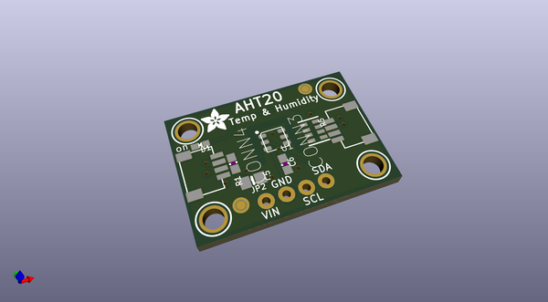
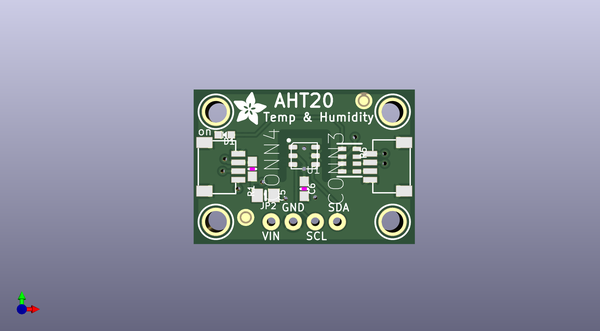
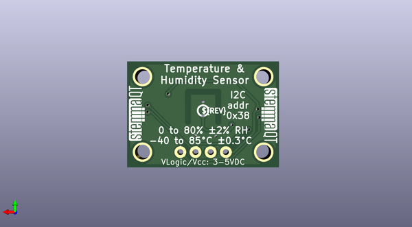

# adafruit_pinguin
 
## summary 
* id: adafruit_adafruit_pinguin_aht20
* user: adafruit
* name: adafruit_pinguin
* board: aht20
* repo: https://github.com/adafruit/Adafruit_Pinguin

* src_file_repo_sch: 
* src_file_repo_sch_link: https://github.com/adafruit/Adafruit_Pinguin/tree/main/
* full details link: https://github.com/oomlout/oomlout_oomp_project_bot_v_2/tree/main/projects/adafruit_adafruit_pinguin_aht20/current_version/working  

## pcb  
 
  
  
  
[board (pdf)](working.pdf)  

## working_bom
| Id | Designator | Footprint | Quantity | Designation | Supplier and ref |  | None | 
| --- | --- | --- | --- | --- | --- | --- | --- | 
| 1 | U$19,U$22,U$25,U$20 | MOUNTINGHOLE_2.5_PLATED | 4 | MOUNTINGHOLE2.5 |  |  | [''] | 
| 2 | C6 | 0603-NO | 1 | 0.1uF |  |  | [''] | 
| 3 | CONN4,CONN3 | JST_SH4 | 2 | STEMMA_I2C_QT |  |  | [''] | 
| 4 | FID4,FID3 | FIDUCIAL_1MM | 2 | FIDUCIAL_1MM |  |  | [''] | 
| 5 | U$28 | ADAFRUIT_3.5MM | 1 |  |  |  | [''] | 
| 6 | D1 | CHIPLED_0603_NOOUTLINE | 1 | GREEN |  |  | [''] | 
| 7 | C5 | 0805-NO | 1 | 10uF |  |  | [''] | 
| 8 | R1 | 0603-NO | 1 | 220 |  |  | [''] | 
| 9 | JP2 | 1X04_ROUND_76 | 1 |  |  |  | [''] | 
| 10 | R5 | RESPACK_4X0603 | 1 | 10K Pack |  |  | [''] | 
| 11 | U1 | LONGAN-IC_SNR6-1.0-3X3X1MM | 1 | AHT20 |  |  | [''] | 
| 12 | U$30,U$31 | STEMMAQT | 2 |  |  |  | [''] | 
| 13 | U$29 | PCBFEAT-REV-040 | 1 |  |  |  | [''] | 

## mounting_holes
| x | y | package | value | ref | size | 
| --- | --- | --- | --- | --- | --- | 
| 0.0 | 12.700000000000003 | MOUNTINGHOLE_2.5_PLATED | MOUNTINGHOLE2.5 | U$19 | m3 | 
| 20.319999999999993 | 12.700000000000003 | MOUNTINGHOLE_2.5_PLATED | MOUNTINGHOLE2.5 | U$20 | m3 | 
| 0.0 | 0.0 | MOUNTINGHOLE_2.5_PLATED | MOUNTINGHOLE2.5 | U$22 | m3 | 
| 20.319999999999993 | 0.0 | MOUNTINGHOLE_2.5_PLATED | MOUNTINGHOLE2.5 | U$25 | m3 | 

