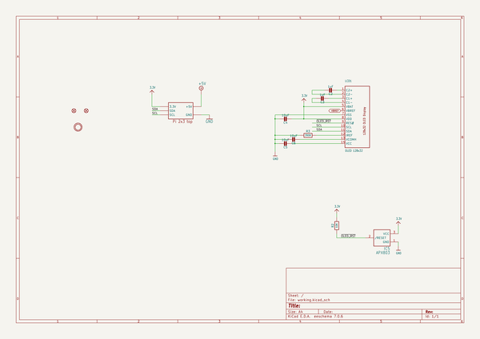
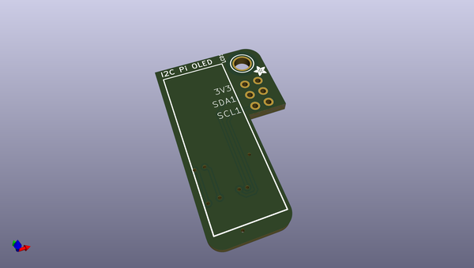
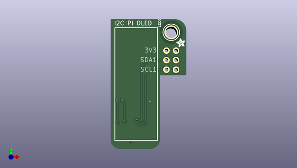
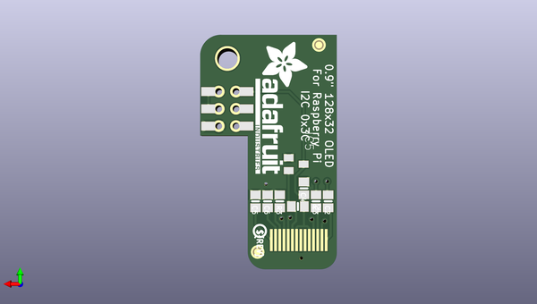

# adafruit_pioled_128x32_pcb
 
## summary 
* id: adafruit_adafruit_pioled_128x32_pcb_adafruit_128x32_pi_oled
* user: adafruit
* name: adafruit_pioled_128x32_pcb
* board: adafruit_128x32_pi_oled
* repo: https://github.com/adafruit/Adafruit-PiOLED-128x32-PCB

* src_file_repo_sch: 
* src_file_repo_sch_link: https://github.com/adafruit/Adafruit-PiOLED-128x32-PCB/tree/master/
* full details link: https://github.com/oomlout/oomlout_oomp_project_bot_v_2/tree/main/projects/adafruit_adafruit_pioled_128x32_pcb_adafruit_128x32_pi_oled/current_version/working  

## schematic  
  
[schematic (pdf)](working_schematic.pdf) 

## pcb  
 
  
  
  
[board (pdf)](working.pdf)  

## working_bom
| Id | Designator | Footprint | Quantity | Designation | Supplier and ref |  | None | 
| --- | --- | --- | --- | --- | --- | --- | --- | 
| 1 | U$1 | ADAFRUIT_2.5MM | 1 |  |  |  | [''] | 
| 2 | RPI1 | RASPBERRYPI_2X3_THMSMT | 1 | RASPBERRYPI_2X3 |  |  | [''] | 
| 3 | LCD1 | UG-2832HSWEG02_WRAPUNDER | 1 | OLED 128x32 |  |  | [''] | 
| 4 | U$4 | MOUNTINGHOLE_3.0_PLATEDTHIN | 1 | MOUNTINGHOLE3.0THIN |  |  | [''] | 
| 5 | C4,C6,C5 | 0805-NO | 3 | 10uF |  |  | [''] | 
| 6 | R3 | 0805-NO | 1 | 390K |  |  | [''] | 
| 7 | C3,C2 | 0805-NO | 2 | 1uF |  |  | [''] | 
| 8 | IC5 | SOT23 | 1 | APX803 |  |  | [''] | 
| 9 | R2 | 0805-NO | 1 | 10K |  |  | [''] | 
| 10 | U$3 | PCBFEAT-REV-040 | 1 |  |  |  | [''] | 
| 11 | FID3,FID4 | FIDUCIAL_1MM | 2 | FIDUCIAL_1MM |  |  | [''] | 
| 12 | U$8 | ADAFRUIT_TEXT_20MM | 1 |  |  |  | [''] | 

## bom_schematic
| Ref | Qnty | Value | Cmp name | Footprint | Description | Vendor | DNP | 
| --- | --- | --- | --- | --- | --- | --- | --- | 
| C2, C3 | 2 | 1uF | CAP_CERAMIC0805-NOOUTLINE | working:0805-NO |  |  |  | 
| C4, C5, C6 | 3 | 10uF | CAP_CERAMIC0805-NOOUTLINE | working:0805-NO |  |  |  | 
| FID3, FID4 | 2 | FIDUCIAL_1MM | FIDUCIAL_1MM | working:FIDUCIAL_1MM |  |  |  | 
| IC5 | 1 | APX803 | AXP083-SAG | working:SOT23 |  |  |  | 
| LCD1 | 1 | OLED 128x32 | DISP_OLED_UG-2832HSWEG02 | working:UG-2832HSWEG02_WRAPUNDER |  |  |  | 
| R2 | 1 | 10K | RESISTOR0805_NOOUTLINE | working:0805-NO |  |  |  | 
| R3 | 1 | 390K | RESISTOR0805_NOOUTLINE | working:0805-NO |  |  |  | 
| RPI1 | 1 | RASPBERRYPI_2X3 | RASPBERRYPI_2X3 | working:RASPBERRYPI_2X3_THMSMT |  |  |  | 
| U$4 | 1 | MOUNTINGHOLE3.0THIN | MOUNTINGHOLE3.0THIN | working:MOUNTINGHOLE_3.0_PLATEDTHIN |  |  |  | 

## mounting_holes
| x | y | package | value | ref | size | 
| --- | --- | --- | --- | --- | --- | 
| 0.0 | 0.0 | MOUNTINGHOLE_3.0_PLATEDTHIN | MOUNTINGHOLE3.0THIN | U$4 | m3 | 

