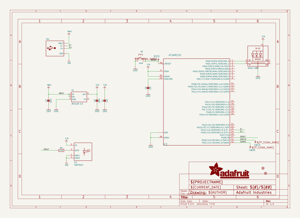
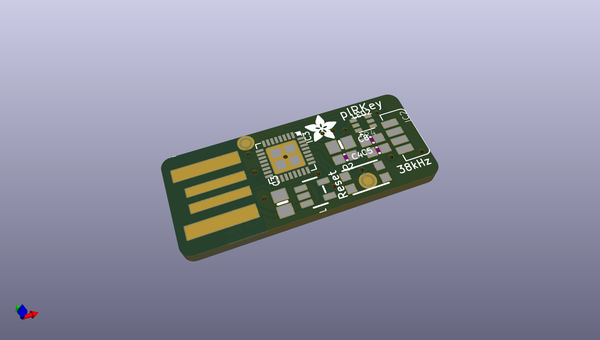
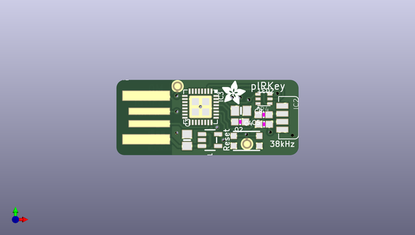
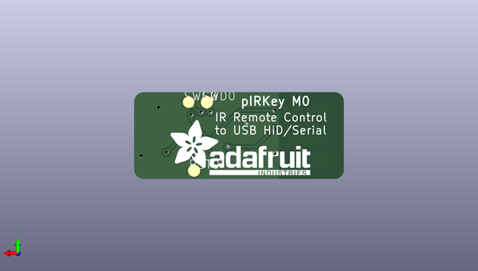

# adafruit_pirkey_pcb
 
## summary 
* id: adafruit_adafruit_pirkey_pcb_adafruit_pirkeyboard
* user: adafruit
* name: adafruit_pirkey_pcb
* board: adafruit_pirkeyboard
* repo: https://github.com/adafruit/Adafruit-pIRKey-PCB

* src_file_repo_sch: 
* src_file_repo_sch_link: https://github.com/adafruit/Adafruit-pIRKey-PCB/tree/master/
* full details link: https://github.com/oomlout/oomlout_oomp_project_bot_v_2/tree/main/projects/adafruit_adafruit_pirkey_pcb_adafruit_pirkeyboard/current_version/working  

## schematic  
  
[schematic (pdf)](working_schematic.pdf)  

## pcb  
 
  
  
  
[board (pdf)](working.pdf)  

## working_bom
| Id | Designator | Footprint | Quantity | Designation | Supplier and ref |  | None | 
| --- | --- | --- | --- | --- | --- | --- | --- | 
| 1 | FID2,FID1 | FIDUCIAL_1MM | 2 | FIDUCIAL_1MM |  |  | [''] | 
| 2 | Q2 | BTN_KMR2_4.6X2.8 | 1 | reset |  |  | [''] | 
| 3 | R4 | 0603-NO | 1 | 2.2K |  |  | [''] | 
| 4 | U1 | SOT23-5 | 1 | AP2112K-3.3 |  |  | [''] | 
| 5 | IC3 | QFN32_5MM | 1 | ATSAMD21E |  |  | [''] | 
| 6 | C5,C4 | 0603-NO | 2 | 1uF |  |  | [''] | 
| 7 | IC2 | TSOP75XYY | 1 | TSOP75XYY |  |  | [''] | 
| 8 | CN1 | USBA_PCB | 1 |  |  |  | [''] | 
| 9 | U$12 | ADAFRUIT_3.5MM | 1 |  |  |  | [''] | 
| 10 | C3,C8 | 0805-NO | 2 | 10uF |  |  | [''] | 
| 11 | LED2 | APA102_2020 | 1 | AP102-2020 |  |  | [''] | 
| 12 | U$8 | ADAFRUIT_TEXT_20MM | 1 |  |  |  | [''] | 
| 13 | SWD0,RST0 | TP16R | 2 | TPTP16R |  |  | [''] | 
| 14 | SWC0 | TP15R | 1 | TPTP15R |  |  | [''] | 

## bom_schematic
| Ref | Qnty | Value | Cmp name | Footprint | Description | Vendor | DNP | 
| --- | --- | --- | --- | --- | --- | --- | --- | 
| C3, C8 | 2 | 10uF | CAP_CERAMIC0805-NOOUTLINE | working:0805-NO |  |  |  | 
| C4, C5 | 2 | 1uF | CAP_CERAMIC0603_NO | working:0603-NO |  |  |  | 
| CN1 | 1 | USB_TYPEAPCB | USB_TYPEAPCB | working:USBA_PCB |  |  |  | 
| FID1, FID2 | 2 | FIDUCIAL_1MM | FIDUCIAL_1MM | working:FIDUCIAL_1MM |  |  |  | 
| IC2 | 1 | TSOP75XYY | TSOP75XYY | working:TSOP75XYY |  |  |  | 
| IC3 | 1 | ATSAMD21E | ATSAMD21E | working:QFN32_5MM |  |  |  | 
| LED2 | 1 | AP102-2020 | APA1022020 | working:APA102_2020 |  |  |  | 
| Q2 | 1 | reset | SWITCH_TACT_SMT4.6X2.8 | working:BTN_KMR2_4.6X2.8 |  |  |  | 
| R4 | 1 | 2.2K | RESISTOR_0603_NOOUT | working:0603-NO |  |  |  | 
| RST0 | 1 | TPTP16R | TPTP16R | working:TP16R |  |  |  | 
| SWC0 | 1 | TPTP15R | TPTP15R | working:TP15R |  |  |  | 
| SWD0 | 1 | TPTP16R | TPTP16R | working:TP16R |  |  |  | 
| U1 | 1 | AP2112K-3.3 | VREG_SOT23-5 | working:SOT23-5 |  |  |  | 

