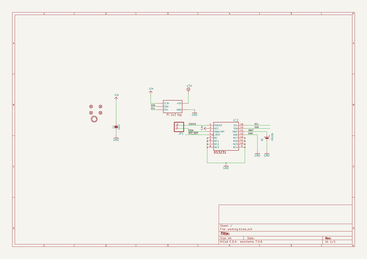

# adafruit_pirtc_ds3231_pcb
 
## summary 
* id: adafruit_adafruit_pirtc_ds3231_pcb_adafruit_ds3231_pirtc
* user: adafruit
* name: adafruit_pirtc_ds3231_pcb
* board: adafruit_ds3231_pirtc
* repo: https://github.com/adafruit/Adafruit-PiRTC-DS3231-PCB

* src_file_repo_sch: 
* src_file_repo_sch_link: https://github.com/adafruit/Adafruit-PiRTC-DS3231-PCB/tree/main/
* full details link: https://github.com/oomlout/oomlout_oomp_project_bot_v_2/tree/main/projects/adafruit_adafruit_pirtc_ds3231_pcb_adafruit_ds3231_pirtc/current_version/working  

## schematic  
  
[schematic (pdf)](working_schematic.pdf)  

## pcb  
 
  
  
  
[board (pdf)](working.pdf)  

## working_bom
| Id | Designator | Footprint | Quantity | Designation | Supplier and ref |  | None | 
| --- | --- | --- | --- | --- | --- | --- | --- | 
| 1 | U$2 | ADAFRUIT_3.5MM | 1 |  |  |  | [''] | 
| 2 | RPI1 | RASPBERRYPI_2X3_THMSMT | 1 | RASPBERRYPI_2X3 |  |  | [''] | 
| 3 | JP1 | 1X02_ROUND | 1 |  |  |  | [''] | 
| 4 | U$4 | MOUNTINGHOLE_3.0_PLATEDTHIN | 1 | MOUNTINGHOLE3.0THIN |  |  | [''] | 
| 5 | B1 | CR1220 | 1 | CR1220 |  |  | [''] | 
| 6 | FID1,FID2,FID4,FID3 | FIDUCIAL_1MM | 4 | FIDUCIAL_1MM |  |  | [''] | 
| 7 | U$3 | PCBFEAT-REV-040 | 1 |  |  |  | [''] | 
| 8 | C1 | 0805-NO | 1 | 10uF |  |  | [''] | 
| 9 | IC2 | SO16W | 1 | DS3231/SO |  |  | [''] | 

## bom_schematic
| Ref | Qnty | Value | Cmp name | Footprint | Description | Vendor | DNP | 
| --- | --- | --- | --- | --- | --- | --- | --- | 
| B1 | 1 | CR1220 | BATTERYCR1220_SMT | working:CR1220 |  |  |  | 
| C1 | 1 | 10uF | CAP_CERAMIC0805-NOOUTLINE | working:0805-NO |  |  |  | 
| FID1, FID2, FID3, FID4 | 4 | FIDUCIAL_1MM | FIDUCIAL_1MM | working:FIDUCIAL_1MM |  |  |  | 
| IC2 | 1 | DS3231/SO | DS3231/SO | working:SO16W |  |  |  | 
| JP1 | 1 | HEADER-1X2ROUND | HEADER-1X2ROUND | working:1X02_ROUND |  |  |  | 
| RPI1 | 1 | RASPBERRYPI_2X3 | RASPBERRYPI_2X3 | working:RASPBERRYPI_2X3_THMSMT |  |  |  | 
| U$4 | 1 | MOUNTINGHOLE3.0THIN | MOUNTINGHOLE3.0THIN | working:MOUNTINGHOLE_3.0_PLATEDTHIN |  |  |  | 

## mounting_holes
| x | y | package | value | ref | size | 
| --- | --- | --- | --- | --- | --- | 
| 0.0 | 0.0 | MOUNTINGHOLE_3.0_PLATEDTHIN | MOUNTINGHOLE3.0THIN | U$4 | m3 | 

