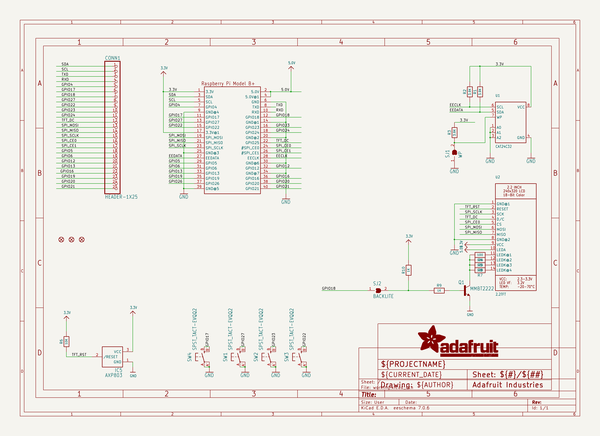
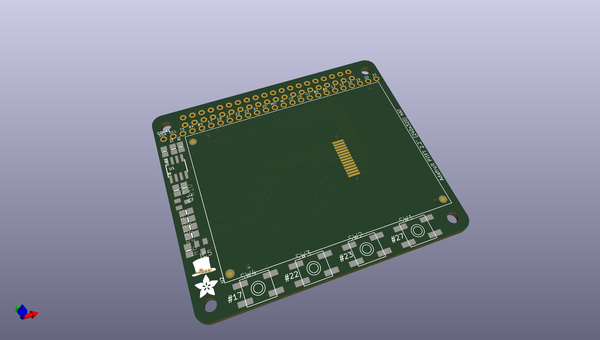
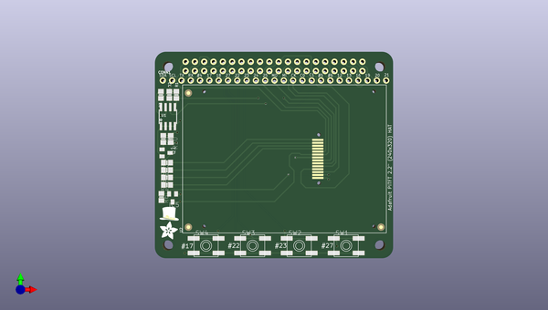
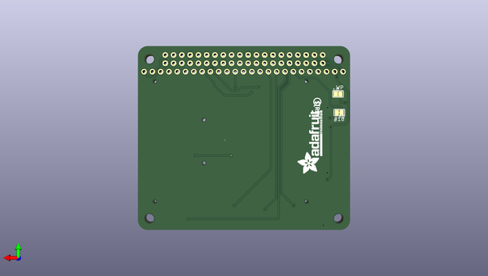

# adafruit_pitft_2_2_inch_hat_pcb
 
## summary 
* id: adafruit_adafruit_pitft_2_2_inch_hat_pcb_adafruit_2_2in_tft_hat_rev_a
* user: adafruit
* name: adafruit_pitft_2_2_inch_hat_pcb
* board: adafruit_2_2in_tft_hat_rev_a
* repo: https://github.com/adafruit/Adafruit-PiTFT-2.2-Inch-HAT-PCB

* src_file_repo_sch: 
* src_file_repo_sch_link: https://github.com/adafruit/Adafruit-PiTFT-2.2-Inch-HAT-PCB/tree/master/
* full details link: https://github.com/oomlout/oomlout_oomp_project_bot_v_2/tree/main/projects/adafruit_adafruit_pitft_2_2_inch_hat_pcb_adafruit_2_2in_tft_hat_rev_a/current_version/working  

## schematic  
  
[schematic (pdf)](working_schematic.pdf) 

## pcb  
 
  
  
  
[board (pdf)](working.pdf)  

## working_bom
| Id | Designator | Footprint | Quantity | Designation | Supplier and ref |  | None | 
| --- | --- | --- | --- | --- | --- | --- | --- | 
| 1 | IC5 | SOT23 | 1 | AXP803 |  |  | [''] | 
| 2 | SW3,SW4,SW2,SW1 | EVQ-Q2 | 4 | SPST_TACT-EVQQ2 |  |  | [''] | 
| 3 | R2,R1,R3 | 0805-NO | 3 | 3.9K |  |  | [''] | 
| 4 | R10,R9 | 0805-NO | 2 | 1K |  |  | [''] | 
| 5 | U1 | SOIC8_150MIL | 1 | CAT24C32 |  |  | [''] | 
| 6 | RPI1 | PI_HAT_NOSLOTS | 1 | RASPBERRYPI_BPLUS_HATNOSLOTS |  |  | [''] | 
| 7 | R8,R5,R7,R4 | 0805-NO | 4 | 100 |  |  | [''] | 
| 8 | FID3,FID1,FID2 | FIDUCIAL_1MM | 3 | FIDUCIAL" |  |  | [''] | 
| 9 | U$4 | PIHATLOGO | 1 |  |  |  | [''] | 
| 10 | R6 | 0805-NO | 1 | 10K |  |  | [''] | 
| 11 | Q1 | SOT23-BEC | 1 | MMBT2222 |  |  | [''] | 
| 12 | CONN1 | 1X25_ROUND_70MIL | 1 | HEADER-1X25 |  |  | [''] | 
| 13 | U$1 | ADAFRUIT_5MM | 1 |  |  |  | [''] | 
| 14 | U2 | TM022HDH26_2.2IN_LCD | 1 | 2.2TFT |  |  | [''] | 
| 15 | U$12 | PCBFEAT-REV-056 | 1 |  |  |  | [''] | 
| 16 | SJ2 | SOLDERJUMPER_CLOSEDWIRE | 1 | BACKLITE |  |  | [''] | 
| 17 | SJ1 | SOLDERJUMPER_CLOSEDWIRE | 1 | WP |  |  | [''] | 
| 18 | U$3 | ADAFRUIT_TEXT_20MM | 1 |  |  |  | [''] | 

## bom_schematic
| Ref | Qnty | Value | Cmp name | Footprint | Description | Vendor | DNP | 
| --- | --- | --- | --- | --- | --- | --- | --- | 
| CONN1 | 1 | HEADER-1X25 | HEADER-1X25 | working:1X25_ROUND_70MIL |  |  |  | 
| FID1, FID2, FID3 | 3 | FIDUCIAL"" | FIDUCIAL{dblquote}{dblquote} | working:FIDUCIAL_1MM |  |  |  | 
| IC5 | 1 | AXP803 | AXP083-SAG | working:SOT23 |  |  |  | 
| Q1 | 1 | MMBT2222 | -NPN-SOT23-BEC | working:SOT23-BEC |  |  |  | 
| R1, R2, R3 | 3 | 3.9K | RESISTOR0805_NOOUTLINE | working:0805-NO |  |  |  | 
| R4, R5, R7, R8 | 4 | 100 | RESISTOR0805_NOOUTLINE | working:0805-NO |  |  |  | 
| R6 | 1 | 10K | RESISTOR0805_NOOUTLINE | working:0805-NO |  |  |  | 
| R9, R10 | 2 | 1K | RESISTOR0805_NOOUTLINE | working:0805-NO |  |  |  | 
| RPI1 | 1 | RASPBERRYPI_BPLUS_HATNOSLOTS | RASPBERRYPI_BPLUS_HATNOSLOTS | working:PI_HAT_NOSLOTS |  |  |  | 
| SJ1 | 1 | WP | SOLDERJUMPER_CLOSED | working:SOLDERJUMPER_CLOSEDWIRE |  |  |  | 
| SJ2 | 1 | BACKLITE | SOLDERJUMPERCLOSED | working:SOLDERJUMPER_CLOSEDWIRE |  |  |  | 
| SW1, SW2, SW3, SW4 | 4 | SPST_TACT-EVQQ2 | SPST_TACT-EVQQ2 | working:EVQ-Q2 |  |  |  | 
| U1 | 1 | CAT24C32 | EEPROM_I2C_SOIC8_GENERIC | working:SOIC8_150MIL |  |  |  | 
| U2 | 1 | 2.2TFT | DISP_LCD_TM022HDH26 | working:TM022HDH26_2.2IN_LCD |  |  |  | 

