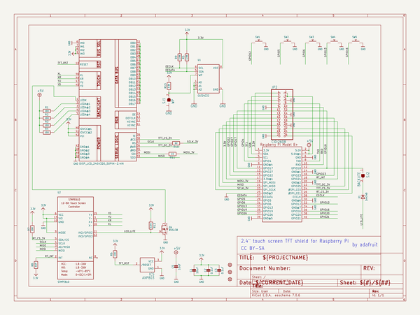
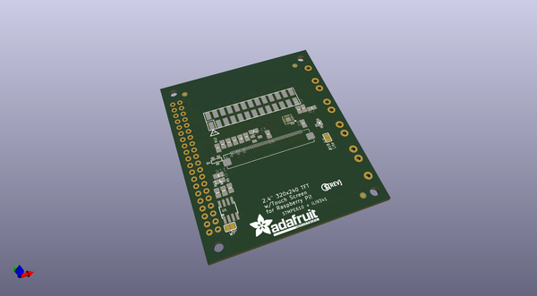
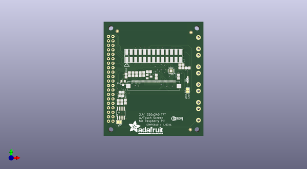
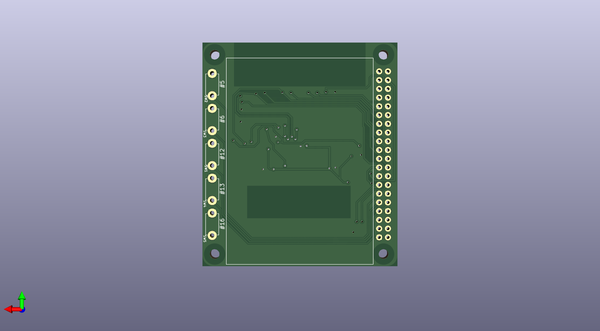

# adafruit_pitft_2_4_inch_hat_pcb
 
## summary 
* id: adafruit_adafruit_pitft_2_4_inch_hat_pcb_adafruit_pitft_2_4in_hat
* user: adafruit
* name: adafruit_pitft_2_4_inch_hat_pcb
* board: adafruit_pitft_2_4in_hat
* repo: https://github.com/adafruit/Adafruit-PiTFT-2.4-Inch-HAT-PCB

* src_file_repo_sch: 
* src_file_repo_sch_link: https://github.com/adafruit/Adafruit-PiTFT-2.4-Inch-HAT-PCB/tree/master/
* full details link: https://github.com/oomlout/oomlout_oomp_project_bot_v_2/tree/main/projects/adafruit_adafruit_pitft_2_4_inch_hat_pcb_adafruit_pitft_2_4in_hat/current_version/working  

## schematic  
  
[schematic (pdf)](working_schematic.pdf)  

## pcb  
 
  
  
  
[board (pdf)](working.pdf)  

## working_bom
| Id | Designator | Footprint | Quantity | Designation | Supplier and ref |  | None | 
| --- | --- | --- | --- | --- | --- | --- | --- | 
| 1 | C5,C1 | 0805-NO | 2 | 10uF |  |  | [''] | 
| 2 | R10,R11 | 0805-NO | 2 | 22 |  |  | [''] | 
| 3 | R6,R7 | 0805-NO | 2 | 10K |  |  | [''] | 
| 4 | U2 | QFN16_3MM | 1 | STMPE610 |  |  | [''] | 
| 5 | JP2 | 2X13_SMT_MALE | 1 | CID:2608 |  |  | [''] | 
| 6 | R3,R1,R4,R2 | 0805-NO | 4 | 100 |  |  | [''] | 
| 7 | R13,R12,R5,R9 | 0805-NO | 4 | 3.9K |  |  | [''] | 
| 8 | Q4 | SOT23-WIDE | 1 | BSS138 |  |  | [''] | 
| 9 | SJ1 | SOLDERJUMPER_CLOSEDWIRE | 1 | WP |  |  | [''] | 
| 10 | R8 | 0805-NO | 1 | DNP |  |  | [''] | 
| 11 | IC5 | SOT23 | 1 | AXP803 |  |  | [''] | 
| 12 | U$9 | PCBFEAT-REV-056 | 1 |  |  |  | [''] | 
| 13 | D1 | SOD-323 | 1 | 1n4148 |  |  | [''] | 
| 14 | SJ2 | SOLDERJUMPER_CLOSEDWIRE | 1 | BACKLITE |  |  | [''] | 
| 15 | U$23 | ADAFRUIT_TEXT_20MM | 1 |  |  |  | [''] | 
| 16 | U$10,U$11,U$18 | FIDUCIAL_1MM | 3 | FIDUCIAL" |  |  | [''] | 
| 17 | U1 | SOIC8_150MIL | 1 | CAT24C32 |  |  | [''] | 
| 18 | C3,C2 | 0805-NO | 2 | 0.1uF |  |  | [''] | 
| 19 | SW3,SW5,SW4,SW1,SW2 | TACT_PANA-EVQ | 5 |  |  |  | [''] | 
| 20 | RPI1 | PI_HAT_NOSLOTS | 1 | RASPBERRYPI_BPLUS_HATNOSLOTS |  |  | [''] | 
| 21 | U$2 | TFT_2.4IN_240X320_50PIN | 1 | DISP_LCD_240X320_50PIN-2.4IN |  |  | [''] | 

## bom_schematic
| Ref | Qnty | Value | Cmp name | Footprint | Description | Vendor | DNP | 
| --- | --- | --- | --- | --- | --- | --- | --- | 
| C1, C5 | 2 | 10uF | CAP_CERAMIC0805-NOOUTLINE | working:0805-NO |  |  |  | 
| C2, C3 | 2 | 0.1uF | CAP_CERAMIC0805-NOOUTLINE | working:0805-NO |  |  |  | 
| D1 | 1 | 1n4148 | DIODESOD-323 | working:SOD-323 |  |  |  | 
| IC5 | 1 | AXP803 | AXP083-SAG | working:SOT23 |  |  |  | 
| JP2 | 1 | CID:2608 | HEADER-2X13-SMT | working:2X13_SMT_MALE |  |  |  | 
| Q4 | 1 | BSS138 | MOSFET-NWIDE | working:SOT23-WIDE |  |  |  | 
| R1, R2, R3, R4 | 4 | 100 | RESISTOR0805_NOOUTLINE | working:0805-NO |  |  |  | 
| R5, R9, R12, R13 | 4 | 3.9K | RESISTOR0805_NOOUTLINE | working:0805-NO |  |  |  | 
| R6, R7 | 2 | 10K | RESISTOR0805_NOOUTLINE | working:0805-NO |  |  |  | 
| R8 | 1 | DNP | RESISTOR0805_NOOUTLINE | working:0805-NO |  |  |  | 
| R10, R11 | 2 | 22 | RESISTOR0805_NOOUTLINE | working:0805-NO |  |  |  | 
| RPI1 | 1 | RASPBERRYPI_BPLUS_HATNOSLOTS | RASPBERRYPI_BPLUS_HATNOSLOTS | working:PI_HAT_NOSLOTS |  |  |  | 
| SJ1 | 1 | WP | SOLDERJUMPER_CLOSED | working:SOLDERJUMPER_CLOSEDWIRE |  |  |  | 
| SJ2 | 1 | BACKLITE | SOLDERJUMPER_CLOSED | working:SOLDERJUMPER_CLOSEDWIRE |  |  |  | 
| SW1, SW2, SW3, SW4, SW5 | 5 | SWITCH_PUSHBUTTONEVQ-PE | SWITCH_PUSHBUTTONEVQ-PE | working:TACT_PANA-EVQ |  |  |  | 
| U1 | 1 | CAT24C32 | EEPROM_I2C_SOIC8_GENERIC | working:SOIC8_150MIL |  |  |  | 
| U2 | 1 | STMPE610 | STMPE610 | working:QFN16_3MM |  |  |  | 
| U$2 | 1 | DISP_LCD_240X320_50PIN-2.4IN | DISP_LCD_240X320_50PIN-2.4IN | working:TFT_2.4IN_240X320_50PIN |  |  |  | 
| U$10, U$11, U$18 | 3 | FIDUCIAL"" | FIDUCIAL{dblquote}{dblquote} | working:FIDUCIAL_1MM |  |  |  | 

