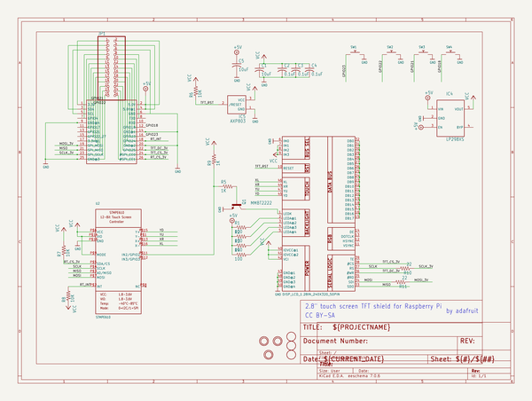
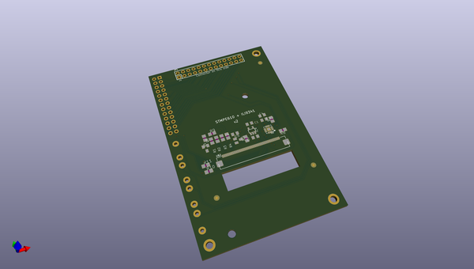
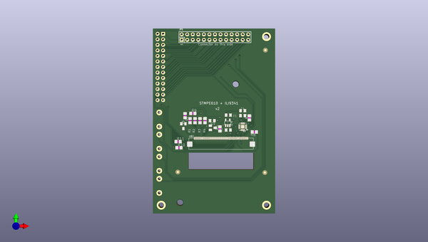
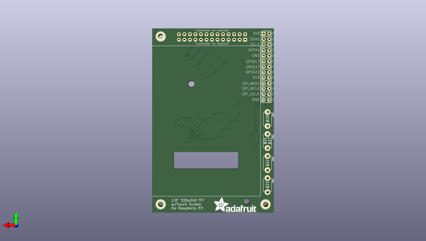

# adafruit_pitft_2_8_inch_display_pcb
 
## summary 
* id: adafruit_adafruit_pitft_2_8_inch_display_pcb_adafruit_pitft_2_8inch_resistive_pcb
* user: adafruit
* name: adafruit_pitft_2_8_inch_display_pcb
* board: adafruit_pitft_2_8inch_resistive_pcb
* repo: https://github.com/adafruit/Adafruit-PiTFT-2.8-inch-Display-PCB

* src_file_repo_sch: 
* src_file_repo_sch_link: https://github.com/adafruit/Adafruit-PiTFT-2.8-inch-Display-PCB/tree/master/
* full details link: https://github.com/oomlout/oomlout_oomp_project_bot_v_2/tree/main/projects/adafruit_adafruit_pitft_2_8_inch_display_pcb_adafruit_pitft_2_8inch_resistive_pcb/current_version/working  

## schematic  
  
[schematic (pdf)](working_schematic.pdf) 

## pcb  
 
  
  
  
[board (pdf)](working.pdf)  

## working_bom
| Id | Designator | Footprint | Quantity | Designation | Supplier and ref |  | None | 
| --- | --- | --- | --- | --- | --- | --- | --- | 
| 1 | C3,C2,C4 | C0805K | 3 | 0.1uF |  |  | [''] | 
| 2 | R6,R7,R8 | R0805 | 3 | 10K |  |  | [''] | 
| 3 | Q1 | SOT23-BEC | 1 | MMBT2222 |  |  | [''] | 
| 4 | R11,R10 | R0805 | 2 | 22 |  |  | [''] | 
| 5 | R1,R3,R2,R4 | R0805 | 4 | 100 |  |  | [''] | 
| 6 | C5,C1 | C0805K | 2 | 10uF |  |  | [''] | 
| 7 | IC4 | SOT23-5L | 1 | MIC5225-3.3 |  |  | [''] | 
| 8 | U$10,U$11,U$18 | FIDUCIAL_1MM | 3 | FIDUCIAL |  |  | [''] | 
| 9 | R9,R5 | R0805 | 2 | 1K |  |  | [''] | 
| 10 | U2 | QFN16_3MM | 1 | STMPE610 |  |  | [''] | 
| 11 | IC5 | SOT23 | 1 | AXP803 |  |  | [''] | 
| 12 | JP1 | 2X13 | 1 |  |  |  | [''] | 
| 13 | U$16,U$17,U$15 | MOUNTINGHOLE_2.5_PLATED_THICK | 3 | MOUNTINGHOLE2.5_THICK |  |  | [''] | 
| 14 | U$2 | TFT_2.83IN_240X320_50PIN | 1 | DISP_LCD_1.28IN_240X320_50PIN |  |  | [''] | 
| 15 | SW1,SW2,SW4,SW3 | TACT_PANA-EVQ | 4 |  |  |  | [''] | 
| 16 | U$3 | RASPBERRYPIV2_SHIELD | 1 | RASPBERRYPI_B_MODELB_V2 |  |  | [''] | 
| 17 | U$23 | ADAFRUIT_TEXT_20MM | 1 |  |  |  | [''] | 

## bom_schematic
| Ref | Qnty | Value | Cmp name | Footprint | Description | Vendor | DNP | 
| --- | --- | --- | --- | --- | --- | --- | --- | 
| C1, C5 | 2 | 10uF | C-USC0805K | working:C0805K |  |  |  | 
| C2, C3, C4 | 3 | 0.1uF | C-USC0805K | working:C0805K |  |  |  | 
| IC4 | 1 | LP298XS | LP298XS | working:SOT23-5L |  |  |  | 
| IC5 | 1 | AXP803 | AXP083-SAG | working:SOT23 |  |  |  | 
| JP1 | 1 | HEADER-2X13 | HEADER-2X13 | working:2X13 |  |  |  | 
| Q1 | 1 | MMBT2222 | -NPN-SOT23-BEC | working:SOT23-BEC |  |  |  | 
| R1, R2, R3, R4 | 4 | 100 | R-US_R0805 | working:R0805 |  |  |  | 
| R5, R9 | 2 | 1K | R-US_R0805 | working:R0805 |  |  |  | 
| R6, R7, R8 | 3 | 10K | R-US_R0805 | working:R0805 |  |  |  | 
| R10, R11 | 2 | 22 | R-US_R0805 | working:R0805 |  |  |  | 
| SW1, SW2, SW3, SW4 | 4 | SWITCH_PUSHBUTTONEVQ-PE | SWITCH_PUSHBUTTONEVQ-PE | working:TACT_PANA-EVQ |  |  |  | 
| U2 | 1 | STMPE610 | STMPE610 | working:QFN16_3MM |  |  |  | 
| U$2 | 1 | DISP_LCD_1.28IN_240X320_50PIN | DISP_LCD_1.28IN_240X320_50PIN | working:TFT_2.83IN_240X320_50PIN |  |  |  | 
| U$3 | 1 | RASPBERRYPI_B_MODELB_V2 | RASPBERRYPI_B_MODELB_V2 | working:RASPBERRYPIV2_SHIELD |  |  |  | 
| U$10, U$11, U$18 | 3 | FIDUCIAL | FIDUCIAL | working:FIDUCIAL_1MM |  |  |  | 
| U$15, U$16, U$17 | 3 | MOUNTINGHOLE2.5_THICK | MOUNTINGHOLE2.5_THICK | working:MOUNTINGHOLE_2.5_PLATED_THICK |  |  |  | 

