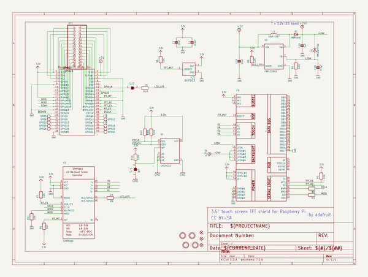
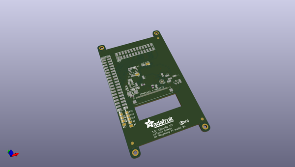
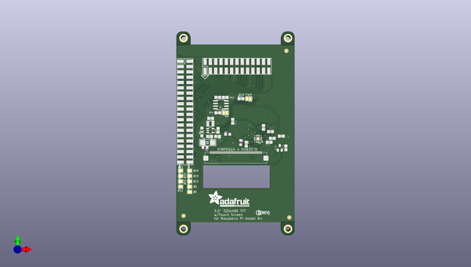
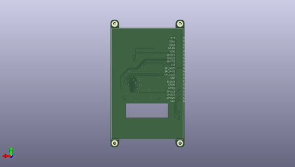

# adafruit_pitft_3_5_plus_pcb
 
## summary 
* id: adafruit_adafruit_pitft_3_5_plus_pcb_adafruit_pitft_plus_3_5in
* user: adafruit
* name: adafruit_pitft_3_5_plus_pcb
* board: adafruit_pitft_plus_3_5in
* repo: https://github.com/adafruit/Adafruit-PiTFT-3.5-Plus-PCB

* src_file_repo_sch: 
* src_file_repo_sch_link: https://github.com/adafruit/Adafruit-PiTFT-3.5-Plus-PCB/tree/master/
* full details link: https://github.com/oomlout/oomlout_oomp_project_bot_v_2/tree/main/projects/adafruit_adafruit_pitft_3_5_plus_pcb_adafruit_pitft_plus_3_5in/current_version/working  

## schematic  
  
[schematic (pdf)](working_schematic.pdf)  

## pcb  
 
  
  
  
[board (pdf)](working.pdf)  

## working_bom
| Id | Designator | Footprint | Quantity | Designation | Supplier and ref |  | None | 
| --- | --- | --- | --- | --- | --- | --- | --- | 
| 1 | U2 | QFN16_3MM | 1 | STMPE610 |  |  | [''] | 
| 2 | @HOLE20,@HOLE17,@HOLE3,@HOLE23,@HOLE21,@HOLE26,@HOLE14,@HOLE12,@HOLE8,@HOLE2,@HOLE27,@HOLE10,@HOLE5,@HOLE13,@HOLE22,@HOLE0,@HOLE25,@HOLE15,@HOLE6,@HOLE11,@HOLE19,@HOLE9,@HOLE18,@HOLE1,@HOLE16,@HOLE7,@HOLE24,@HOLE4 |  | 28 |  |  |  | [''] | 
| 3 | C1,C16 | 0805-NO | 2 | 10uF |  |  | [''] | 
| 4 | U3 | SOT23-5@1 | 1 | FAN5333BSX |  |  | [''] | 
| 5 | R2,R11,R5,R6,R7 | 0805-NO | 5 | 10K |  |  | [''] | 
| 6 | GPIO26,GPIO5,GPIO20,GPIO21,GPIO6,GPIO16,GPIO12,GPIO13,GPIO19 | PAD-1.5X2.0 | 9 |  |  |  | [''] | 
| 7 | D2 | SOD-123 | 1 | MBR0540 |  |  | [''] | 
| 8 | U1 | SOIC8_150MIL | 1 | CAT24C32 |  |  | [''] | 
| 9 | L1 | INDUCTOR_1007 | 1 | 10uH 1007 |  |  | [''] | 
| 10 | R10 | 0805-NO | 1 | 1K |  |  | [''] | 
| 11 | D1 | SMADIODE | 1 | MM3Z24VT1G |  |  | [''] | 
| 12 | U$23 | ADAFRUIT_TEXT_20MM | 1 |  |  |  | [''] | 
| 13 | U$10,U$11,U$18 | FIDUCIAL_1MM | 3 | FIDUCIAL" |  |  | [''] | 
| 14 | R13,R12,R14 | 0805-NO | 3 | 3.9K |  |  | [''] | 
| 15 | SJ2 | SOLDERJUMPER_CLOSEDWIRE | 1 |  |  |  | [''] | 
| 16 | C20 | _0805MP | 1 | 1uF |  |  | [''] | 
| 17 | IC5 | SOT23 | 1 | AXP803 |  |  | [''] | 
| 18 | R4 | 0805-NO | 1 | 12 |  |  | [''] | 
| 19 | C4,C18 | 0805-NO | 2 | 0.1uF |  |  | [''] | 
| 20 | SJ1 | SOLDERJUMPER_CLOSEDWIRE | 1 | WP |  |  | [''] | 
| 21 | R8 | 0805-NO | 1 | DNP |  |  | [''] | 
| 22 | R1 | 0805-NO | 1 | 12Ω |  |  | [''] | 
| 23 | R9 | _0805MP | 1 | 1K |  |  | [''] | 
| 24 | U$19 | PCBFEAT-REV-056 | 1 |  |  |  | [''] | 
| 25 | R3 | _0805MP | 1 | 12 |  |  | [''] | 
| 26 | JP1 | 2X13_SMT_MALE | 1 |  |  |  | [''] | 
| 27 | X1 | TFT_3.5IN_320X480_50PIN | 1 |  |  |  | [''] | 
| 28 | U$20,U$15,U$17,U$16 | MOUNTINGHOLE_2.5_PLATED_THICK | 4 | MOUNTINGHOLE2.5_THICK |  |  | [''] | 
| 29 | RPI1 | RASPBERRYPI_BPLUS_SHIELD_SMT | 1 | RASPBERRYPI_BPLUS_SMT |  |  | [''] | 

## bom_schematic
| Ref | Qnty | Value | Cmp name | Footprint | Description | Vendor | DNP | 
| --- | --- | --- | --- | --- | --- | --- | --- | 
| C1, C16 | 2 | 10uF | CAP_CERAMIC0805-NOOUTLINE | working:0805-NO |  |  |  | 
| C4, C18 | 2 | 0.1uF | CAP_CERAMIC0805-NOOUTLINE | working:0805-NO |  |  |  | 
| C20 | 1 | 1uF | CAP_CERAMIC_0805MP | working:_0805MP |  |  |  | 
| D1 | 1 | MM3Z24VT1G | DIODESMA | working:SMADIODE |  |  |  | 
| D2 | 1 | MBR0540 | DIODESOD-123 | working:SOD-123 |  |  |  | 
| GPIO5, GPIO6, GPIO12, GPIO13, GPIO16, GPIO19, GPIO20, GPIO21, GPIO26 | 9 | TESTPOINT1.5X2.0MM_NOCREAM | TESTPOINT1.5X2.0MM_NOCREAM | working:PAD-1.5X2.0 |  |  |  | 
| IC5 | 1 | AXP803 | AXP083-SAG | working:SOT23 |  |  |  | 
| JP1 | 1 | HEADER-2X13-SMT | HEADER-2X13-SMT | working:2X13_SMT_MALE |  |  |  | 
| L1 | 1 | 10uH 1007 | INDUCTOR | working:INDUCTOR_1007 |  |  |  | 
| R1 | 1 | 12Ω | RESISTOR0805_NOOUTLINE | working:0805-NO |  |  |  | 
| R2, R5, R6, R7, R11 | 5 | 10K | RESISTOR0805_NOOUTLINE | working:0805-NO |  |  |  | 
| R3 | 1 | 12 | RESISTOR_0805MP | working:_0805MP |  |  |  | 
| R4 | 1 | 12 | RESISTOR0805_NOOUTLINE | working:0805-NO |  |  |  | 
| R8 | 1 | DNP | RESISTOR0805_NOOUTLINE | working:0805-NO |  |  |  | 
| R9 | 1 | 1K | RESISTOR_0805MP | working:_0805MP |  |  |  | 
| R10 | 1 | 1K | RESISTOR0805_NOOUTLINE | working:0805-NO |  |  |  | 
| R12, R13, R14 | 3 | 3.9K | RESISTOR0805_NOOUTLINE | working:0805-NO |  |  |  | 
| RPI1 | 1 | RASPBERRYPI_BPLUS_SMT | RASPBERRYPI_BPLUS_SMT | working:RASPBERRYPI_BPLUS_SHIELD_SMT |  |  |  | 
| SJ1 | 1 | WP | SOLDERJUMPER_CLOSED | working:SOLDERJUMPER_CLOSEDWIRE |  |  |  | 
| SJ2 | 1 | SOLDERJUMPERCLOSED | SOLDERJUMPERCLOSED | working:SOLDERJUMPER_CLOSEDWIRE |  |  |  | 
| U1 | 1 | CAT24C32 | EEPROM_I2C_SOIC8_GENERIC | working:SOIC8_150MIL |  |  |  | 
| U2 | 1 | STMPE610 | STMPE610 | working:QFN16_3MM |  |  |  | 
| U3 | 1 | FAN5333BSX | FAN5331 | working:SOT23-5@1 |  |  |  | 
| U$10, U$11, U$18 | 3 | FIDUCIAL"" | FIDUCIAL{dblquote}{dblquote} | working:FIDUCIAL_1MM |  |  |  | 
| U$15, U$16, U$17, U$20 | 4 | MOUNTINGHOLE2.5_THICK | MOUNTINGHOLE2.5_THICK | working:MOUNTINGHOLE_2.5_PLATED_THICK |  |  |  | 
| X1 | 1 | DISP_LCD_3.5IN_320X480_50PIN | DISP_LCD_3.5IN_320X480_50PIN | working:TFT_3.5IN_320X480_50PIN |  |  |  | 

