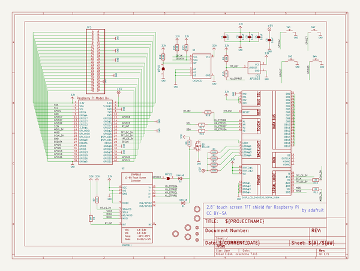
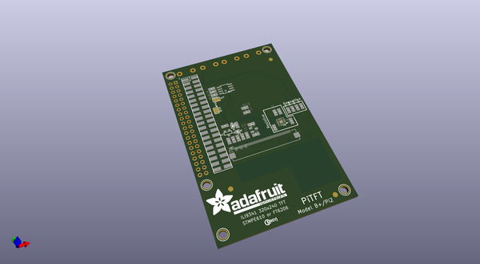
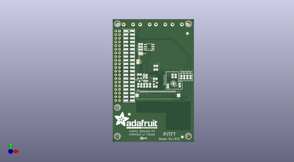
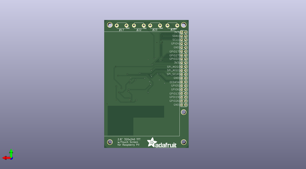

# adafruit_pitft_plus_2_8_pcb
 
## summary 
* id: adafruit_adafruit_pitft_plus_2_8_pcb_adafruit_pitft_2_8in
* user: adafruit
* name: adafruit_pitft_plus_2_8_pcb
* board: adafruit_pitft_2_8in
* repo: https://github.com/adafruit/Adafruit-PiTFT-Plus-2.8-PCB

* src_file_repo_sch: 
* src_file_repo_sch_link: https://github.com/adafruit/Adafruit-PiTFT-Plus-2.8-PCB/tree/master/
* full details link: https://github.com/oomlout/oomlout_oomp_project_bot_v_2/tree/main/projects/adafruit_adafruit_pitft_plus_2_8_pcb_adafruit_pitft_2_8in/current_version/working  

## schematic  
  
[schematic (pdf)](working_schematic.pdf)  

## pcb  
 
  
  
  
[board (pdf)](working.pdf)  

## working_bom
| Id | Designator | Footprint | Quantity | Designation | Supplier and ref |  | None | 
| --- | --- | --- | --- | --- | --- | --- | --- | 
| 1 | U$15,U$3,U$17,U$40,U$16 | MOUNTINGHOLE_3.0_PLATEDTHIN | 5 | MOUNTINGHOLE3.0THIN |  |  | [''] | 
| 2 | R1,R2,R4,R3 | 0805-NO | 4 | 100 |  |  | [''] | 
| 3 | R13,R12,R14,R9 | 0805-NO | 4 | 3.9K |  |  | [''] | 
| 4 | R18,R16,R15,R17 | 0805-NO | 4 | 0 |  |  | [''] | 
| 5 | D1,D2 | SOD-323 | 2 | 1N4148 |  |  | [''] | 
| 6 | R6,R7 | 0805-NO | 2 | 10K |  |  | [''] | 
| 7 | IC5 | SOT23 | 1 | APX803 |  |  | [''] | 
| 8 | U$12 | PCBFEAT-REV-040 | 1 |  |  |  | [''] | 
| 9 | U$18,U$10,U$11 | FIDUCIAL_1MM | 3 | FIDUCIAL" |  |  | [''] | 
| 10 | R11,R10 | 0805-NO | 2 | 22 |  |  | [''] | 
| 11 | JP3 | 2X20_SMT_MALE | 1 |  |  |  | [''] | 
| 12 | U2 | QFN16_3MM | 1 | STMPE811 |  |  | [''] | 
| 13 | WPJ1,WPJ0 | SOLDERJUMPER_CLOSEDWIRE | 2 |  |  |  | [''] | 
| 14 | C3,C4,C2 | 0805-NO | 3 | 0.1uF |  |  | [''] | 
| 15 | U1 | SOIC8_150MIL | 1 | CAT24C32 |  |  | [''] | 
| 16 | R8 | 0805-NO | 1 | DNP |  |  | [''] | 
| 17 | U$42 | ADAFRUIT_TEXT_30MM | 1 |  |  |  | [''] | 
| 18 | C1,C5 | 0805-NO | 2 | 10uF |  |  | [''] | 
| 19 | Q2 | SOT23-WIDE | 1 | BSS138 |  |  | [''] | 
| 20 | SW2,SW4,SW3,SW1 | TACT_PANA-EVQ | 4 |  |  |  | [''] | 
| 21 | U$23 | ADAFRUIT_TEXT_20MM | 1 |  |  |  | [''] | 
| 22 | U$2 | TFT_2.83IN_240X320_50PIN | 1 | DISP_LCD_240X320_50PIN_2.8IN |  |  | [''] | 
| 23 | RPI1 | RASPBERRYPI_BPLUS_SHIELD_NODIM | 1 | RASPBERRYPI_BPLUS_SHIELD_NODIM |  |  | [''] | 

## bom_schematic
| Ref | Qnty | Value | Cmp name | Footprint | Description | Vendor | DNP | 
| --- | --- | --- | --- | --- | --- | --- | --- | 
| C1, C5 | 2 | 10uF | CAP_CERAMIC0805-NOOUTLINE | working:0805-NO |  |  |  | 
| C2, C3, C4 | 3 | 0.1uF | CAP_CERAMIC0805-NOOUTLINE | working:0805-NO |  |  |  | 
| D1, D2 | 2 | 1N4148 | DIODESOD-323 | working:SOD-323 |  |  |  | 
| IC5 | 1 | APX803 | AXP083-SAG | working:SOT23 |  |  |  | 
| JP3 | 1 | PINHD-2X20_SMT | PINHD-2X20_SMT | working:2X20_SMT_MALE |  |  |  | 
| Q2 | 1 | BSS138 | MOSFET-NWIDE | working:SOT23-WIDE |  |  |  | 
| R1, R2, R3, R4 | 4 | 100 | RESISTOR0805_NOOUTLINE | working:0805-NO |  |  |  | 
| R6, R7 | 2 | 10K | RESISTOR0805_NOOUTLINE | working:0805-NO |  |  |  | 
| R8 | 1 | DNP | RESISTOR0805_NOOUTLINE | working:0805-NO |  |  |  | 
| R9, R12, R13, R14 | 4 | 3.9K | RESISTOR0805_NOOUTLINE | working:0805-NO |  |  |  | 
| R10, R11 | 2 | 22 | RESISTOR0805_NOOUTLINE | working:0805-NO |  |  |  | 
| R15, R16, R17, R18 | 4 | 0 | RESISTOR0805_NOOUTLINE | working:0805-NO |  |  |  | 
| RPI1 | 1 | RASPBERRYPI_BPLUS_SHIELD_NODIM | RASPBERRYPI_BPLUS_SHIELD_NODIM | working:RASPBERRYPI_BPLUS_SHIELD_NODIM |  |  |  | 
| SW1, SW2, SW3, SW4 | 4 | SWITCH_PUSHBUTTONEVQ-PE | SWITCH_PUSHBUTTONEVQ-PE | working:TACT_PANA-EVQ |  |  |  | 
| U1 | 1 | CAT24C32 | EEPROM_I2C_SOIC8_GENERIC | working:SOIC8_150MIL |  |  |  | 
| U2 | 1 | STMPE811 | STMPE610 | working:QFN16_3MM |  |  |  | 
| U$2 | 1 | DISP_LCD_240X320_50PIN_2.8IN | DISP_LCD_240X320_50PIN_2.8IN | working:TFT_2.83IN_240X320_50PIN |  |  |  | 
| U$3, U$15, U$16, U$17, U$40 | 5 | MOUNTINGHOLE3.0THIN | MOUNTINGHOLE3.0THIN | working:MOUNTINGHOLE_3.0_PLATEDTHIN |  |  |  | 
| U$10, U$11, U$18 | 3 | FIDUCIAL"" | FIDUCIAL{dblquote}{dblquote} | working:FIDUCIAL_1MM |  |  |  | 
| WPJ0, WPJ1 | 2 | SOLDERJUMPERCLOSED | SOLDERJUMPERCLOSED | working:SOLDERJUMPER_CLOSEDWIRE |  |  |  | 

## mounting_holes
| x | y | package | value | ref | size | 
| --- | --- | --- | --- | --- | --- | 
| 0.02539999999999054 | 77.90179999999998 | MOUNTINGHOLE_3.0_PLATEDTHIN | MOUNTINGHOLE3.0THIN | U$3 | m3 | 
| 49.022000000000006 | 77.90179999999998 | MOUNTINGHOLE_3.0_PLATEDTHIN | MOUNTINGHOLE3.0THIN | U$15 | m3 | 
| 48.99659999999999 | 0.0 | MOUNTINGHOLE_3.0_PLATEDTHIN | MOUNTINGHOLE3.0THIN | U$16 | m3 | 
| 0.0 | 0.0 | MOUNTINGHOLE_3.0_PLATEDTHIN | MOUNTINGHOLE3.0THIN | U$17 | m3 | 
| 0.02539999999999054 | 19.913599999999988 | MOUNTINGHOLE_3.0_PLATEDTHIN | MOUNTINGHOLE3.0THIN | U$40 | m3 | 

