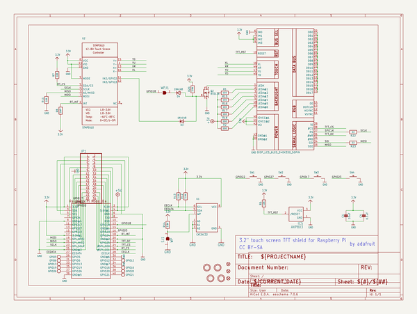
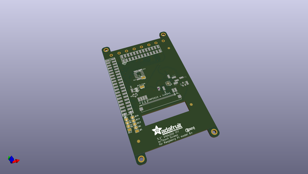
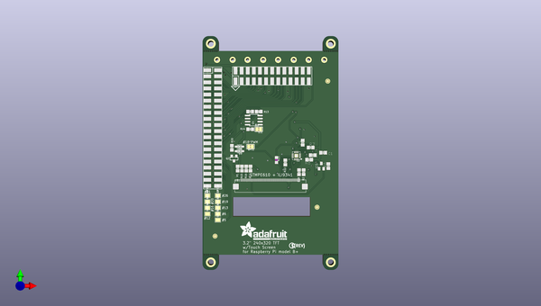
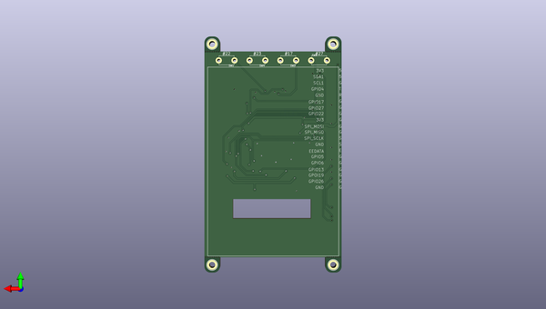

# adafruit_pitft_plus_3_2_pcb
 
## summary 
* id: adafruit_adafruit_pitft_plus_3_2_pcb_adafruit_pitft_3_2in
* user: adafruit
* name: adafruit_pitft_plus_3_2_pcb
* board: adafruit_pitft_3_2in
* repo: https://github.com/adafruit/Adafruit-PiTFT-Plus-3.2-PCB

* src_file_repo_sch: 
* src_file_repo_sch_link: https://github.com/adafruit/Adafruit-PiTFT-Plus-3.2-PCB/tree/master/
* full details link: https://github.com/oomlout/oomlout_oomp_project_bot_v_2/tree/main/projects/adafruit_adafruit_pitft_plus_3_2_pcb_adafruit_pitft_3_2in/current_version/working  

## schematic  
  
[schematic (pdf)](working_schematic.pdf) 

## pcb  
 
  
  
  
[board (pdf)](working.pdf)  

## working_bom
| Id | Designator | Footprint | Quantity | Designation | Supplier and ref |  | None | 
| --- | --- | --- | --- | --- | --- | --- | --- | 
| 1 | @HOLE10,@HOLE11,@HOLE26,@HOLE25,@HOLE17,@HOLE18,@HOLE22,@HOLE24,@HOLE21,@HOLE6,@HOLE0,@HOLE8,@HOLE3,@HOLE13,@HOLE12,@HOLE5,@HOLE15,@HOLE4,@HOLE23,@HOLE2,@HOLE14,@HOLE20,@HOLE27,@HOLE9,@HOLE7,@HOLE16,@HOLE1,@HOLE19 |  | 28 |  |  |  | [''] | 
| 2 | C4 | 0805-NO | 1 | 0.1uF |  |  | [''] | 
| 3 | R15,R2,R17,R16,R1,R18 | 0805-NO | 6 | 100 |  |  | [''] | 
| 4 | D4,D3 | SOD-323 | 2 | 1N4148 |  |  | [''] | 
| 5 | R12,R13,R14,R20 | 0805-NO | 4 | 3.9K |  |  | [''] | 
| 6 | GPIO5,GPIO12,GPIO26,GPIO6,GPIO13,GPIO20,GPIO19,GPIO21,GPIO16 | PAD-1.5X2.0 | 9 |  |  |  | [''] | 
| 7 | Q2 | SOT23-WIDE | 1 | BSS138 |  |  | [''] | 
| 8 | R6,R11,R7 | 0805-NO | 3 | 10K |  |  | [''] | 
| 9 | R23 | _0805MP | 1 | 22 |  |  | [''] | 
| 10 | WPJ1 | SOLDERJUMPER_CLOSEDWIRE | 1 |  |  |  | [''] | 
| 11 | JP1 | 2X13_SMT_MALE | 1 |  |  |  | [''] | 
| 12 | R8 | 0805-NO | 1 | DNP |  |  | [''] | 
| 13 | U$19 | PCBFEAT-REV-056 | 1 |  |  |  | [''] | 
| 14 | R22 | 0805-NO | 1 | 22 |  |  | [''] | 
| 15 | U$23 | ADAFRUIT_TEXT_20MM | 1 |  |  |  | [''] | 
| 16 | U2 | QFN16_3MM | 1 | STMPE610 |  |  | [''] | 
| 17 | SJ1 | SOLDERJUMPER_CLOSEDWIRE | 1 | WP |  |  | [''] | 
| 18 | U$11,U$18,U$10 | FIDUCIAL_1MM | 3 | FIDUCIAL" |  |  | [''] | 
| 19 | C1 | 0805-NO | 1 | 10uF |  |  | [''] | 
| 20 | IC5 | SOT23 | 1 | AXP803 |  |  | [''] | 
| 21 | U1 | SOIC8_150MIL | 1 | CAT24C32 |  |  | [''] | 
| 22 | U$17,U$15,U$20,U$16 | MOUNTINGHOLE_2.5_PLATED_THICK | 4 | MOUNTINGHOLE2.5_THICK |  |  | [''] | 
| 23 | SW3,SW4,SW1,SW2 | TACT_PANA-EVQ | 4 |  |  |  | [''] | 
| 24 | RPI1 | RASPBERRYPI_BPLUS_SHIELD_SMT | 1 | RASPBERRYPI_BPLUS_SMT |  |  | [''] | 
| 25 | U$1 | TFT_3.2IN_240X320_50PIN | 1 | DISP_LCD_6LED_240X320_50PIN |  |  | [''] | 

## bom_schematic
| Ref | Qnty | Value | Cmp name | Footprint | Description | Vendor | DNP | 
| --- | --- | --- | --- | --- | --- | --- | --- | 
| C1 | 1 | 10uF | CAP_CERAMIC0805-NOOUTLINE | working:0805-NO |  |  |  | 
| C4 | 1 | 0.1uF | CAP_CERAMIC0805-NOOUTLINE | working:0805-NO |  |  |  | 
| D3, D4 | 2 | 1N4148 | DIODESOD-323 | working:SOD-323 |  |  |  | 
| GPIO5, GPIO6, GPIO12, GPIO13, GPIO16, GPIO19, GPIO20, GPIO21, GPIO26 | 9 | TESTPOINT1.5X2.0MM_NOCREAM | TESTPOINT1.5X2.0MM_NOCREAM | working:PAD-1.5X2.0 |  |  |  | 
| IC5 | 1 | AXP803 | AXP083-SAG | working:SOT23 |  |  |  | 
| JP1 | 1 | HEADER-2X13-SMT | HEADER-2X13-SMT | working:2X13_SMT_MALE |  |  |  | 
| Q2 | 1 | BSS138 | MOSFET-NWIDE | working:SOT23-WIDE |  |  |  | 
| R1, R2, R15, R16, R17, R18 | 6 | 100 | RESISTOR0805_NOOUTLINE | working:0805-NO |  |  |  | 
| R6, R7, R11 | 3 | 10K | RESISTOR0805_NOOUTLINE | working:0805-NO |  |  |  | 
| R8 | 1 | DNP | RESISTOR0805_NOOUTLINE | working:0805-NO |  |  |  | 
| R12, R13, R14, R20 | 4 | 3.9K | RESISTOR0805_NOOUTLINE | working:0805-NO |  |  |  | 
| R22 | 1 | 22 | RESISTOR0805_NOOUTLINE | working:0805-NO |  |  |  | 
| R23 | 1 | 22 | RESISTOR_0805MP | working:_0805MP |  |  |  | 
| RPI1 | 1 | RASPBERRYPI_BPLUS_SMT | RASPBERRYPI_BPLUS_SMT | working:RASPBERRYPI_BPLUS_SHIELD_SMT |  |  |  | 
| SJ1 | 1 | WP | SOLDERJUMPER_CLOSED | working:SOLDERJUMPER_CLOSEDWIRE |  |  |  | 
| SW1, SW2, SW3, SW4 | 4 | SWITCH_PUSHBUTTONEVQ-PE | SWITCH_PUSHBUTTONEVQ-PE | working:TACT_PANA-EVQ |  |  |  | 
| U1 | 1 | CAT24C32 | EEPROM_I2C_SOIC8_GENERIC | working:SOIC8_150MIL |  |  |  | 
| U2 | 1 | STMPE610 | STMPE610 | working:QFN16_3MM |  |  |  | 
| U$1 | 1 | DISP_LCD_6LED_240X320_50PIN | DISP_LCD_6LED_240X320_50PIN | working:TFT_3.2IN_240X320_50PIN |  |  |  | 
| U$10, U$11, U$18 | 3 | FIDUCIAL"" | FIDUCIAL{dblquote}{dblquote} | working:FIDUCIAL_1MM |  |  |  | 
| U$15, U$16, U$17, U$20 | 4 | MOUNTINGHOLE2.5_THICK | MOUNTINGHOLE2.5_THICK | working:MOUNTINGHOLE_2.5_PLATED_THICK |  |  |  | 
| WPJ1 | 1 | SOLDERJUMPERCLOSED | SOLDERJUMPERCLOSED | working:SOLDERJUMPER_CLOSEDWIRE |  |  |  | 

