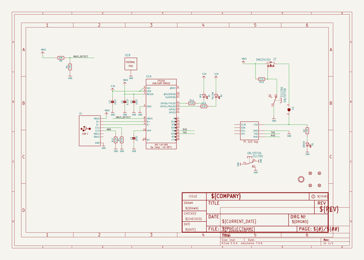
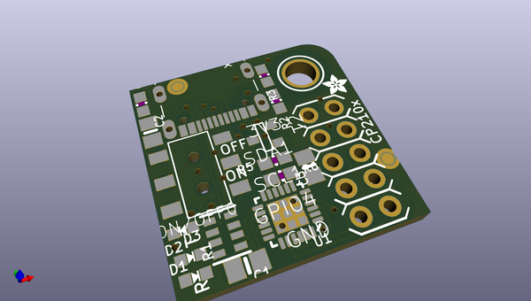
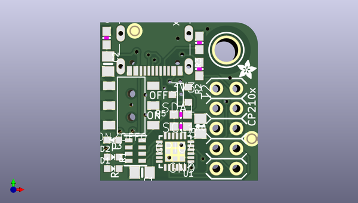
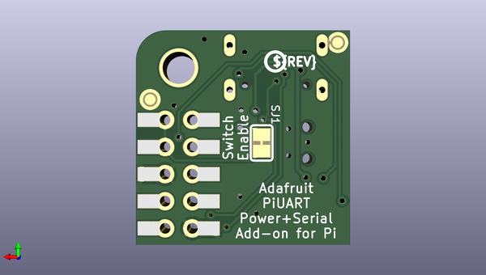

# adafruit_piuart_pcb
 
## summary 
* id: adafruit_adafruit_piuart_pcb_adafruit_piuart_usb_micro
* user: adafruit
* name: adafruit_piuart_pcb
* board: adafruit_piuart_usb_micro
* repo: https://github.com/adafruit/Adafruit-PiUART-PCB

* src_file_repo_sch: 
* src_file_repo_sch_link: https://github.com/adafruit/Adafruit-PiUART-PCB/tree/master/
* full details link: https://github.com/oomlout/oomlout_oomp_project_bot_v_2/tree/main/projects/adafruit_adafruit_piuart_pcb_adafruit_piuart_usb_micro/current_version/working  

## schematic  
  
[schematic (pdf)](working_schematic.pdf) 

## pcb  
 
  
  
  
[board (pdf)](working.pdf)  

## working_bom
| Id | Designator | Footprint | Quantity | Designation | Supplier and ref |  | None | 
| --- | --- | --- | --- | --- | --- | --- | --- | 
| 1 | U$18 | MOUNTINGHOLE_3.0_PLATEDTHIN | 1 | MOUNTINGHOLE3.0THIN |  |  | [''] | 
| 2 | R5,R2 | 0603-NO | 2 | 47K |  |  | [''] | 
| 3 | X2 | USB_C_CUSB31-CFM2AX-01-X | 1 |  |  |  | [''] | 
| 4 | C4 | 0603-NO | 1 | 0.1uF |  |  | [''] | 
| 5 | U$8 | ADAFRUIT_2.5MM | 1 |  |  |  | [''] | 
| 6 | C2,C1,C3 | 0805-NO | 3 | 10uF |  |  | [''] | 
| 7 | U$9 | RASPBERRYPI_2X5_THMSMT | 1 | RASPBERRYPI_2X5 |  |  | [''] | 
| 8 | R1 | RESPACK_4X0603 | 1 | 5.1K |  |  | [''] | 
| 9 | T2 | SOT-23 | 1 | DMG3415U |  |  | [''] | 
| 10 | R3 | 0603-NO | 1 | 5.1K |  |  | [''] | 
| 11 | U1 | QFN24_4MM_SMSC | 1 | CP2104 |  |  | [''] | 
| 12 | FID1,FID2,FID3,FID4 | FIDUCIAL_1MM | 4 | FIDUCIAL_1MM |  |  | [''] | 
| 13 | D2 | CHIPLED_0603_NOOUTLINE | 1 | YELLOW |  |  | [''] | 
| 14 | D1 | CHIPLED_0603_NOOUTLINE | 1 | RED |  |  | [''] | 
| 15 | ON/OFF0 | EG1390 | 1 | EG1390 |  |  | [''] | 
| 16 | D3 | CHIPLED_0603_NOOUTLINE | 1 | GREEN |  |  | [''] | 
| 17 | R6 | 0603-NO | 1 | 20K |  |  | [''] | 
| 18 | U$17 | PCBFEAT-REV-040 | 1 |  |  |  | [''] | 
| 19 | SJ1 | SOLDERJUMPER_CLOSEDWIRE | 1 |  |  |  | [''] | 

## bom_schematic
| Ref | Qnty | Value | Cmp name | Footprint | Description | Vendor | DNP | 
| --- | --- | --- | --- | --- | --- | --- | --- | 
| C1, C2, C3 | 3 | 10uF | CAP_CERAMIC0805-NOOUTLINE | working:0805-NO |  |  |  | 
| C4 | 1 | 0.1uF | CAP_CERAMIC0603_NO | working:0603-NO |  |  |  | 
| D1 | 1 | RED | LED0603_NOOUTLINE | working:CHIPLED_0603_NOOUTLINE |  |  |  | 
| D2 | 1 | YELLOW | LED0603_NOOUTLINE | working:CHIPLED_0603_NOOUTLINE |  |  |  | 
| D3 | 1 | GREEN | LED0603_NOOUTLINE | working:CHIPLED_0603_NOOUTLINE |  |  |  | 
| FID1, FID2, FID3, FID4 | 4 | FIDUCIAL_1MM | FIDUCIAL_1MM | working:FIDUCIAL_1MM |  |  |  | 
| ON/OFF0 | 1 | EG1390 | DPDT-EG1390 | working:EG1390 |  |  |  | 
| R1 | 1 | 5.1K | RESISTOR_4PACK | working:RESPACK_4X0603 |  |  |  | 
| R2, R5 | 2 | 47K | RESISTOR_0603_NOOUT | working:0603-NO |  |  |  | 
| R3 | 1 | 5.1K | RESISTOR_0603_NOOUT | working:0603-NO |  |  |  | 
| R6 | 1 | 20K | RESISTOR_0603_NOOUT | working:0603-NO |  |  |  | 
| SJ1 | 1 | SOLDERJUMPERCLOSED | SOLDERJUMPERCLOSED | working:SOLDERJUMPER_CLOSEDWIRE |  |  |  | 
| T2 | 1 | DMG3415U | PMOSSOT23 | working:SOT-23 |  |  |  | 
| U1 | 1 | CP2104 | CP2104 | working:QFN24_4MM_SMSC |  |  |  | 
| U$9 | 1 | RASPBERRYPI_2X5 | RASPBERRYPI_2X5 | working:RASPBERRYPI_2X5_THMSMT |  |  |  | 
| U$18 | 1 | MOUNTINGHOLE3.0THIN | MOUNTINGHOLE3.0THIN | working:MOUNTINGHOLE_3.0_PLATEDTHIN |  |  |  | 
| X2 | 1 | USB_C | USB_C | working:USB_C_CUSB31-CFM2AX-01-X |  |  |  | 

## mounting_holes
| x | y | package | value | ref | size | 
| --- | --- | --- | --- | --- | --- | 
| 0.0 | 0.0 | MOUNTINGHOLE_3.0_PLATEDTHIN | MOUNTINGHOLE3.0THIN | U$18 | m3 | 

