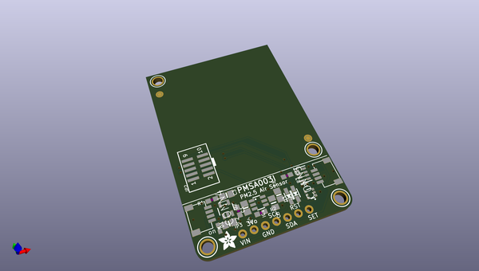

# adafruit_pmsa003i_pcb
 
## summary 
* id: adafruit_adafruit_pmsa003i_pcb_adafruit_pmsa003i
* user: adafruit
* name: adafruit_pmsa003i_pcb
* board: adafruit_pmsa003i
* repo: https://github.com/adafruit/Adafruit-PMSA003I-PCB

* src_file_repo_sch: 
* src_file_repo_sch_link: https://github.com/adafruit/Adafruit-PMSA003I-PCB/tree/master/
* full details link: https://github.com/oomlout/oomlout_oomp_project_bot_v_2/tree/main/projects/adafruit_adafruit_pmsa003i_pcb_adafruit_pmsa003i/current_version/working  

## schematic  
  
[schematic (pdf)](working_schematic.pdf) 

## pcb  
 
  
  
  
[board (pdf)](working.pdf)  

## working_bom
| Id | Designator | Footprint | Quantity | Designation | Supplier and ref |  | None | 
| --- | --- | --- | --- | --- | --- | --- | --- | 
| 1 | C6 | 0805-NO | 1 | 1uF |  |  | [''] | 
| 2 | FID3,FID4 | FIDUCIAL_1MM | 2 | FIDUCIAL_1MM |  |  | [''] | 
| 3 | IC1 | SOT23-6 | 1 | AP3602/RT9361 |  |  | [''] | 
| 4 | CONN3,CONN4 | JST_SH4 | 2 | STEMMA_I2C_QT |  |  | [''] | 
| 5 | R3 | RESPACK_4X0603 | 1 | 10K |  |  | [''] | 
| 6 | C5 | 0805_10MGAP | 1 | 10uF |  |  | [''] | 
| 7 | R4,R2 | 0603-NO | 2 | 100K |  |  | [''] | 
| 8 | C2,C3,C4 | 0805-NO | 3 | 10uF |  |  | [''] | 
| 9 | U2 | SOT23-5 | 1 | AP2112K-3.3 |  |  | [''] | 
| 10 | JP3 | 1X07_ROUND_70 | 1 |  |  |  | [''] | 
| 11 | Q2 | SOT363 | 1 | BSS138 |  |  | [''] | 
| 12 | U$1,U$21,U$17,U$19 | MOUNTINGHOLE_2.5_PLATED | 4 | MOUNTINGHOLE2.5 |  |  | [''] | 
| 13 | U$22 | ADAFRUIT_3.5MM | 1 |  |  |  | [''] | 
| 14 | D1 | CHIPLED_0603_NOOUTLINE | 1 | GREEN |  |  | [''] | 
| 15 | R1 | 0603-NO | 1 | 10K |  |  | [''] | 
| 16 | D3,D2 | SOD-323 | 2 | 1N4148 |  |  | [''] | 
| 17 | JP2 | 2X05_1.27MM_SMT | 1 |  |  |  | [''] | 
| 18 | C1 | 0603-NO | 1 | 0.1uF |  |  | [''] | 
| 19 | U$31,U$30 | STEMMAQT | 2 |  |  |  | [''] | 
| 20 | U$25 | PCBFEAT-REV-040 | 1 |  |  |  | [''] | 
| 21 | U$28 | ADAFRUIT_TEXT_20MM | 1 |  |  |  | [''] | 

## bom_schematic
| Ref | Qnty | Value | Cmp name | Footprint | Description | Vendor | DNP | 
| --- | --- | --- | --- | --- | --- | --- | --- | 
| C1 | 1 | 0.1uF | CAP_CERAMIC0603_NO | working:0603-NO |  |  |  | 
| C2, C3, C4 | 3 | 10uF | CAP_CERAMIC0805-NOOUTLINE | working:0805-NO |  |  |  | 
| C5 | 1 | 10uF | CAP_CERAMIC0805_10MGAP | working:0805_10MGAP |  |  |  | 
| C6 | 1 | 1uF | CAP_CERAMIC0805-NOOUTLINE | working:0805-NO |  |  |  | 
| CONN3, CONN4 | 2 | STEMMA_I2C_QT | STEMMA_I2C_QT | working:JST_SH4 |  |  |  | 
| D1 | 1 | GREEN | LED0603_NOOUTLINE | working:CHIPLED_0603_NOOUTLINE |  |  |  | 
| D2, D3 | 2 | 1N4148 | DIODESOD-323 | working:SOD-323 |  |  |  | 
| FID3, FID4 | 2 | FIDUCIAL_1MM | FIDUCIAL_1MM | working:FIDUCIAL_1MM |  |  |  | 
| IC1 | 1 | AP3602 | AP3602 | working:SOT23-6 |  |  |  | 
| JP2 | 1 | HEADER-2X51.27MM | HEADER-2X51.27MM | working:2X05_1.27MM_SMT |  |  |  | 
| JP3 | 1 | HEADER-1X770MIL | HEADER-1X770MIL | working:1X07_ROUND_70 |  |  |  | 
| Q2 | 1 | BSS138 | MOSFET-N_DUAL | working:SOT363 |  |  |  | 
| R1 | 1 | 10K | RESISTOR_0603_NOOUT | working:0603-NO |  |  |  | 
| R2, R4 | 2 | 100K | RESISTOR_0603_NOOUT | working:0603-NO |  |  |  | 
| R3 | 1 | 10K | RESISTOR_4PACK | working:RESPACK_4X0603 |  |  |  | 
| U2 | 1 | AP2112K-3.3 | VREG_SOT23-5 | working:SOT23-5 |  |  |  | 
| U$1, U$17, U$19, U$21 | 4 | MOUNTINGHOLE2.5 | MOUNTINGHOLE2.5 | working:MOUNTINGHOLE_2.5_PLATED |  |  |  | 

## mounting_holes
| x | y | package | value | ref | size | 
| --- | --- | --- | --- | --- | --- | 
| 0.21 | 45.76 | MOUNTINGHOLE_2.5_PLATED | MOUNTINGHOLE2.5 | U$1 | m3 | 
| 30.21 | 12.76 | MOUNTINGHOLE_2.5_PLATED | MOUNTINGHOLE2.5 | U$17 | m3 | 
| 0.0 | 0.0 | MOUNTINGHOLE_2.5_PLATED | MOUNTINGHOLE2.5 | U$19 | m3 | 
| 30.48 | 0.0 | MOUNTINGHOLE_2.5_PLATED | MOUNTINGHOLE2.5 | U$21 | m3 | 

