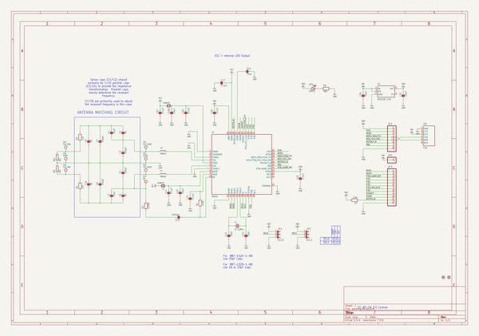
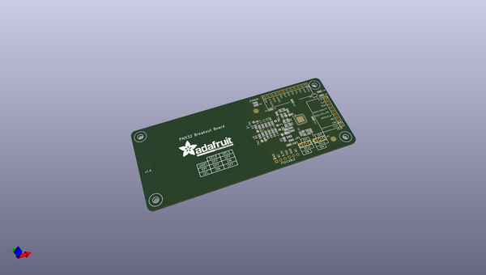
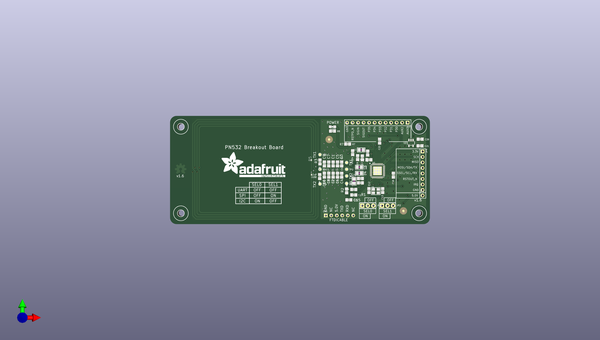
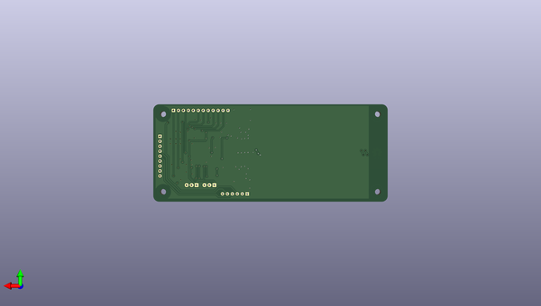

# adafruit_pn532_rfid_nfc_breakout
 
## summary 
* id: adafruit_adafruit_pn532_rfid_nfc_breakout_adafruit_pn532_breakout_v1_4
* user: adafruit
* name: adafruit_pn532_rfid_nfc_breakout
* board: adafruit_pn532_breakout_v1_4
* repo: https://github.com/adafruit/Adafruit-PN532-RFID-NFC-Breakout

* src_file_repo_sch: 
* src_file_repo_sch_link: https://github.com/adafruit/Adafruit-PN532-RFID-NFC-Breakout/tree/master/
* full details link: https://github.com/oomlout/oomlout_oomp_project_bot_v_2/tree/main/projects/adafruit_adafruit_pn532_rfid_nfc_breakout_adafruit_pn532_breakout_v1_4/current_version/working  

## schematic  
  
[schematic (pdf)](working_schematic.pdf) 

## pcb  
 
  
  
  
[board (pdf)](working.pdf)  

## working_bom
| Id | Designator | Footprint | Quantity | Designation | Supplier and ref |  | None | 
| --- | --- | --- | --- | --- | --- | --- | --- | 
| 1 | R5,R6 | R0201 | 2 | NC |  |  | [''] | 
| 2 | C9,C10,C5,C6 | 0805-NO | 4 | NC |  |  | [''] | 
| 3 | R2 | 0805-NO | 1 | 1.69K |  |  | [''] | 
| 4 | TP5 | TESTPOINT_ROUND_1MM | 1 | TX1_PRE |  |  | [''] | 
| 5 | U$1 | ADAFRUIT_TEXT_30MM | 1 |  |  |  | [''] | 
| 6 | U$6,U$36,U$38,U$37 | MOUNTINGHOLE_3.0 | 4 |  |  |  | [''] | 
| 7 | C25,C21,C22,C19,C26 | 0805-NO | 5 | 10µF |  |  | [''] | 
| 8 | C14,C16,C17,C11,C24,C23,C20 | 0805-NO | 7 | 0.1µF |  |  | [''] | 
| 9 | FID1,FID2 | FIDUCIAL-1X2.5 | 2 | FIDUCIAL1X2.5 |  |  | [''] | 
| 10 | C1,C2 | 0805-NO | 2 | 22pF |  |  | [''] | 
| 11 | TP6,TP2 | TESTPOINT_ROUND_1MM | 2 | TGND |  |  | [''] | 
| 12 | U2 | SOT23-5 | 1 | MIC5225-3.3V |  |  | [''] | 
| 13 | U$50 | OSHWLOGO_TOP_0.2 | 1 |  |  |  | [''] | 
| 14 | JP5 | 1X01_ROUND | 1 |  |  |  | [''] | 
| 15 | TP1 | TESTPOINT_ROUND_1MM | 1 | TX1_POST |  |  | [''] | 
| 16 | L2,L1 | 0805 | 2 | FERRITE |  |  | [''] | 
| 17 | C7,C8 | 0805-NO | 2 | 100pF |  |  | [''] | 
| 18 | C15 | 0805-NO | 1 | 1000pF |  |  | [''] | 
| 19 | R8 | 0805-NO | 1 | TBD |  |  | [''] | 
| 20 | LED1 | CHIPLED_0805_NOOUTLINE | 1 | GREEN |  |  | [''] | 
| 21 | CN1 | 1X06_ROUND | 1 | FTDI |  |  | [''] | 
| 22 | L3,L4 | 0805 | 2 | 560nH |  |  | [''] | 
| 23 | C4,C3 | 0805-NO | 2 | 220pF |  |  | [''] | 
| 24 | R4,R3 | 0805-NO | 2 | 1.5 |  |  | [''] | 
| 25 | JP3 | 1X12_ROUND | 1 |  |  |  | [''] | 
| 26 | R7 | 0805-NO | 1 | 10K |  |  | [''] | 
| 27 | TP4 | TESTPOINT_ROUND_1MM | 1 | TX2_PRE |  |  | [''] | 
| 28 | JP1 | JUMPER3 | 1 | SEL0 |  |  | [''] | 
| 29 | JP2 | JUMPER3 | 1 | SEL1 |  |  | [''] | 
| 30 | TP3 | TESTPOINT_ROUND_1MM | 1 | TX2_POST |  |  | [''] | 
| 31 | JP4 | 1X08_ROUND | 1 |  |  |  | [''] | 
| 32 | TP7 | TESTPOINT_ROUND_1MM | 1 | RX |  |  | [''] | 
| 33 | R1 | 0805-NO | 1 | 1.0K |  |  | [''] | 
| 34 | U1 | HVQFN40-6X6 | 1 | PN532 |  |  | [''] | 
| 35 | C12,C13 | 0805-NO | 2 | 33pF |  |  | [''] | 
| 36 | Y1 | CRYSTAL_3.2X2.5 | 1 | 27.12MHz |  |  | [''] | 

## bom_schematic
| Ref | Qnty | Value | Cmp name | Footprint | Description | Vendor | DNP | 
| --- | --- | --- | --- | --- | --- | --- | --- | 
| C1, C2 | 2 | 22pF | CAP_CERAMIC0805-NOOUTLINE | working:0805-NO |  |  |  | 
| C3, C4 | 2 | 220pF | CAP_CERAMIC0805-NOOUTLINE | working:0805-NO |  |  |  | 
| C5, C6, C9, C10 | 4 | NC | CAP_CERAMIC0805-NOOUTLINE | working:0805-NO |  |  |  | 
| C7, C8 | 2 | 100pF | CAP_CERAMIC0805-NOOUTLINE | working:0805-NO |  |  |  | 
| C11, C14, C16, C17, C20, C23, C24 | 7 | 0.1µF | CAP_CERAMIC0805-NOOUTLINE | working:0805-NO |  |  |  | 
| C12, C13 | 2 | 33pF | CAP_CERAMIC0805-NOOUTLINE | working:0805-NO |  |  |  | 
| C15 | 1 | 1000pF | CAP_CERAMIC0805-NOOUTLINE | working:0805-NO |  |  |  | 
| C19, C21, C22, C25, C26 | 5 | 10µF | CAP_CERAMIC0805-NOOUTLINE | working:0805-NO |  |  |  | 
| CN1 | 1 | FTDI | FTDIUSBCABLE | working:1X06_ROUND |  |  |  | 
| FID1, FID2 | 2 | FIDUCIAL1X2.5 | FIDUCIAL1X2.5 | working:FIDUCIAL-1X2.5 |  |  |  | 
| JP1 | 1 | SEL0 | JUMPER3 | working:JUMPER3 |  |  |  | 
| JP2 | 1 | SEL1 | JUMPER3 | working:JUMPER3 |  |  |  | 
| JP3 | 1 | HEADER-1X12 | HEADER-1X12 | working:1X12_ROUND |  |  |  | 
| JP4 | 1 | HEADER-1X8ROUND | HEADER-1X8ROUND | working:1X08_ROUND |  |  |  | 
| JP5 | 1 | HEADER-1X1ROUND | HEADER-1X1ROUND | working:1X01_ROUND |  |  |  | 
| L1, L2 | 2 | FERRITE | FERRITE0805 | working:0805 |  |  |  | 
| L3, L4 | 2 | 560nH | INDUCTOR0805 | working:0805 |  |  |  | 
| LED1 | 1 | GREEN | LED0805_NOOUTLINE | working:CHIPLED_0805_NOOUTLINE |  |  |  | 
| R1 | 1 | 1.0K | RESISTOR0805_NOOUTLINE | working:0805-NO |  |  |  | 
| R2 | 1 | 1.69K | RESISTOR0805_NOOUTLINE | working:0805-NO |  |  |  | 
| R3, R4 | 2 | 1.5 | RESISTOR0805_NOOUTLINE | working:0805-NO |  |  |  | 
| R5, R6 | 2 | NC | R-EU_R0201 | working:R0201 |  |  |  | 
| R7 | 1 | 10K | RESISTOR0805_NOOUTLINE | working:0805-NO |  |  |  | 
| R8 | 1 | TBD | RESISTOR0805_NOOUTLINE | working:0805-NO |  |  |  | 
| TP1 | 1 | TX1_POST | TESTPOINTROUND1MM | working:TESTPOINT_ROUND_1MM |  |  |  | 
| TP2, TP6 | 2 | TGND | TESTPOINTROUND1MM | working:TESTPOINT_ROUND_1MM |  |  |  | 
| TP3 | 1 | TX2_POST | TESTPOINTROUND1MM | working:TESTPOINT_ROUND_1MM |  |  |  | 
| TP4 | 1 | TX2_PRE | TESTPOINTROUND1MM | working:TESTPOINT_ROUND_1MM |  |  |  | 
| TP5 | 1 | TX1_PRE | TESTPOINTROUND1MM | working:TESTPOINT_ROUND_1MM |  |  |  | 
| TP7 | 1 | RX | TESTPOINTROUND1MM | working:TESTPOINT_ROUND_1MM |  |  |  | 
| U1 | 1 | PN532 | PN532 | working:HVQFN40-6X6 |  |  |  | 
| U2 | 1 | MIC5225-3.3V | VREG_SOT23-5 | working:SOT23-5 |  |  |  | 
| Y1 | 1 | 27.12MHz | CRYSTAL3.2X2.5 | working:CRYSTAL_3.2X2.5 |  |  |  | 

## mounting_holes
| x | y | package | value | ref | size | 
| --- | --- | --- | --- | --- | --- | 
| 0.0 | 40.0 | MOUNTINGHOLE_3.0 | nan | U$6 | m3 | 
| 0.0 | 0.0 | MOUNTINGHOLE_3.0 | nan | U$36 | m3 | 
| 110.0 | 0.0 | MOUNTINGHOLE_3.0 | nan | U$37 | m3 | 
| 110.0 | 40.0 | MOUNTINGHOLE_3.0 | nan | U$38 | m3 | 

