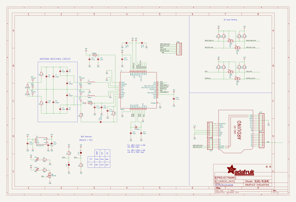
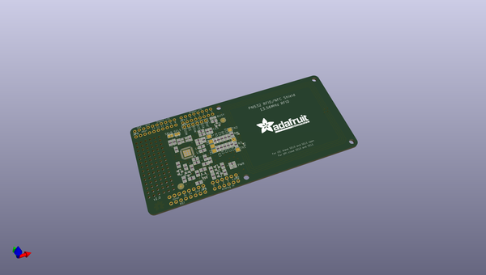
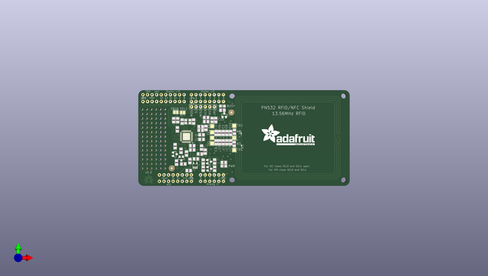
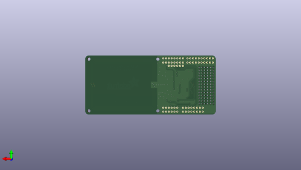

# adafruit_pn532_rfid_nfc_shield
 
## summary 
* id: adafruit_adafruit_pn532_rfid_nfc_shield_adafruit_pn532_shield_v1_3
* user: adafruit
* name: adafruit_pn532_rfid_nfc_shield
* board: adafruit_pn532_shield_v1_3
* repo: https://github.com/adafruit/Adafruit-PN532-RFID-NFC-Shield

* src_file_repo_sch: 
* src_file_repo_sch_link: https://github.com/adafruit/Adafruit-PN532-RFID-NFC-Shield/tree/master/
* full details link: https://github.com/oomlout/oomlout_oomp_project_bot_v_2/tree/main/projects/adafruit_adafruit_pn532_rfid_nfc_shield_adafruit_pn532_shield_v1_3/current_version/working  

## schematic  
  
[schematic (pdf)](working_schematic.pdf)  

## pcb  
 
  
  
  
[board (pdf)](working.pdf)  

## working_bom
| Id | Designator | Footprint | Quantity | Designation | Supplier and ref |  | None | 
| --- | --- | --- | --- | --- | --- | --- | --- | 
| 1 | C7,C8 | 0805 | 2 | 100pF |  |  | [''] | 
| 2 | Q2,Q6,Q4,Q1,Q3 | SOT23-WIDE | 5 | BSS138 |  |  | [''] | 
| 3 | L4,L3 | 0805 | 2 | 560nH |  |  | [''] | 
| 4 | R7,R16,R14,R9,R17,R13,R15,R18,R12,R11 | 0805 | 10 | 10K |  |  | [''] | 
| 5 | JP6 | 1X06-BIG | 1 |  |  |  | [''] | 
| 6 | @HOLE1,@HOLE0,@HOLE2,@HOLE3 |  | 4 |  |  |  | [''] | 
| 7 | C14,C20,C11,C17,C24,C16 | 0805 | 6 | 0.1µF |  |  | [''] | 
| 8 | JP1,JP4 | 1X08_ROUND_70 | 2 |  |  |  | [''] | 
| 9 | C21,C22,C25,C18,C19,C26 | 0805 | 6 | 10µF |  |  | [''] | 
| 10 | R10,R8 | 0805 | 2 | TBD |  |  | [''] | 
| 11 | TP6,TP2 | TESTPOINT_PAD_2MM | 2 | TGND |  |  | [''] | 
| 12 | R6,R5 | R0201 | 2 | NC |  |  | [''] | 
| 13 | U$50 | OSHWLOGO_TOP_0.2 | 1 |  |  |  | [''] | 
| 14 | L1,L2 | 0805 | 2 | FERRITE |  |  | [''] | 
| 15 | C10,C6,C5,C9 | 0805 | 4 | NC |  |  | [''] | 
| 16 | JP3 | 1X10_ROUND70 | 1 |  |  |  | [''] | 
| 17 | TP3 | TESTPOINT_PAD_2MM | 1 | TX2_POST |  |  | [''] | 
| 18 | C1,C2 | 0805 | 2 | 22pF |  |  | [''] | 
| 19 | C3,C4 | 0805 | 2 | 220pF |  |  | [''] | 
| 20 | JP2 | 1X06_ROUND_70 | 1 |  |  |  | [''] | 
| 21 | LED2 | CHIPLED_0805 | 1 | IRQ |  |  | [''] | 
| 22 | FID2,FID1 | FIDUCIAL-1X2.5 | 2 | FIDUCIAL1X2.5 |  |  | [''] | 
| 23 | TP4 | TESTPOINT_PAD_2MM | 1 | TX2_PRE |  |  | [''] | 
| 24 | C15 | 0805 | 1 | 1000pF |  |  | [''] | 
| 25 | TP5 | TESTPOINT_PAD_2MM | 1 | TX1_PRE |  |  | [''] | 
| 26 | U1 | HVQFN40-6X6 | 1 | PN532 |  |  | [''] | 
| 27 | Y1 | CRYSTAL_3.2X2.5 | 1 | 27.12MHz |  |  | [''] | 
| 28 | SJ1,SJ2 | SOLDERJUMPER_REFLOW_NOPASTE | 2 |  |  |  | [''] | 
| 29 | C12,C13 | 0805 | 2 | 33pF |  |  | [''] | 
| 30 | U$3 | ADAFRUIT_TEXT_30MM | 1 |  |  |  | [''] | 
| 31 | LED1 | CHIPLED_0805 | 1 | PWR |  |  | [''] | 
| 32 | TP1 | TESTPOINT_PAD_2MM | 1 | TX1_POST |  |  | [''] | 
| 33 | R2 | 0805 | 1 | 1.69K |  |  | [''] | 
| 34 | R4,R3 | 0805 | 2 | 1.5 |  |  | [''] | 
| 35 | TP7 | TESTPOINT_PAD_2MM | 1 | RX |  |  | [''] | 
| 36 | R1 | 0805 | 1 | 1.0K |  |  | [''] | 
| 37 | U3 | ARDUINOR3-NODIM | 1 | ARDUINOR3NODIM |  |  | [''] | 
| 38 | U2 | SOT23-5 | 1 | ADP122(3.3V) |  |  | [''] | 

## bom_schematic
| Ref | Qnty | Value | Cmp name | Footprint | Description | Vendor | DNP | 
| --- | --- | --- | --- | --- | --- | --- | --- | 
| C1, C2 | 2 | 22pF | CAP_CERAMIC0805 | working:0805 |  |  |  | 
| C3, C4 | 2 | 220pF | CAP_CERAMIC0805 | working:0805 |  |  |  | 
| C5, C6, C9, C10 | 4 | NC | CAP_CERAMIC0805 | working:0805 |  |  |  | 
| C7, C8 | 2 | 100pF | CAP_CERAMIC0805 | working:0805 |  |  |  | 
| C11, C14, C16, C17, C20, C24 | 6 | 0.1µF | CAP_CERAMIC0805 | working:0805 |  |  |  | 
| C12, C13 | 2 | 33pF | CAP_CERAMIC0805 | working:0805 |  |  |  | 
| C15 | 1 | 1000pF | CAP_CERAMIC0805 | working:0805 |  |  |  | 
| C18, C19, C21, C22, C25, C26 | 6 | 10µF | CAP_CERAMIC0805 | working:0805 |  |  |  | 
| FID1, FID2 | 2 | FIDUCIAL1X2.5 | FIDUCIAL1X2.5 | working:FIDUCIAL-1X2.5 |  |  |  | 
| JP1, JP4 | 2 | HEADER-1X870MIL | HEADER-1X870MIL | working:1X08_ROUND_70 |  |  |  | 
| JP2 | 1 | HEADER-1X670MIL | HEADER-1X670MIL | working:1X06_ROUND_70 |  |  |  | 
| JP3 | 1 | HEADER-1X1070MIL | HEADER-1X1070MIL | working:1X10_ROUND70 |  |  |  | 
| JP6 | 1 | PINHD-1X6B | PINHD-1X6B | working:1X06-BIG |  |  |  | 
| L1, L2 | 2 | FERRITE | FERRITE0805 | working:0805 |  |  |  | 
| L3, L4 | 2 | 560nH | INDUCTOR0805 | working:0805 |  |  |  | 
| LED1 | 1 | PWR | LED0805 | working:CHIPLED_0805 |  |  |  | 
| LED2 | 1 | IRQ | LED0805 | working:CHIPLED_0805 |  |  |  | 
| Q1, Q2, Q3, Q4, Q6 | 5 | BSS138 | MOSFET-NWIDE | working:SOT23-WIDE |  |  |  | 
| R1 | 1 | 1.0K | RESISTOR0805 | working:0805 |  |  |  | 
| R2 | 1 | 1.69K | RESISTOR0805 | working:0805 |  |  |  | 
| R3, R4 | 2 | 1.5 | RESISTOR0805 | working:0805 |  |  |  | 
| R5, R6 | 2 | NC | R-EU_R0201 | working:R0201 |  |  |  | 
| R7, R9, R11, R12, R13, R14, R15, R16, R17, R18 | 10 | 10K | RESISTOR0805 | working:0805 |  |  |  | 
| R8, R10 | 2 | TBD | RESISTOR0805 | working:0805 |  |  |  | 
| SJ1, SJ2 | 2 | SOLDERJUMPERREFLOW_NOPASTE | SOLDERJUMPERREFLOW_NOPASTE | working:SOLDERJUMPER_REFLOW_NOPASTE |  |  |  | 
| TP1 | 1 | TX1_POST | TESTPOINTPAD | working:TESTPOINT_PAD_2MM |  |  |  | 
| TP2, TP6 | 2 | TGND | TESTPOINTPAD | working:TESTPOINT_PAD_2MM |  |  |  | 
| TP3 | 1 | TX2_POST | TESTPOINTPAD | working:TESTPOINT_PAD_2MM |  |  |  | 
| TP4 | 1 | TX2_PRE | TESTPOINTPAD | working:TESTPOINT_PAD_2MM |  |  |  | 
| TP5 | 1 | TX1_PRE | TESTPOINTPAD | working:TESTPOINT_PAD_2MM |  |  |  | 
| TP7 | 1 | RX | TESTPOINTPAD | working:TESTPOINT_PAD_2MM |  |  |  | 
| U1 | 1 | PN532 | PN532 | working:HVQFN40-6X6 |  |  |  | 
| U2 | 1 | ADP122(3.3V) | VREG_SOT23-5 | working:SOT23-5 |  |  |  | 
| U3 | 1 | ARDUINOR3NODIM | ARDUINOR3NODIM | working:ARDUINOR3-NODIM |  |  |  | 
| Y1 | 1 | 27.12MHz | CRYSTALTHIN | working:CRYSTAL_3.2X2.5 |  |  |  | 

