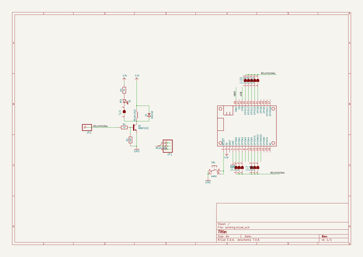
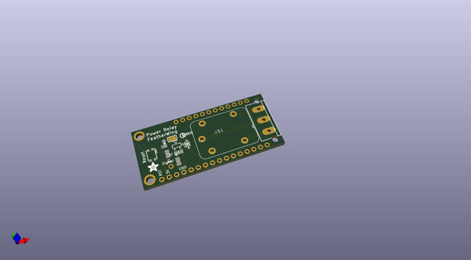
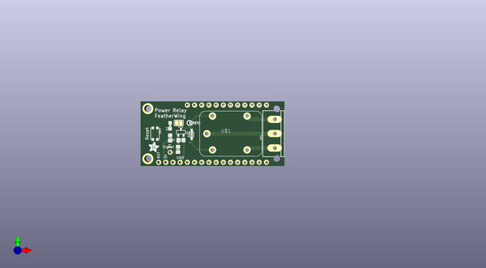
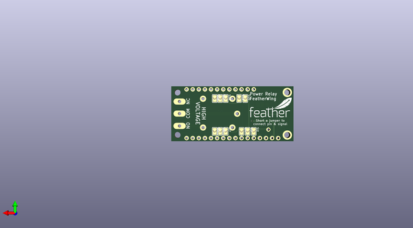

# adafruit_power_relay_featherwing_pcb
 
## summary 
* id: adafruit_adafruit_power_relay_featherwing_pcb_adafruit_powerrelay_wing
* user: adafruit
* name: adafruit_power_relay_featherwing_pcb
* board: adafruit_powerrelay_wing
* repo: https://github.com/adafruit/Adafruit-Power-Relay-FeatherWing-PCB

* src_file_repo_sch: 
* src_file_repo_sch_link: https://github.com/adafruit/Adafruit-Power-Relay-FeatherWing-PCB/tree/master/
* full details link: https://github.com/oomlout/oomlout_oomp_project_bot_v_2/tree/main/projects/adafruit_adafruit_power_relay_featherwing_pcb_adafruit_powerrelay_wing/current_version/working  

## schematic  
  
[schematic (pdf)](working_schematic.pdf) 

## pcb  
 
  
  
  
[board (pdf)](working.pdf)  

## working_bom
| Id | Designator | Footprint | Quantity | Designation | Supplier and ref |  | None | 
| --- | --- | --- | --- | --- | --- | --- | --- | 
| 1 | D1 | SOD-323 | 1 | 1N4148 |  |  | [''] | 
| 2 | U$1 | RELAY_G5LE-1 | 1 | RELAY_G5LE |  |  | [''] | 
| 3 | D2 | CHIPLED_0805_NOOUTLINE | 1 | RED |  |  | [''] | 
| 4 | SJ1 | SOLDERJUMPER_CLOSEDWIRE | 1 |  |  |  | [''] | 
| 5 | R3,R1 | 0805-NO | 2 | 1K |  |  | [''] | 
| 6 | MS2 | FEATHERWING | 1 | FEATHERWING |  |  | [''] | 
| 7 | R2 | 0805-NO | 1 | 10K |  |  | [''] | 
| 8 | U$5 | PCBFEAT-REV-040 | 1 |  |  |  | [''] | 
| 9 | SW1 | BTN_KMR2_4.6X2.8 | 1 | KMR2 |  |  | [''] | 
| 10 | JP1 | TERMBLOCK_1X3_5.08MM | 1 |  |  |  | [''] | 
| 11 | JP2 | 1X01_ROUND | 1 |  |  |  | [''] | 
| 12 | Q1 | SOT23-R | 1 | MMBT2222 |  |  | [''] | 
| 13 | U$6 | ADAFRUIT_3.5MM | 1 |  |  |  | [''] | 
| 14 | SJ20,SJ17,SJ7,SJ9,SJ19,SJ4,SJ8,SJ2,SJ18,SJ3,SJ16 | SOLDERJUMPER_ARROW_NOPASTE | 11 |  |  |  | [''] | 
| 15 | U$7 | FEATHERLOGO_MED | 1 |  |  |  | [''] | 

## bom_schematic
| Ref | Qnty | Value | Cmp name | Footprint | Description | Vendor | DNP | 
| --- | --- | --- | --- | --- | --- | --- | --- | 
| D1 | 1 | 1N4148 | DIODESOD-323 | working:SOD-323 |  |  |  | 
| D2 | 1 | RED | LED0805_NOOUTLINE | working:CHIPLED_0805_NOOUTLINE |  |  |  | 
| JP1 | 1 | HEADER-1X3_508TERM | HEADER-1X3_508TERM | working:TERMBLOCK_1X3_5.08MM |  |  |  | 
| JP2 | 1 | HEADER-1X1ROUND | HEADER-1X1ROUND | working:1X01_ROUND |  |  |  | 
| MS2 | 1 | FEATHERWING | FEATHERWING | working:FEATHERWING |  |  |  | 
| Q1 | 1 | MMBT2222 | TRANSISTOR_NPN | working:SOT23-R |  |  |  | 
| R1, R3 | 2 | 1K | RESISTOR0805_NOOUTLINE | working:0805-NO |  |  |  | 
| R2 | 1 | 10K | RESISTOR0805_NOOUTLINE | working:0805-NO |  |  |  | 
| SJ1 | 1 | SOLDERJUMPER_CLOSED | SOLDERJUMPER_CLOSED | working:SOLDERJUMPER_CLOSEDWIRE |  |  |  | 
| SJ2, SJ3, SJ4, SJ7, SJ8, SJ9, SJ16, SJ17, SJ18, SJ19, SJ20 | 11 | SOLDERJUMPER | SOLDERJUMPER | working:SOLDERJUMPER_ARROW_NOPASTE |  |  |  | 
| SW1 | 1 | KMR2 | SWITCH_TACT_SMT4.6X2.8 | working:BTN_KMR2_4.6X2.8 |  |  |  | 
| U$1 | 1 | RELAY_G5LE | RELAY_G5LE | working:RELAY_G5LE-1 |  |  |  | 

