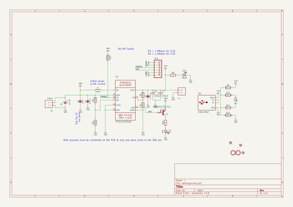
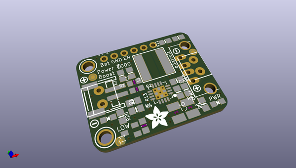
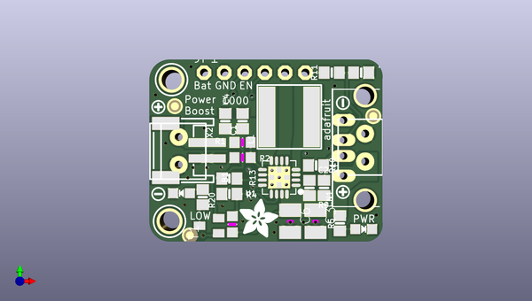
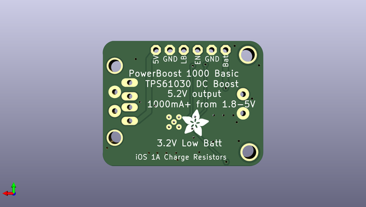

# adafruit_powerboost_1000_pcb
 
## summary 
* id: adafruit_adafruit_powerboost_1000_pcb_adafruit_powerboost_1000_basic
* user: adafruit
* name: adafruit_powerboost_1000_pcb
* board: adafruit_powerboost_1000_basic
* repo: https://github.com/adafruit/Adafruit-PowerBoost-1000-PCB

* src_file_repo_sch: 
* src_file_repo_sch_link: https://github.com/adafruit/Adafruit-PowerBoost-1000-PCB/tree/master/
* full details link: https://github.com/oomlout/oomlout_oomp_project_bot_v_2/tree/main/projects/adafruit_adafruit_powerboost_1000_pcb_adafruit_powerboost_1000_basic/current_version/working  

## schematic  
  
[schematic (pdf)](working_schematic.pdf) 

## pcb  
 
  
  
  
[board (pdf)](working.pdf)  

## working_bom
| Id | Designator | Footprint | Quantity | Designation | Supplier and ref |  | None | 
| --- | --- | --- | --- | --- | --- | --- | --- | 
| 1 | C4 | 0805-NO | 1 | 0.1uF |  |  | [''] | 
| 2 | X1 | TERMBLOCK_1X2-3.5MM | 1 |  |  |  | [''] | 
| 3 | R20,R5 | 0805-NO | 2 | 1K |  |  | [''] | 
| 4 | U$25,U$13 | SYMBOL_PLUS | 2 |  |  |  | [''] | 
| 5 | U$10,U$11 | MOUNTINGHOLE_2.5_PLATED | 2 | MOUNTINGHOLE2.5 |  |  | [''] | 
| 6 | R10,R12 | 0805-NO | 2 | 49.9K 1% |  |  | [''] | 
| 7 | LED2 | CHIPLED_0805_NOOUTLINE | 1 | GREEN |  |  | [''] | 
| 8 | U$26,U$12 | SYMBOL_MINUS | 2 |  |  |  | [''] | 
| 9 | U1 | PVQFN-16 | 1 | TPS61030RSAR |  |  | [''] | 
| 10 | C1 | 0805-NO | 1 | 10uF |  |  | [''] | 
| 11 | R3,R1 | _0805MP | 2 | 1.87M |  |  | [''] | 
| 12 | R13,R4 | 0805-NO | 2 | 200K |  |  | [''] | 
| 13 | LED1 | CHIPLED_0805_NOOUTLINE | 1 | RED |  |  | [''] | 
| 14 | R11 | 0805-NO | 1 | 75K 1% |  |  | [''] | 
| 15 | C6,C3 | C1210 | 2 | 100uF |  |  | [''] | 
| 16 | U$33,U$28 | ADAFRUIT_5MM | 2 |  |  |  | [''] | 
| 17 | R2 | _0805MP | 1 | 340K |  |  | [''] | 
| 18 | C2 | 0805-NO | 1 | 2.2uF |  |  | [''] | 
| 19 | FID3,FID1,FID2 | FIDUCIAL_1MM | 3 | FIDUCIAL" |  |  | [''] | 
| 20 | L1 | INDUCTOR_8X8MM | 1 | 6.8uH |  |  | [''] | 
| 21 | R9 | 0805-NO | 1 | 43K 1% |  |  | [''] | 
| 22 | CN1 | USB_HOST-PTH | 1 | USBA_FEMALE |  |  | [''] | 
| 23 | T1 | SC59-BEC | 1 | MMUN2133LT1G |  |  | [''] | 
| 24 | B1 | JSTPH2 | 1 | 1.8-5V |  |  | [''] | 
| 25 | X2 | TERMBLOCK_1X2-3.5MM | 1 | 3.5mm |  |  | [''] | 
| 26 | JP1 | 1X06-CLEANBIG | 1 |  |  |  | [''] | 

## bom_schematic
| Ref | Qnty | Value | Cmp name | Footprint | Description | Vendor | DNP | 
| --- | --- | --- | --- | --- | --- | --- | --- | 
| B1 | 1 | 1.8-5V | BATTERY | working:JSTPH2 |  |  |  | 
| C1 | 1 | 10uF | CAP_CERAMIC0805-NOOUTLINE | working:0805-NO |  |  |  | 
| C2 | 1 | 2.2uF | CAP_CERAMIC0805-NOOUTLINE | working:0805-NO |  |  |  | 
| C3, C6 | 2 | 100uF | C-USC1210 | working:C1210 |  |  |  | 
| C4 | 1 | 0.1uF | CAP_CERAMIC0805-NOOUTLINE | working:0805-NO |  |  |  | 
| CN1 | 1 | USBA_FEMALE | USB_TYPEAPTHFML | working:USB_HOST-PTH |  |  |  | 
| FID1, FID2, FID3 | 3 | FIDUCIAL"" | FIDUCIAL{dblquote}{dblquote} | working:FIDUCIAL_1MM |  |  |  | 
| JP1 | 1 | PINHD-1X6CB | PINHD-1X6CB | working:1X06-CLEANBIG |  |  |  | 
| L1 | 1 | 6.8uH | INDUCTOR-8X8 | working:INDUCTOR_8X8MM |  |  |  | 
| LED1 | 1 | RED | LED0805_NOOUTLINE | working:CHIPLED_0805_NOOUTLINE |  |  |  | 
| LED2 | 1 | GREEN | LED0805_NOOUTLINE | working:CHIPLED_0805_NOOUTLINE |  |  |  | 
| R1, R3 | 2 | 1.87M | RESISTOR_0805MP | working:_0805MP |  |  |  | 
| R2 | 1 | 340K | RESISTOR_0805MP | working:_0805MP |  |  |  | 
| R4, R13 | 2 | 200K | RESISTOR0805_NOOUTLINE | working:0805-NO |  |  |  | 
| R5, R20 | 2 | 1K | RESISTOR0805_NOOUTLINE | working:0805-NO |  |  |  | 
| R9 | 1 | 43K 1% | RESISTOR0805_NOOUTLINE | working:0805-NO |  |  |  | 
| R10, R12 | 2 | 49.9K 1% | RESISTOR0805_NOOUTLINE | working:0805-NO |  |  |  | 
| R11 | 1 | 75K 1% | RESISTOR0805_NOOUTLINE | working:0805-NO |  |  |  | 
| T1 | 1 | MMUN2133LT1G | -PNP_DRIVER-SC59-BEC | working:SC59-BEC |  |  |  | 
| U1 | 1 | TPS61030RSAR | VREG_TPS6103X | working:PVQFN-16 |  |  |  | 
| U$10, U$11 | 2 | MOUNTINGHOLE2.5 | MOUNTINGHOLE2.5 | working:MOUNTINGHOLE_2.5_PLATED |  |  |  | 
| X1 | 1 | TERMBLOCK_1X2 | TERMBLOCK_1X2 | working:TERMBLOCK_1X2-3.5MM |  |  |  | 
| X2 | 1 | 3.5mm | TERMBLOCK_1X2 | working:TERMBLOCK_1X2-3.5MM |  |  |  | 

## mounting_holes
| x | y | package | value | ref | size | 
| --- | --- | --- | --- | --- | --- | 
| 0.25 | 17.78 | MOUNTINGHOLE_2.5_PLATED | MOUNTINGHOLE2.5 | U$10 | m3 | 
| 0.0 | 0.0 | MOUNTINGHOLE_2.5_PLATED | MOUNTINGHOLE2.5 | U$11 | m3 | 

