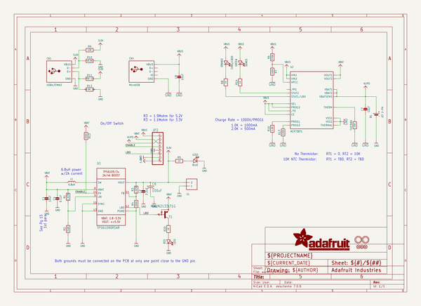
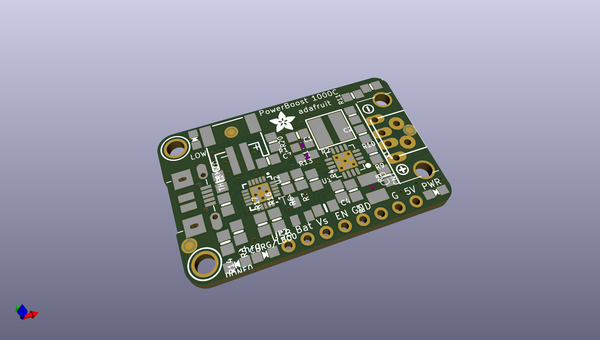
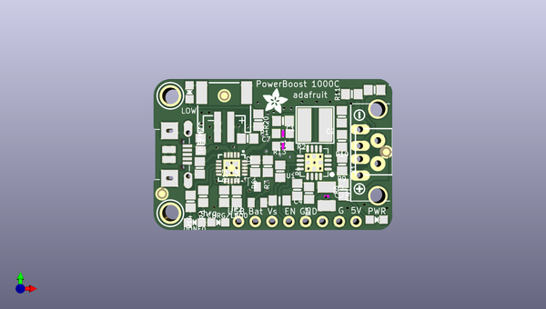
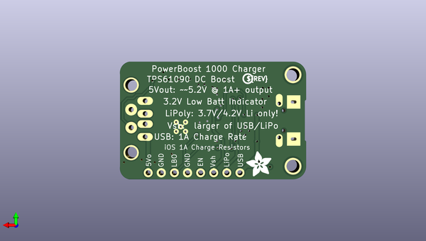

# adafruit_powerboost_1000c
 
## summary 
* id: adafruit_adafruit_powerboost_1000c_adafruit_powerboost_1000c_rev_b
* user: adafruit
* name: adafruit_powerboost_1000c
* board: adafruit_powerboost_1000c_rev_b
* repo: https://github.com/adafruit/Adafruit-PowerBoost-1000C

* src_file_repo_sch: 
* src_file_repo_sch_link: https://github.com/adafruit/Adafruit-PowerBoost-1000C/tree/master/
* full details link: https://github.com/oomlout/oomlout_oomp_project_bot_v_2/tree/main/projects/adafruit_adafruit_powerboost_1000c_adafruit_powerboost_1000c_rev_b/current_version/working  

## schematic  
  
[schematic (pdf)](working_schematic.pdf) 

## pcb  
 
  
  
  
[board (pdf)](working.pdf)  

## working_bom
| Id | Designator | Footprint | Quantity | Designation | Supplier and ref |  | None | 
| --- | --- | --- | --- | --- | --- | --- | --- | 
| 1 | B1 | JSTPH2 | 1 | JST 2-PH |  |  | [''] | 
| 2 | CHRG/LBO0 | CHIPLED_0805_NOOUTLINE | 1 | ORANGE |  |  | [''] | 
| 3 | U$11,U$10 | MOUNTINGHOLE_2.5_PLATED | 2 | MOUNTINGHOLE2.5 |  |  | [''] | 
| 4 | U$25 | SYMBOL_PLUS | 1 |  |  |  | [''] | 
| 5 | R11 | 0805-NO | 1 | 75K 1% |  |  | [''] | 
| 6 | R17,R7 | 0805-NO | 2 | 100K |  |  | [''] | 
| 7 | R16 | 0805-NO | 1 | 1.0K |  |  | [''] | 
| 8 | R20,R5,R8,R14 | 0805-NO | 4 | 1K |  |  | [''] | 
| 9 | U1 | PVQFN-16 | 1 | TPS61090RSAR |  |  | [''] | 
| 10 | R6 | 0805-NO | 1 | 270K |  |  | [''] | 
| 11 | CN4 | 4UCONN_20329 | 1 | MicroUSB |  |  | [''] | 
| 12 | R10 | 0805-NO | 1 | 49.9K |  |  | [''] | 
| 13 | DONE0 | CHIPLED_0805_NOOUTLINE | 1 | GREEN |  |  | [''] | 
| 14 | R3 | 0805-NO | 1 | 1.87M |  |  | [''] | 
| 15 | C8,C1,C7 | 0805-NO | 3 | 10uF |  |  | [''] | 
| 16 | C6 | C1210 | 1 | 100uF |  |  | [''] | 
| 17 | L1 | INDUCTOR_5X5MM_TDK_VLC5045 | 1 | 6.8uH |  |  | [''] | 
| 18 | C4 | 0805_10MGAP | 1 | 0.1uF |  |  | [''] | 
| 19 | R9 | 0805-NO | 1 | 43K |  |  | [''] | 
| 20 | R13,R4 | 0805-NO | 2 | 200K |  |  | [''] | 
| 21 | FID1,FID2,FID3 | FIDUCIAL_1MM | 3 | FIDUCIAL" |  |  | [''] | 
| 22 | U$26 | SYMBOL_MINUS | 1 |  |  |  | [''] | 
| 23 | R2 | _0805MP | 1 | 340K |  |  | [''] | 
| 24 | LED1 | CHIPLED_0805_NOOUTLINE | 1 | RED |  |  | [''] | 
| 25 | THERM0 | 0805-NO | 1 | 15K |  |  | [''] | 
| 26 | T1 | SC59-BEC | 1 | MMUN2133LT1G |  |  | [''] | 
| 27 | C2 | 0805-NO | 1 | 2.2uF |  |  | [''] | 
| 28 | R1 | _0805MP | 1 | 1.87M |  |  | [''] | 
| 29 | X1 | TERMBLOCK_1X2-3.5MM | 1 |  |  |  | [''] | 
| 30 | CN1 | USB_HOST-PTH | 1 | USBA_FEMALE |  |  | [''] | 
| 31 | JP2 | 1X08_ROUND | 1 |  |  |  | [''] | 
| 32 | U2 | QFN20_4MM | 1 | MCP73871 |  |  | [''] | 
| 33 | R12 | 0805-NO | 1 | 49.9K 1% |  |  | [''] | 
| 34 | U$45 | ADAFRUIT_3.5MM | 1 |  |  |  | [''] | 
| 35 | LED2 | CHIPLED_0805_NOOUTLINE | 1 | BLUE |  |  | [''] | 
| 36 | U$28 | ADAFRUIT_5MM | 1 |  |  |  | [''] | 
| 37 | U$12 | PCBFEAT-REV-040 | 1 |  |  |  | [''] | 

## bom_schematic
| Ref | Qnty | Value | Cmp name | Footprint | Description | Vendor | DNP | 
| --- | --- | --- | --- | --- | --- | --- | --- | 
| B1 | 1 | JST 2-PH | BATTERY | working:JSTPH2 |  |  |  | 
| C1, C7, C8 | 3 | 10uF | CAP_CERAMIC0805-NOOUTLINE | working:0805-NO |  |  |  | 
| C2 | 1 | 2.2uF | CAP_CERAMIC0805-NOOUTLINE | working:0805-NO |  |  |  | 
| C4 | 1 | 0.1uF | CAP_CERAMIC0805_10MGAP | working:0805_10MGAP |  |  |  | 
| C6 | 1 | 100uF | C-USC1210 | working:C1210 |  |  |  | 
| CHRG/LBO0 | 1 | ORANGE | LED0805_NOOUTLINE | working:CHIPLED_0805_NOOUTLINE |  |  |  | 
| CN1 | 1 | USBA_FEMALE | USB_TYPEAPTHFML | working:USB_HOST-PTH |  |  |  | 
| CN4 | 1 | MicroUSB | USBMICRO_20329 | working:4UCONN_20329 |  |  |  | 
| DONE0 | 1 | GREEN | LED0805_NOOUTLINE | working:CHIPLED_0805_NOOUTLINE |  |  |  | 
| FID1, FID2, FID3 | 3 | FIDUCIAL"" | FIDUCIAL{dblquote}{dblquote} | working:FIDUCIAL_1MM |  |  |  | 
| JP2 | 1 | HEADER-1X8ROUND | HEADER-1X8ROUND | working:1X08_ROUND |  |  |  | 
| L1 | 1 | 6.8uH | INDUCTORTDK_VLC5045 | working:INDUCTOR_5X5MM_TDK_VLC5045 |  |  |  | 
| LED1 | 1 | RED | LED0805_NOOUTLINE | working:CHIPLED_0805_NOOUTLINE |  |  |  | 
| LED2 | 1 | BLUE | LED0805_NOOUTLINE | working:CHIPLED_0805_NOOUTLINE |  |  |  | 
| R1 | 1 | 1.87M | RESISTOR_0805MP | working:_0805MP |  |  |  | 
| R2 | 1 | 340K | RESISTOR_0805MP | working:_0805MP |  |  |  | 
| R3 | 1 | 1.87M | RESISTOR0805_NOOUTLINE | working:0805-NO |  |  |  | 
| R4, R13 | 2 | 200K | RESISTOR0805_NOOUTLINE | working:0805-NO |  |  |  | 
| R5, R8, R14, R20 | 4 | 1K | RESISTOR0805_NOOUTLINE | working:0805-NO |  |  |  | 
| R6 | 1 | 270K | RESISTOR0805_NOOUTLINE | working:0805-NO |  |  |  | 
| R7, R17 | 2 | 100K | RESISTOR0805_NOOUTLINE | working:0805-NO |  |  |  | 
| R9 | 1 | 43K | RESISTOR0805_NOOUTLINE | working:0805-NO |  |  |  | 
| R10 | 1 | 49.9K | RESISTOR0805_NOOUTLINE | working:0805-NO |  |  |  | 
| R11 | 1 | 75K 1% | RESISTOR0805_NOOUTLINE | working:0805-NO |  |  |  | 
| R12 | 1 | 49.9K 1% | RESISTOR0805_NOOUTLINE | working:0805-NO |  |  |  | 
| R16 | 1 | 1.0K | RESISTOR0805_NOOUTLINE | working:0805-NO |  |  |  | 
| T1 | 1 | MMUN2133LT1G | -PNP_DRIVER-SC59-BEC | working:SC59-BEC |  |  |  | 
| THERM0 | 1 | 15K | RESISTOR0805_NOOUTLINE | working:0805-NO |  |  |  | 
| U1 | 1 | TPS61090RSAR | VREG_TPS6103X | working:PVQFN-16 |  |  |  | 
| U2 | 1 | MCP73871 | MCP73871 | working:QFN20_4MM |  |  |  | 
| U$10, U$11 | 2 | MOUNTINGHOLE2.5 | MOUNTINGHOLE2.5 | working:MOUNTINGHOLE_2.5_PLATED |  |  |  | 
| X1 | 1 | TERMBLOCK_1X2 | TERMBLOCK_1X2 | working:TERMBLOCK_1X2-3.5MM |  |  |  | 

## mounting_holes
| x | y | package | value | ref | size | 
| --- | --- | --- | --- | --- | --- | 
| 0.0 | 17.78 | MOUNTINGHOLE_2.5_PLATED | MOUNTINGHOLE2.5 | U$10 | m3 | 
| 0.0 | 0.0 | MOUNTINGHOLE_2.5_PLATED | MOUNTINGHOLE2.5 | U$11 | m3 | 

