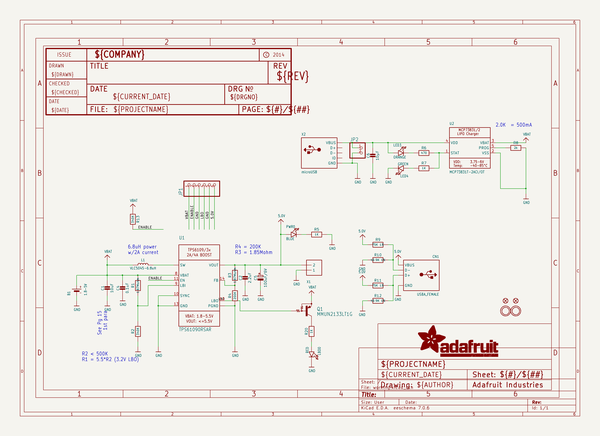
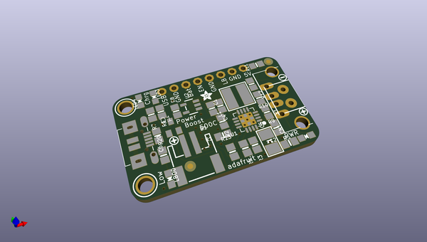
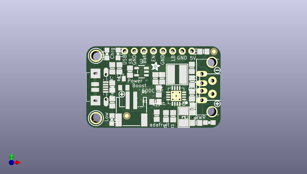
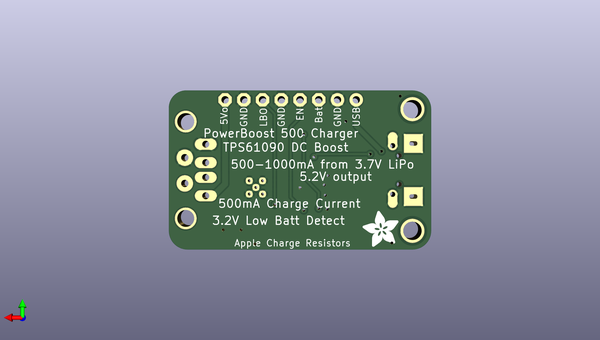

# adafruit_powerboost_500_charger_pcb
 
## summary 
* id: adafruit_adafruit_powerboost_500_charger_pcb_adafruit_powerboost_500c
* user: adafruit
* name: adafruit_powerboost_500_charger_pcb
* board: adafruit_powerboost_500c
* repo: https://github.com/adafruit/Adafruit-PowerBoost-500-Charger-PCB

* src_file_repo_sch: 
* src_file_repo_sch_link: https://github.com/adafruit/Adafruit-PowerBoost-500-Charger-PCB/tree/master/
* full details link: https://github.com/oomlout/oomlout_oomp_project_bot_v_2/tree/main/projects/adafruit_adafruit_powerboost_500_charger_pcb_adafruit_powerboost_500c/current_version/working  

## schematic  
  
[schematic (pdf)](working_schematic.pdf) 

## pcb  
 
  
  
  
[board (pdf)](working.pdf)  

## working_bom
| Id | Designator | Footprint | Quantity | Designation | Supplier and ref |  | None | 
| --- | --- | --- | --- | --- | --- | --- | --- | 
| 1 | U$26 | SYMBOL_MINUS | 1 |  |  |  | [''] | 
| 2 | R3,R1 | 0805-NO | 2 | 1.87Mohm |  |  | [''] | 
| 3 | U$13,U$25 | SYMBOL_PLUS | 2 |  |  |  | [''] | 
| 4 | R13,R2 | 0805-NO | 2 | 340K |  |  | [''] | 
| 5 | U$12,U$10 | MOUNTINGHOLE_2.5_PLATED | 2 | MOUNTINGHOLE2.5 |  |  | [''] | 
| 6 | R6 | 0805-NO | 1 | 470 |  |  | [''] | 
| 7 | R10,R12 | 0805-NO | 2 | 49.9K 1% |  |  | [''] | 
| 8 | FID3,FID2 | FIDUCIAL_1MM | 2 | FIDUCIAL" |  |  | [''] | 
| 9 | C2 | 0805-NO | 1 | 2.2uF |  |  | [''] | 
| 10 | PWR0 | CHIPLED_0805_NOOUTLINE | 1 | BLUE |  |  | [''] | 
| 11 | C6 | 0805-NO | 1 | 10µF |  |  | [''] | 
| 12 | LED4 | CHIPLED_0805_NOOUTLINE | 1 | GREEN |  |  | [''] | 
| 13 | R9,R11 | 0805-NO | 2 | 75K 1% |  |  | [''] | 
| 14 | Q1 | SC59-BEC | 1 | MMUN2133LT1G |  |  | [''] | 
| 15 | R7,R20,R5 | 0805-NO | 3 | 1K |  |  | [''] | 
| 16 | U1 | PVQFN-16 | 1 | TPS61090RSAR |  |  | [''] | 
| 17 | B1 | JSTPH2 | 1 | 1.8-5V |  |  | [''] | 
| 18 | U2 | SOT23-5 | 1 | MCP73831T-2ACI/OT |  |  | [''] | 
| 19 | X2 | 4UCONN_20329 | 1 | microUSB |  |  | [''] | 
| 20 | C5 | EIA3528-21_B-R | 1 | 100uF/6V |  |  | [''] | 
| 21 | R4 | 0805-NO | 1 | 200K |  |  | [''] | 
| 22 | JP1 | 1X06-CLEANBIG | 1 |  |  |  | [''] | 
| 23 | JP2 | 1X02_ROUND | 1 |  |  |  | [''] | 
| 24 | R8 | 0805-NO | 1 | 2k |  |  | [''] | 
| 25 | CN1 | USB_HOST-PTH | 1 | USBA_FEMALE |  |  | [''] | 
| 26 | LBO0 | CHIPLED_0805_NOOUTLINE | 1 | RED |  |  | [''] | 
| 27 | L1 | INDUCTOR_5X5MM_TDK_VLC5045 | 1 | VLC5045-6.8uH |  |  | [''] | 
| 28 | U$28 | ADAFRUIT_2.5MM | 1 |  |  |  | [''] | 
| 29 | C4 | 0805-NO | 1 | 0.1uF |  |  | [''] | 
| 30 | C1 | 0805-NO | 1 | 10uF |  |  | [''] | 
| 31 | LED3 | CHIPLED_0805_NOOUTLINE | 1 | ORANGE |  |  | [''] | 
| 32 | X1 | TERMBLOCK_1X2-3.5MM | 1 |  |  |  | [''] | 
| 33 | U$29 | ADAFRUIT_5MM | 1 |  |  |  | [''] | 

## bom_schematic
| Ref | Qnty | Value | Cmp name | Footprint | Description | Vendor | DNP | 
| --- | --- | --- | --- | --- | --- | --- | --- | 
| B1 | 1 | 1.8-5V | BATTERY | working:JSTPH2 |  |  |  | 
| C1 | 1 | 10uF | CAP_CERAMIC0805-NOOUTLINE | working:0805-NO |  |  |  | 
| C2 | 1 | 2.2uF | CAP_CERAMIC0805-NOOUTLINE | working:0805-NO |  |  |  | 
| C4 | 1 | 0.1uF | CAP_CERAMIC0805-NOOUTLINE | working:0805-NO |  |  |  | 
| C5 | 1 | 100uF/6V | CAP_TANTALUMB/3528_REFLOW | working:EIA3528-21_B-R |  |  |  | 
| C6 | 1 | 10µF | CAP_CERAMIC0805-NOOUTLINE | working:0805-NO |  |  |  | 
| CN1 | 1 | USBA_FEMALE | USB_TYPEAPTHFML | working:USB_HOST-PTH |  |  |  | 
| FID2, FID3 | 2 | FIDUCIAL"" | FIDUCIAL{dblquote}{dblquote} | working:FIDUCIAL_1MM |  |  |  | 
| JP1 | 1 | PINHD-1X6CB | PINHD-1X6CB | working:1X06-CLEANBIG |  |  |  | 
| JP2 | 1 | HEADER-1X2ROUND | HEADER-1X2ROUND | working:1X02_ROUND |  |  |  | 
| L1 | 1 | VLC5045-6.8uH | INDUCTORTDK_VLC5045 | working:INDUCTOR_5X5MM_TDK_VLC5045 |  |  |  | 
| LBO0 | 1 | RED | LED0805_NOOUTLINE | working:CHIPLED_0805_NOOUTLINE |  |  |  | 
| LED3 | 1 | ORANGE | LED0805_NOOUTLINE | working:CHIPLED_0805_NOOUTLINE |  |  |  | 
| LED4 | 1 | GREEN | LED0805_NOOUTLINE | working:CHIPLED_0805_NOOUTLINE |  |  |  | 
| PWR0 | 1 | BLUE | LED0805_NOOUTLINE | working:CHIPLED_0805_NOOUTLINE |  |  |  | 
| Q1 | 1 | MMUN2133LT1G | -PNP_DRIVER-SC59-BEC | working:SC59-BEC |  |  |  | 
| R1, R3 | 2 | 1.87Mohm | RESISTOR0805_NOOUTLINE | working:0805-NO |  |  |  | 
| R2, R13 | 2 | 340K | RESISTOR0805_NOOUTLINE | working:0805-NO |  |  |  | 
| R4 | 1 | 200K | RESISTOR0805_NOOUTLINE | working:0805-NO |  |  |  | 
| R5, R7, R20 | 3 | 1K | RESISTOR0805_NOOUTLINE | working:0805-NO |  |  |  | 
| R6 | 1 | 470 | RESISTOR0805_NOOUTLINE | working:0805-NO |  |  |  | 
| R8 | 1 | 2k | RESISTOR0805_NOOUTLINE | working:0805-NO |  |  |  | 
| R9, R11 | 2 | 75K 1% | RESISTOR0805_NOOUTLINE | working:0805-NO |  |  |  | 
| R10, R12 | 2 | 49.9K 1% | RESISTOR0805_NOOUTLINE | working:0805-NO |  |  |  | 
| U1 | 1 | TPS61090RSAR | VREG_TPS6103X | working:PVQFN-16 |  |  |  | 
| U2 | 1 | MCP73831T-2ACI/OT | MCP73831/2 | working:SOT23-5 |  |  |  | 
| U$10, U$12 | 2 | MOUNTINGHOLE2.5 | MOUNTINGHOLE2.5 | working:MOUNTINGHOLE_2.5_PLATED |  |  |  | 
| X1 | 1 | TERMBLOCK_1X2 | TERMBLOCK_1X2 | working:TERMBLOCK_1X2-3.5MM |  |  |  | 
| X2 | 1 | microUSB | USBMICRO_20329 | working:4UCONN_20329 |  |  |  | 

## mounting_holes
| x | y | package | value | ref | size | 
| --- | --- | --- | --- | --- | --- | 
| 0.0 | 16.51 | MOUNTINGHOLE_2.5_PLATED | MOUNTINGHOLE2.5 | U$10 | m3 | 
| 0.0 | 0.0 | MOUNTINGHOLE_2.5_PLATED | MOUNTINGHOLE2.5 | U$12 | m3 | 

