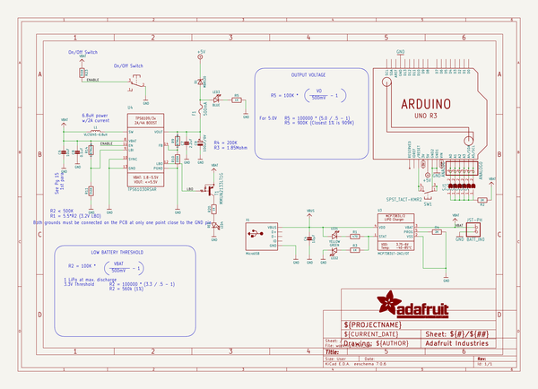

# adafruit_powerboost_500_shield_pcb
 
## summary 
* id: adafruit_adafruit_powerboost_500_shield_pcb_adafruit_powerboost_shield
* user: adafruit
* name: adafruit_powerboost_500_shield_pcb
* board: adafruit_powerboost_shield
* repo: https://github.com/adafruit/Adafruit-PowerBoost-500-Shield-PCB

* src_file_repo_sch: 
* src_file_repo_sch_link: https://github.com/adafruit/Adafruit-PowerBoost-500-Shield-PCB/tree/master/
* full details link: https://github.com/oomlout/oomlout_oomp_project_bot_v_2/tree/main/projects/adafruit_adafruit_powerboost_500_shield_pcb_adafruit_powerboost_shield/current_version/working  

## schematic  
  
[schematic (pdf)](working_schematic.pdf)  

## pcb  
 
  
  
  
[board (pdf)](working.pdf)  

## working_bom
| Id | Designator | Footprint | Quantity | Designation | Supplier and ref |  | None | 
| --- | --- | --- | --- | --- | --- | --- | --- | 
| 1 | LED3 | CHIPLED_0805_NOOUTLINE | 1 | BLUE |  |  | [''] | 
| 2 | R9,R14 | 0805-NO | 2 | 1.87Mohm |  |  | [''] | 
| 3 | R11,R23 | 0805-NO | 2 | 340K |  |  | [''] | 
| 4 | @HOLE0,@HOLE1,@HOLE2 |  | 3 |  |  |  | [''] | 
| 5 | S1 | OS102011MA1Q | 1 | OS102011MA1Q |  |  | [''] | 
| 6 | LED1 | CHIPLED_0805_NOOUTLINE | 1 | YELLOW |  |  | [''] | 
| 7 | D1 | SOD-123 | 1 | MBR120 |  |  | [''] | 
| 8 | U4 | PVQFN-16 | 1 | TPS61030RSAR |  |  | [''] | 
| 9 | R10 | 0805-NO | 1 | 200K |  |  | [''] | 
| 10 | T1 | SC59-BEC | 1 | MMUN2133LT1G |  |  | [''] | 
| 11 | C9 | EIA3528-21_B-R | 1 | 100uF/6V |  |  | [''] | 
| 12 | R5,R20,R3 | 0805-NO | 3 | 1K |  |  | [''] | 
| 13 | R1 | 0805-NO | 1 | 470 |  |  | [''] | 
| 14 | U$4,U$3 | FIDUCIAL_1MM | 2 | FIDUCIAL |  |  | [''] | 
| 15 | R4,R2 | 0805-NO | 2 | 2K |  |  | [''] | 
| 16 | C4 | 0805-NO | 1 | 10µF |  |  | [''] | 
| 17 | U$6 | ADAFRUIT_TEXT_30MM | 1 |  |  |  | [''] | 
| 18 | F1 | R1206 | 1 | 500mA |  |  | [''] | 
| 19 | L1 | INDUCTOR_5X5MM_TDK_VLC5045 | 1 | VLC5045-6.8uH |  |  | [''] | 
| 20 | X1 | 4UCONN_20329 | 1 | MicroUSB |  |  | [''] | 
| 21 | C8 | 0805-NO | 1 | 0.1uF |  |  | [''] | 
| 22 | ANALOG0 | 1X06 | 1 | ANALOG |  |  | [''] | 
| 23 | LED2 | CHIPLED_0805_NOOUTLINE | 1 | GREEN |  |  | [''] | 
| 24 | U3 | SOT23-5 | 1 | MCP73831T-2ACI/OT |  |  | [''] | 
| 25 | C6 | 0805-NO | 1 | 10uF |  |  | [''] | 
| 26 | U2 | ARDUINOR3-NOSILK | 1 | ARDUINOR3-NOSILK |  |  | [''] | 
| 27 | SW1 | KMR2 | 1 | SPST_TACT-KMR2 |  |  | [''] | 
| 28 | BATT_IN0 | JST-PH-2-SMT | 1 | JST-PH |  |  | [''] | 
| 29 | LED4 | CHIPLED_0805_NOOUTLINE | 1 | RED |  |  | [''] | 
| 30 | C7 | 0805-NO | 1 | 2.2uF |  |  | [''] | 
| 31 | SJ2,SJ1,SJ6,SJ4,SJ5,SJ3 | SOLDERJUMPER_ARROW_NOPASTE | 6 |  |  |  | [''] | 

## bom_schematic
| Ref | Qnty | Value | Cmp name | Footprint | Description | Vendor | DNP | 
| --- | --- | --- | --- | --- | --- | --- | --- | 
| ANALOG0 | 1 | ANALOG | PINHD-1X6 | working:1X06 |  |  |  | 
| BATT_IN0 | 1 | JST-PH | JST_2PIN-SMT | working:JST-PH-2-SMT |  |  |  | 
| C4 | 1 | 10µF | CAP_CERAMIC0805-NOOUTLINE | working:0805-NO |  |  |  | 
| C6 | 1 | 10uF | CAP_CERAMIC0805-NOOUTLINE | working:0805-NO |  |  |  | 
| C7 | 1 | 2.2uF | CAP_CERAMIC0805-NOOUTLINE | working:0805-NO |  |  |  | 
| C8 | 1 | 0.1uF | CAP_CERAMIC0805-NOOUTLINE | working:0805-NO |  |  |  | 
| C9 | 1 | 100uF/6V | CAP_TANTALUMB/3528_REFLOW | working:EIA3528-21_B-R |  |  |  | 
| D1 | 1 | MBR120 | DIODE-SCHOTTKYSOD-123 | working:SOD-123 |  |  |  | 
| F1 | 1 | 500mA | PTCFUSE-1206 | working:R1206 |  |  |  | 
| L1 | 1 | VLC5045-6.8uH | INDUCTORTDK_VLC5045 | working:INDUCTOR_5X5MM_TDK_VLC5045 |  |  |  | 
| LED1 | 1 | YELLOW | LED0805_NOOUTLINE | working:CHIPLED_0805_NOOUTLINE |  |  |  | 
| LED2 | 1 | GREEN | LED0805_NOOUTLINE | working:CHIPLED_0805_NOOUTLINE |  |  |  | 
| LED3 | 1 | BLUE | LED0805_NOOUTLINE | working:CHIPLED_0805_NOOUTLINE |  |  |  | 
| LED4 | 1 | RED | LED0805_NOOUTLINE | working:CHIPLED_0805_NOOUTLINE |  |  |  | 
| R1 | 1 | 470 | RESISTOR0805_NOOUTLINE | working:0805-NO |  |  |  | 
| R2, R4 | 2 | 2K | RESISTOR0805_NOOUTLINE | working:0805-NO |  |  |  | 
| R3, R5, R20 | 3 | 1K | RESISTOR0805_NOOUTLINE | working:0805-NO |  |  |  | 
| R9, R14 | 2 | 1.87Mohm | RESISTOR0805_NOOUTLINE | working:0805-NO |  |  |  | 
| R10 | 1 | 200K | RESISTOR0805_NOOUTLINE | working:0805-NO |  |  |  | 
| R11, R23 | 2 | 340K | RESISTOR0805_NOOUTLINE | working:0805-NO |  |  |  | 
| S1 | 1 | OS102011MA1Q | OS102011MA1Q | working:OS102011MA1Q |  |  |  | 
| SJ1, SJ2, SJ3, SJ4, SJ5, SJ6 | 6 | SOLDERJUMPER | SOLDERJUMPER | working:SOLDERJUMPER_ARROW_NOPASTE |  |  |  | 
| SW1 | 1 | SPST_TACT-KMR2 | SPST_TACT-KMR2 | working:KMR2 |  |  |  | 
| T1 | 1 | MMUN2133LT1G | -PNP_DRIVER-SC59-BEC | working:SC59-BEC |  |  |  | 
| U2 | 1 | ARDUINOR3-NOSILK | ARDUINOR3-NOSILK | working:ARDUINOR3-NOSILK |  |  |  | 
| U3 | 1 | MCP73831T-2ACI/OT | MCP73831/2 | working:SOT23-5 |  |  |  | 
| U4 | 1 | TPS61030RSAR | VREG_TPS6103X | working:PVQFN-16 |  |  |  | 
| U$3, U$4 | 2 | FIDUCIAL | FIDUCIAL | working:FIDUCIAL_1MM |  |  |  | 
| X1 | 1 | MicroUSB | USBMICRO_20329 | working:4UCONN_20329 |  |  |  | 

