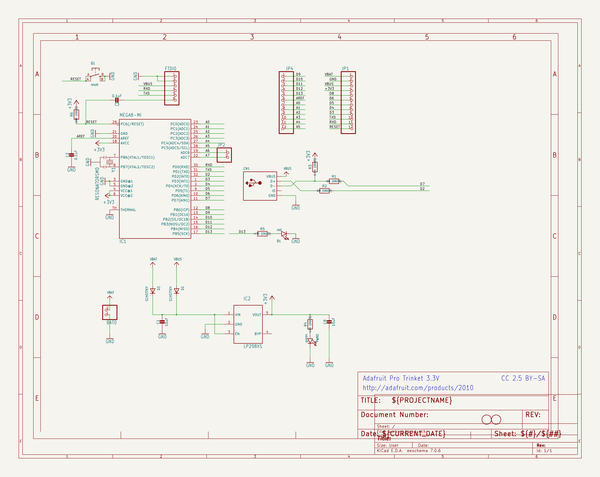
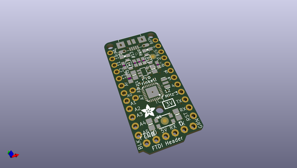
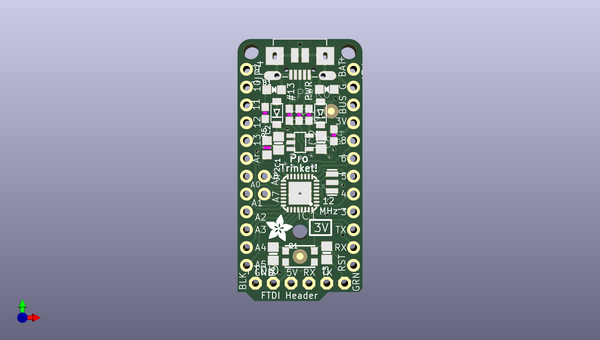
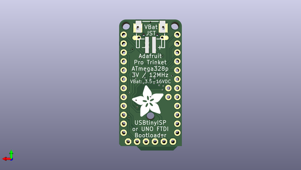

# adafruit_pro_trinket_pcbs
 
## summary 
* id: adafruit_adafruit_pro_trinket_pcbs_adafruit_pro_trinket_3v3
* user: adafruit
* name: adafruit_pro_trinket_pcbs
* board: adafruit_pro_trinket_3v3
* repo: https://github.com/adafruit/Adafruit-Pro-Trinket-PCBs

* src_file_repo_sch: 
* src_file_repo_sch_link: https://github.com/adafruit/Adafruit-Pro-Trinket-PCBs/tree/master/
* full details link: https://github.com/oomlout/oomlout_oomp_project_bot_v_2/tree/main/projects/adafruit_adafruit_pro_trinket_pcbs_adafruit_pro_trinket_3v3/current_version/working  

## schematic  
  
[schematic (pdf)](working_schematic.pdf) 

## pcb  
 
  
  
  
[board (pdf)](working.pdf)  

## working_bom
| Id | Designator | Footprint | Quantity | Designation | Supplier and ref |  | None | 
| --- | --- | --- | --- | --- | --- | --- | --- | 
| 1 | IC2 | SOT23-5L | 1 | MIC5225-3.3v |  |  | [''] | 
| 2 | D2,D3 | SOD-123FL | 2 | SCHOTTKY |  |  | [''] | 
| 3 | JP2 | 1X02_ROUND | 1 |  |  |  | [''] | 
| 4 | @HOLE1,@HOLE2,@HOLE0 |  | 3 |  |  |  | [''] | 
| 5 | IC1 | MLF32-TH | 1 | ATmega328P |  |  | [''] | 
| 6 | U$1,U$6 | FIDUCIAL_1MM | 2 | FIDUCIAL |  |  | [''] | 
| 7 | C2 | _0805MP | 1 | 0.1uF |  |  | [''] | 
| 8 | CN1 | 4UCONN_20329 | 1 |  |  |  | [''] | 
| 9 | R3 | 0603-NO | 1 | 1.5K (0603) |  |  | [''] | 
| 10 | R4,R5 | 0603-NO | 2 | 470 (0603) |  |  | [''] | 
| 11 | JP4,JP1 | 1X12-CB | 2 |  |  |  | [''] | 
| 12 | Y1 | RESONATOR-SMD | 1 | 12MHz |  |  | [''] | 
| 13 | U$7 | ADAFRUIT_3.5MM | 1 |  |  |  | [''] | 
| 14 | C3 | 0805-NO | 1 | 0.1uF |  |  | [''] | 
| 15 | PWR0 | CHIPLED_0805_NOOUTLINE | 1 | green |  |  | [''] | 
| 16 | Q1 | BTN_KMR2_4.6X2.8 | 1 | reset |  |  | [''] | 
| 17 | R1,R2 | 0603-NO | 2 | 68 (0603) |  |  | [''] | 
| 18 | C1,C8 | 0805-NO | 2 | 10uF |  |  | [''] | 
| 19 | B1 | CHIPLED_0805_NOOUTLINE | 1 | red |  |  | [''] | 
| 20 | R6 | 0805-NO | 1 | 10K (0603) |  |  | [''] | 
| 21 | FTDI0 | 1X06-CLEANBIG | 1 |  |  |  | [''] | 
| 22 | U$9 | ADAFRUIT_9MM | 1 |  |  |  | [''] | 
| 23 | BAT0 | JSTPH2 | 1 |  |  |  | [''] | 

## bom_schematic
| Ref | Qnty | Value | Cmp name | Footprint | Description | Vendor | DNP | 
| --- | --- | --- | --- | --- | --- | --- | --- | 
| B1 | 1 | red | LED0805_NOOUTLINE | working:CHIPLED_0805_NOOUTLINE |  |  |  | 
| BAT0 | 1 | CON_JST_PH_2PIN | CON_JST_PH_2PIN | working:JSTPH2 |  |  |  | 
| C1, C8 | 2 | 10uF | CAP_CERAMIC0805-NOOUTLINE | working:0805-NO |  |  |  | 
| C2 | 1 | 0.1uF | CAP_CERAMIC_0805MP | working:_0805MP |  |  |  | 
| C3 | 1 | 0.1uF | CAP_CERAMIC0805-NOOUTLINE | working:0805-NO |  |  |  | 
| CN1 | 1 | USBMICRO_20329 | USBMICRO_20329 | working:4UCONN_20329 |  |  |  | 
| D2, D3 | 2 | SCHOTTKY | DIODE_SOD-123FL | working:SOD-123FL |  |  |  | 
| FTDI0 | 1 | PINHD-1X6CB | PINHD-1X6CB | working:1X06-CLEANBIG |  |  |  | 
| IC1 | 1 | MEGA8-MI | MEGA8-MI | working:MLF32-TH |  |  |  | 
| IC2 | 1 | LP298XS | LP298XS | working:SOT23-5L |  |  |  | 
| JP1, JP4 | 2 | PINHD-1X12-CB | PINHD-1X12-CB | working:1X12-CB |  |  |  | 
| JP2 | 1 | HEADER-1X2ROUND | HEADER-1X2ROUND | working:1X02_ROUND |  |  |  | 
| PWR0 | 1 | green | LED0805_NOOUTLINE | working:CHIPLED_0805_NOOUTLINE |  |  |  | 
| Q1 | 1 | reset | SWITCH_TACT_SMT4.6X2.8 | working:BTN_KMR2_4.6X2.8 |  |  |  | 
| R1, R2 | 2 | 68 (0603) | RESISTOR_0603_NOOUT | working:0603-NO |  |  |  | 
| R3 | 1 | 1.5K (0603) | RESISTOR_0603_NOOUT | working:0603-NO |  |  |  | 
| R4, R5 | 2 | 470 (0603) | RESISTOR_0603_NOOUT | working:0603-NO |  |  |  | 
| R6 | 1 | 10K (0603) | RESISTOR0805_NOOUTLINE | working:0805-NO |  |  |  | 
| U$1, U$6 | 2 | FIDUCIAL | FIDUCIAL | working:FIDUCIAL_1MM |  |  |  | 
| Y1 | 1 | RESONATORSMD | RESONATORSMD | working:RESONATOR-SMD |  |  |  | 

