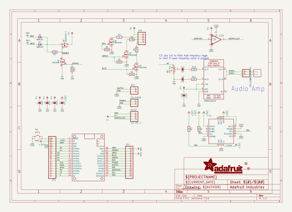
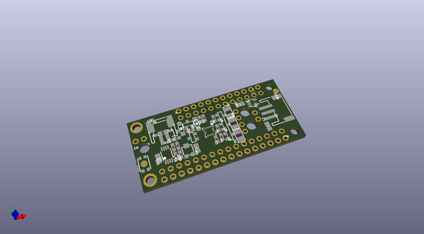
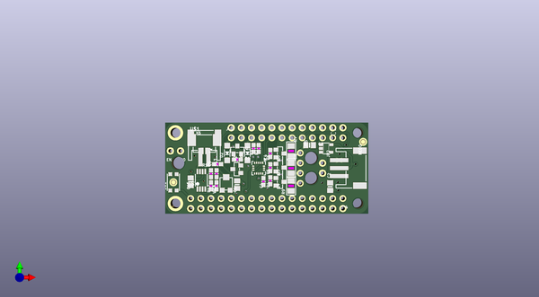
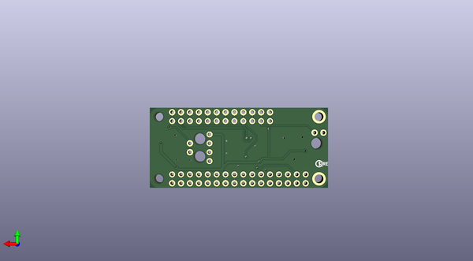

# adafruit_prop_maker_featherwing_pcb
 
## summary 
* id: adafruit_adafruit_prop_maker_featherwing_pcb_adafruit_prop_maker_featherwing
* user: adafruit
* name: adafruit_prop_maker_featherwing_pcb
* board: adafruit_prop_maker_featherwing
* repo: https://github.com/adafruit/Adafruit-Prop-Maker-FeatherWing-PCB

* src_file_repo_sch: 
* src_file_repo_sch_link: https://github.com/adafruit/Adafruit-Prop-Maker-FeatherWing-PCB/tree/master/
* full details link: https://github.com/oomlout/oomlout_oomp_project_bot_v_2/tree/main/projects/adafruit_adafruit_prop_maker_featherwing_pcb_adafruit_prop_maker_featherwing/current_version/working  

## schematic  
  
[schematic (pdf)](working_schematic.pdf) 

## pcb  
 
  
  
  
[board (pdf)](working.pdf)  

## working_bom
| Id | Designator | Footprint | Quantity | Designation | Supplier and ref |  | None | 
| --- | --- | --- | --- | --- | --- | --- | --- | 
| 1 | R4,R1,R6,R5 | 0603-NO | 4 | 100k |  |  | [''] | 
| 2 | C1,C15,C2,C3 | 0805-NO | 4 | 10uF |  |  | [''] | 
| 3 | R9,R8 | _1206 | 2 | 1.75o |  |  | [''] | 
| 4 | VR2 | TRIMPOT_BOURNS_3303W | 1 | 10K trim |  |  | [''] | 
| 5 | JP4 | 1X16_ROUND | 1 |  |  |  | [''] | 
| 6 | R2,R3 | 0603-NO | 2 | 10K |  |  | [''] | 
| 7 | R11 | 0603-NO | 1 | 100K |  |  | [''] | 
| 8 | C9,C4,C13 | 0603-NO | 3 | 1uF |  |  | [''] | 
| 9 | FID1,FID3 | FIDUCIAL_1MM | 2 | FIDUCIAL_1MM |  |  | [''] | 
| 10 | Q4,Q2,Q6,Q5 | SOT23-WIDE | 4 | DMG3406 |  |  | [''] | 
| 11 | D2,D1 | SOD-123 | 2 | MBR120 |  |  | [''] | 
| 12 | R12,R13 | 0603-NO | 2 | 100 |  |  | [''] | 
| 13 | U$14 | PROPMAKER_TOP | 1 |  |  |  | [''] | 
| 14 | X6 | JSTPH2 | 1 | CON_JST_PH_2PIN_MTPH2 |  |  | [''] | 
| 15 | @HOLE0,@HOLE2,@HOLE1 |  | 3 |  |  |  | [''] | 
| 16 | NEO0 | JSTPH3 | 1 | JST PH 3 |  |  | [''] | 
| 17 | JP2,EN_PINS0 | 1X02_ROUND | 2 |  |  |  | [''] | 
| 18 | U5 | MSOP8_0.65MM | 1 | PAM8302AASCR |  |  | [''] | 
| 19 | SW1 | BTN_KMR2_4.6X2.8 | 1 | KMR2 |  |  | [''] | 
| 20 | IC4 | LGA16_3X3MM | 1 | LIS3DH |  |  | [''] | 
| 21 | U$1 | 53398-0271 | 1 | CON_MOLEX_2P |  |  | [''] | 
| 22 | JP1 | 1X12_ROUND | 1 |  |  |  | [''] | 
| 23 | IC2 | SOT23-5 | 1 | 74AHCT1G125DBV |  |  | [''] | 
| 24 | R7 | _1206 | 1 | 3o |  |  | [''] | 
| 25 | JP5 | 1X04_ROUND | 1 |  |  |  | [''] | 
| 26 | MS1 | FEATHERWING | 1 | FEATHERWING |  |  | [''] | 
| 27 | Q3 | SOT23-WIDE | 1 | DMG3415U-7 |  |  | [''] | 
| 28 | U$15 | PCBFEAT-REV-040 | 1 |  |  |  | [''] | 
| 29 | U$6 | PROPMAKER_BOT | 1 |  |  |  | [''] | 

## bom_schematic
| Ref | Qnty | Value | Cmp name | Footprint | Description | Vendor | DNP | 
| --- | --- | --- | --- | --- | --- | --- | --- | 
| C1, C2, C3, C15 | 4 | 10uF | CAP_CERAMIC0805-NOOUTLINE | working:0805-NO |  |  |  | 
| C4, C9, C13 | 3 | 1uF | CAP_CERAMIC0603_NO | working:0603-NO |  |  |  | 
| D1, D2 | 2 | MBR120 | DIODE-SCHOTTKYSOD-123 | working:SOD-123 |  |  |  | 
| EN_PINS0 | 1 | HEADER-1X2ROUND | HEADER-1X2ROUND | working:1X02_ROUND |  |  |  | 
| FID1, FID3 | 2 | FIDUCIAL_1MM | FIDUCIAL_1MM | working:FIDUCIAL_1MM |  |  |  | 
| IC2 | 1 | 741G125DBV | 741G125DBV | working:SOT23-5 |  |  |  | 
| IC4 | 1 | LIS3DH | ACCEL_LIS3DHTR | working:LGA16_3X3MM |  |  |  | 
| JP1 | 1 | HEADER-1X12 | HEADER-1X12 | working:1X12_ROUND |  |  |  | 
| JP2 | 1 | HEADER-1X2ROUND | HEADER-1X2ROUND | working:1X02_ROUND |  |  |  | 
| JP4 | 1 | HEADER-1X16ROUND | HEADER-1X16ROUND | working:1X16_ROUND |  |  |  | 
| JP5 | 1 | HEADER-1X4ROUND | HEADER-1X4ROUND | working:1X04_ROUND |  |  |  | 
| MS1 | 1 | FEATHERWING | FEATHERWING | working:FEATHERWING |  |  |  | 
| NEO0 | 1 | JST PH 3 | CON_JST_PH_3PIN | working:JSTPH3 |  |  |  | 
| Q2, Q4, Q5, Q6 | 4 | DMG3406 | MOSFET-NWIDE | working:SOT23-WIDE |  |  |  | 
| Q3 | 1 | DMG3415U-7 | MOSFET-PWIDE | working:SOT23-WIDE |  |  |  | 
| R1, R4, R5, R6 | 4 | 100k | RESISTOR_0603_NOOUT | working:0603-NO |  |  |  | 
| R2, R3 | 2 | 10K | RESISTOR_0603_NOOUT | working:0603-NO |  |  |  | 
| R7 | 1 | 3o | RESISTOR_1206 | working:_1206 |  |  |  | 
| R8, R9 | 2 | 1.75o | RESISTOR_1206 | working:_1206 |  |  |  | 
| R11 | 1 | 100K | RESISTOR_0603_NOOUT | working:0603-NO |  |  |  | 
| R12, R13 | 2 | 100 | RESISTOR_0603_NOOUT | working:0603-NO |  |  |  | 
| SW1 | 1 | KMR2 | SWITCH_TACT_SMT4.6X2.8 | working:BTN_KMR2_4.6X2.8 |  |  |  | 
| U5 | 1 | PAM8302AASCR | AUDIOAMP_PAM8302A | working:MSOP8_0.65MM |  |  |  | 
| U$1 | 1 | CON_MOLEX_2P | CON_MOLEX_2P | working:53398-0271 |  |  |  | 
| VR2 | 1 | 10K trim | TRIMPOT3303W/X | working:TRIMPOT_BOURNS_3303W |  |  |  | 
| X6 | 1 | CON_JST_PH_2PIN_MTPH2 | CON_JST_PH_2PIN_MTPH2 | working:JSTPH2 |  |  |  | 

