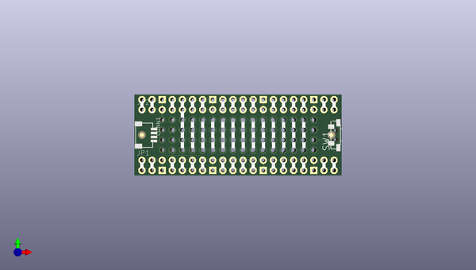

# adafruit_proto_picowbell_pcb
 
## summary 
* id: adafruit_adafruit_proto_picowbell_pcb_adafruit_proto_picowbell
* user: adafruit
* name: adafruit_proto_picowbell_pcb
* board: adafruit_proto_picowbell
* repo: https://github.com/adafruit/Adafruit-Proto-PiCowbell-PCB

* src_file_repo_sch: 
* src_file_repo_sch_link: https://github.com/adafruit/Adafruit-Proto-PiCowbell-PCB/tree/main/
* full details link: https://github.com/oomlout/oomlout_oomp_project_bot_v_2/tree/main/projects/adafruit_adafruit_proto_picowbell_pcb_adafruit_proto_picowbell/current_version/working  

## schematic  
  
[schematic (pdf)](working_schematic.pdf) 

## pcb  
 
  
  
  
[board (pdf)](working.pdf)  

## working_bom
| Id | Designator | Footprint | Quantity | Designation | Supplier and ref |  | None | 
| --- | --- | --- | --- | --- | --- | --- | --- | 
| 1 | PLABEL34 | PLABEL34 | 1 |  |  |  | [''] | 
| 2 | PLABEL18 | PLABEL18 | 1 |  |  |  | [''] | 
| 3 | PLABEL20 | PLABEL20 | 1 |  |  |  | [''] | 
| 4 | PLABEL4 | PLABEL4 | 1 |  |  |  | [''] | 
| 5 | PLABEL32 | PLABEL32 | 1 |  |  |  | [''] | 
| 6 | PLABEL17 | PLABEL17 | 1 |  |  |  | [''] | 
| 7 | CB1 | PICOWBELL | 1 | PICOWBELL_THM |  |  | [''] | 
| 8 | SW1 | SPST_TACTILE_RA | 1 | RA Tact |  |  | [''] | 
| 9 | JP1,JP2 | 1X20_ROUND_70MIL | 2 |  |  |  | [''] | 
| 10 | PLABEL1 | PLABEL1 | 1 |  |  |  | [''] | 
| 11 | PLABEL16 | PLABEL16 | 1 |  |  |  | [''] | 
| 12 | PLABEL5 | PLABEL5 | 1 |  |  |  | [''] | 
| 13 | PLABEL9 | PLABEL9 | 1 |  |  |  | [''] | 
| 14 | PLABEL15 | PLABEL15 | 1 |  |  |  | [''] | 
| 15 | PLABEL27 | PLABEL27 | 1 |  |  |  | [''] | 
| 16 | PLABEL3 | PLABEL3 | 1 |  |  |  | [''] | 
| 17 | PLABEL10 | PLABEL10 | 1 |  |  |  | [''] | 
| 18 | PLABEL25 | PLABEL25 | 1 |  |  |  | [''] | 
| 19 | FID2,FID1 | FIDUCIAL_1MM | 2 | FIDUCIAL_1MM |  |  | [''] | 
| 20 | PLABEL26 | PLABEL26 | 1 |  |  |  | [''] | 
| 21 | PLABEL23 | PLABEL23 | 1 |  |  |  | [''] | 
| 22 | PLABEL2 | PLABEL2 | 1 |  |  |  | [''] | 
| 23 | PLABEL33 | PLABEL33 | 1 |  |  |  | [''] | 
| 24 | PLABEL30 | PLABEL30 | 1 |  |  |  | [''] | 
| 25 | PLABEL28 | PLABEL28 | 1 |  |  |  | [''] | 
| 26 | PLABEL29 | PLABEL29 | 1 |  |  |  | [''] | 
| 27 | PLABEL13 | PLABEL13 | 1 |  |  |  | [''] | 
| 28 | PLABEL12 | PLABEL12 | 1 |  |  |  | [''] | 
| 29 | PLABEL8 | PLABEL8 | 1 |  |  |  | [''] | 
| 30 | PLABEL0 | PLABEL0 | 1 |  |  |  | [''] | 
| 31 | CONN1 | JST_SH4 | 1 | STEMMA_I2C_QT |  |  | [''] | 
| 32 | PLABEL11 | PLABEL11 | 1 |  |  |  | [''] | 
| 33 | PLABEL21 | PLABEL21 | 1 |  |  |  | [''] | 
| 34 | PLABEL31 | PLABEL31 | 1 |  |  |  | [''] | 
| 35 | PLABEL22 | PLABEL22 | 1 |  |  |  | [''] | 
| 36 | PLABEL24 | PLABEL24 | 1 |  |  |  | [''] | 
| 37 | PLABEL7 | PLABEL7 | 1 |  |  |  | [''] | 
| 38 | PLABEL14 | PLABEL14 | 1 |  |  |  | [''] | 
| 39 | PLABEL19 | PLABEL19 | 1 |  |  |  | [''] | 
| 40 | PLABEL6 | PLABEL6 | 1 |  |  |  | [''] | 
| 41 | PLABEL64 | PLABEL64 | 1 |  |  |  | [''] | 
| 42 | PLABEL38 | PLABEL38 | 1 |  |  |  | [''] | 
| 43 | PLABEL51 | PLABEL51 | 1 |  |  |  | [''] | 
| 44 | PLABEL58 | PLABEL58 | 1 |  |  |  | [''] | 
| 45 | PLABEL46 | PLABEL46 | 1 |  |  |  | [''] | 
| 46 | PLABEL49 | PLABEL49 | 1 |  |  |  | [''] | 
| 47 | PLABEL67 | PLABEL67 | 1 |  |  |  | [''] | 
| 48 | PLABEL39 | PLABEL39 | 1 |  |  |  | [''] | 
| 49 | PLABEL65 | PLABEL65 | 1 |  |  |  | [''] | 
| 50 | PLABEL62 | PLABEL62 | 1 |  |  |  | [''] | 
| 51 | PLABEL63 | PLABEL63 | 1 |  |  |  | [''] | 
| 52 | PLABEL36 | PLABEL36 | 1 |  |  |  | [''] | 
| 53 | PLABEL45 | PLABEL45 | 1 |  |  |  | [''] | 
| 54 | PLABEL53 | PLABEL53 | 1 |  |  |  | [''] | 
| 55 | PLABEL52 | PLABEL52 | 1 |  |  |  | [''] | 
| 56 | U$2 | ADAFRUIT_2.5MM | 1 |  |  |  | [''] | 
| 57 | PLABEL55 | PLABEL55 | 1 |  |  |  | [''] | 
| 58 | PLABEL50 | PLABEL50 | 1 |  |  |  | [''] | 
| 59 | U$6 | PCBFEAT-REV-040 | 1 |  |  |  | [''] | 
| 60 | PLABEL41 | PLABEL41 | 1 |  |  |  | [''] | 
| 61 | PLABEL47 | PLABEL47 | 1 |  |  |  | [''] | 
| 62 | PLABEL40 | PLABEL40 | 1 |  |  |  | [''] | 
| 63 | PLABEL61 | PLABEL61 | 1 |  |  |  | [''] | 
| 64 | PLABEL60 | PLABEL60 | 1 |  |  |  | [''] | 
| 65 | PLABEL54 | PLABEL54 | 1 |  |  |  | [''] | 
| 66 | PLABEL59 | PLABEL59 | 1 |  |  |  | [''] | 
| 67 | PLABEL43 | PLABEL43 | 1 |  |  |  | [''] | 
| 68 | PLABEL57 | PLABEL57 | 1 |  |  |  | [''] | 
| 69 | PLABEL44 | PLABEL44 | 1 |  |  |  | [''] | 
| 70 | PLABEL48 | PLABEL48 | 1 |  |  |  | [''] | 
| 71 | PLABEL37 | PLABEL37 | 1 |  |  |  | [''] | 
| 72 | PLABEL42 | PLABEL42 | 1 |  |  |  | [''] | 
| 73 | PLABEL56 | PLABEL56 | 1 |  |  |  | [''] | 
| 74 | PLABEL35 | PLABEL35 | 1 |  |  |  | [''] | 
| 75 | PLABEL66 | PLABEL66 | 1 |  |  |  | [''] | 

## bom_schematic
| Ref | Qnty | Value | Cmp name | Footprint | Description | Vendor | DNP | 
| --- | --- | --- | --- | --- | --- | --- | --- | 
| CB1 | 1 | PICOWBELL_THM | PICOWBELL_THM | working:PICOWBELL |  |  |  | 
| CONN1 | 1 | STEMMA_I2C_QT | STEMMA_I2C_QT | working:JST_SH4 |  |  |  | 
| FID1, FID2 | 2 | FIDUCIAL_1MM | FIDUCIAL_1MM | working:FIDUCIAL_1MM |  |  |  | 
| JP1, JP2 | 2 | HEADER-1X20_70MIL | HEADER-1X20_70MIL | working:1X20_ROUND_70MIL |  |  |  | 
| SW1 | 1 | RA Tact | SWITCH_SPST_MNT_TACT_RA | working:SPST_TACTILE_RA |  |  |  | 

