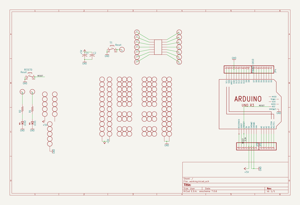
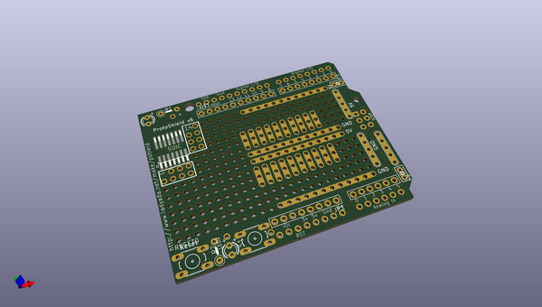

# adafruit_proto_shield_pcb
 
## summary 
* id: adafruit_adafruit_proto_shield_pcb_adafruit_proto_shield
* user: adafruit
* name: adafruit_proto_shield_pcb
* board: adafruit_proto_shield
* repo: https://github.com/adafruit/Adafruit-Proto-Shield-PCB

* src_file_repo_sch: 
* src_file_repo_sch_link: https://github.com/adafruit/Adafruit-Proto-Shield-PCB/tree/master/
* full details link: https://github.com/oomlout/oomlout_oomp_project_bot_v_2/tree/main/projects/adafruit_adafruit_proto_shield_pcb_adafruit_proto_shield/current_version/working  

## schematic  
  
[schematic (pdf)](working_schematic.pdf)  

## pcb  
 
  
  
  
[board (pdf)](working.pdf)  

## working_bom
| Id | Designator | Footprint | Quantity | Designation | Supplier and ref |  | None | 
| --- | --- | --- | --- | --- | --- | --- | --- | 
| 1 | U$6,U$35,U$7,U$4,U$19,U$34,U$16,U$8,U$39,U$25,U$38,U$2,U$41,U$37,U$40,U$27,U$9 | PERFHOLE | 17 | PERFHOLE |  |  | [''] | 
| 2 | U$1 | 1X10-BIG | 1 | PINHD-1X10 |  |  | [''] | 
| 3 | U$11,U$23,U$33,U$21,U$28,U$15,U$29,U$32,U$26,U$17,U$31,U$18,U$20,U$13,U$30,U$12,U$14,U$10,U$5,U$22 | 3-STRIP | 20 | 3-STRIP |  |  | [''] | 
| 4 | JP1,JP4 | 1X08-BIG | 2 |  |  |  | [''] | 
| 5 | C2,C1 | C025-025X050 | 2 |  |  |  | [''] | 
| 6 | @HOLE1,@HOLE0 |  | 2 |  |  |  | [''] | 
| 7 | JP9 | 1X06-BIG | 1 |  |  |  | [''] | 
| 8 | U$43,U$24,U$3 | 5-STRIP | 3 | 5-STRIP |  |  | [''] | 
| 9 | LED1,LED2 | LED3MM | 2 |  |  |  | [''] | 
| 10 | R2,R1 | 0207_5V | 2 |  |  |  | [''] | 
| 11 | M1 | ARDUINOR3_ICSP | 1 | ARDUINO_R3_ICSP |  |  | [''] | 
| 12 | S1,RESET0 | B3F-10XX | 2 | Reset |  |  | [''] | 
| 13 | IC1 | SO-14NMW | 1 | SMD-14 |  |  | [''] | 
| 14 | VCCSTRIP1,GNDSTRIP2,VCCSTRIP2,GNDSTRIP1 | 12-STRIP | 4 | 12-STRIP |  |  | [''] | 
| 15 | U$36 | ADAFRUIT_9MM | 1 |  |  |  | [''] | 

## bom_schematic
| Ref | Qnty | Value | Cmp name | Footprint | Description | Vendor | DNP | 
| --- | --- | --- | --- | --- | --- | --- | --- | 
| C1, C2 | 2 | C-US025-025X050 | C-US025-025X050 | working:C025-025X050 |  |  |  | 
| GNDSTRIP1, GNDSTRIP2 | 2 | 12-STRIP | 12-STRIP | working:12-STRIP |  |  |  | 
| IC1 | 1 | SMD-14 | SMD-14 | working:SO-14NMW |  |  |  | 
| JP1, JP4 | 2 | PINHD-1X8BIG | PINHD-1X8BIG | working:1X08-BIG |  |  |  | 
| JP9 | 1 | PINHD-1X6B | PINHD-1X6B | working:1X06-BIG |  |  |  | 
| LED1, LED2 | 2 | LED3MM | LED3MM | working:LED3MM |  |  |  | 
| M1 | 1 | ARDUINO_R3_ICSP | ARDUINO_R3_ICSP | working:ARDUINOR3_ICSP |  |  |  | 
| R1, R2 | 2 | R-US_0207/5V | R-US_0207/5V | working:0207_5V |  |  |  | 
| RESET0 | 1 | Reset | 10-XX | working:B3F-10XX |  |  |  | 
| S1 | 1 | Reset | 10-XX | working:B3F-10XX |  |  |  | 
| U$1 | 1 | PINHD-1X10 | PINHD-1X10 | working:1X10-BIG |  |  |  | 
| U$2, U$4, U$6, U$7, U$8, U$9, U$16, U$19, U$25, U$27, U$34, U$35, U$37, U$38, U$39, U$40, U$41 | 17 | PERFHOLE | PERFHOLE | working:PERFHOLE |  |  |  | 
| U$3, U$24, U$43 | 3 | 5-STRIP | 5-STRIP | working:5-STRIP |  |  |  | 
| U$5, U$10, U$11, U$12, U$13, U$14, U$15, U$17, U$18, U$20, U$21, U$22, U$23, U$26, U$28, U$29, U$30, U$31, U$32, U$33 | 20 | 3-STRIP | 3-STRIP | working:3-STRIP |  |  |  | 
| VCCSTRIP1, VCCSTRIP2 | 2 | 12-STRIP | 12-STRIP | working:12-STRIP |  |  |  | 

