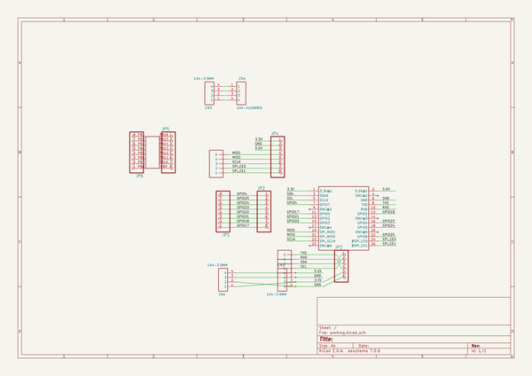
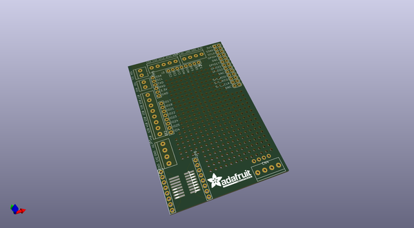
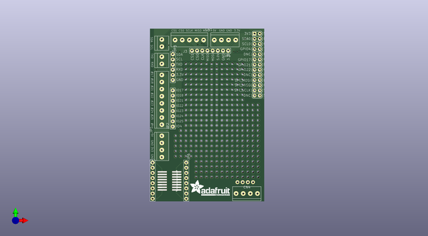
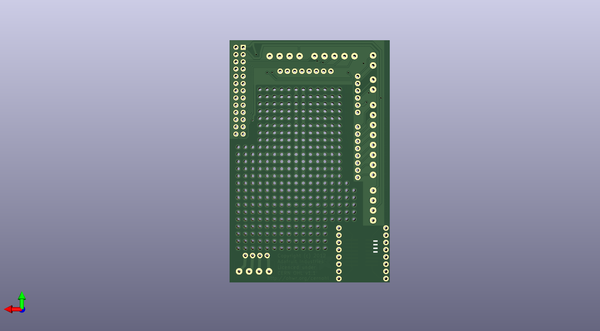

# adafruit_prototyping_pi_plate_pcb
 
## summary 
* id: adafruit_adafruit_prototyping_pi_plate_pcb_adafruit_proto_pi_plate
* user: adafruit
* name: adafruit_prototyping_pi_plate_pcb
* board: adafruit_proto_pi_plate
* repo: https://github.com/adafruit/Adafruit-Prototyping-Pi-Plate-PCB

* src_file_repo_sch: 
* src_file_repo_sch_link: https://github.com/adafruit/Adafruit-Prototyping-Pi-Plate-PCB/tree/master/
* full details link: https://github.com/oomlout/oomlout_oomp_project_bot_v_2/tree/main/projects/adafruit_adafruit_prototyping_pi_plate_pcb_adafruit_proto_pi_plate/current_version/working  

## schematic  
  
[schematic (pdf)](working_schematic.pdf) 

## pcb  
 
  
  
  
[board (pdf)](working.pdf)  

## working_bom
| Id | Designator | Footprint | Quantity | Designation | Supplier and ref |  | None | 
| --- | --- | --- | --- | --- | --- | --- | --- | 
| 1 | J3 | 1X05-3.5MM | 1 | 1X5 |  |  | [''] | 
| 2 | CN1,CN3,CN2 | 1X04-3.5MM | 3 | 1X4-3.5MM |  |  | [''] | 
| 3 | JP4,JP2,JP6,JP5 | 1X08-BIG | 4 |  |  |  | [''] | 
| 4 | JP3 | 1X06-BIG | 1 |  |  |  | [''] | 
| 5 | U$1 | RASBERRYPI_SHIELD | 1 | RASPBERRYPI_BB |  |  | [''] | 
| 6 | CN4 | 1X04-CLEANBIG | 1 | 1X4-CLEANBIG |  |  | [''] | 
| 7 | JP1 | 1X08-3.5MM | 1 |  |  |  | [''] | 
| 8 | U$3 | ADAFRUIT_TEXT_20MM | 1 |  |  |  | [''] | 
| 9 | U$2 | SO-16NMW | 1 | SMD-16SOIC |  |  | [''] | 
| 10 | J1,J2 | 1X2-3.5MM | 2 | 1X2-3.5MM |  |  | [''] | 

## bom_schematic
| Ref | Qnty | Value | Cmp name | Footprint | Description | Vendor | DNP | 
| --- | --- | --- | --- | --- | --- | --- | --- | 
| CN1, CN2, CN3 | 3 | 1X4-3.5MM | 1X4-3.5MM | working:1X04-3.5MM |  |  |  | 
| CN4 | 1 | 1X4-CLEANBIG | 1X4-CLEANBIG | working:1X04-CLEANBIG |  |  |  | 
| J1, J2 | 2 | 1X2-3.5MM | 1X2-3.5MM | working:1X2-3.5MM |  |  |  | 
| J3 | 1 | 1X5 | 1X5 | working:1X05-3.5MM |  |  |  | 
| JP1 | 1 | PINHD-1X8-3.5MM | PINHD-1X8-3.5MM | working:1X08-3.5MM |  |  |  | 
| JP2, JP4, JP5, JP6 | 4 | PINHD-1X8BIG | PINHD-1X8BIG | working:1X08-BIG |  |  |  | 
| JP3 | 1 | PINHD-1X6B | PINHD-1X6B | working:1X06-BIG |  |  |  | 
| U$1 | 1 | RASPBERRYPI_BB | RASPBERRYPI_BB | working:RASBERRYPI_SHIELD |  |  |  | 
| U$2 | 1 | SMD-16SOIC | SMD-16SOIC | working:SO-16NMW |  |  |  | 

