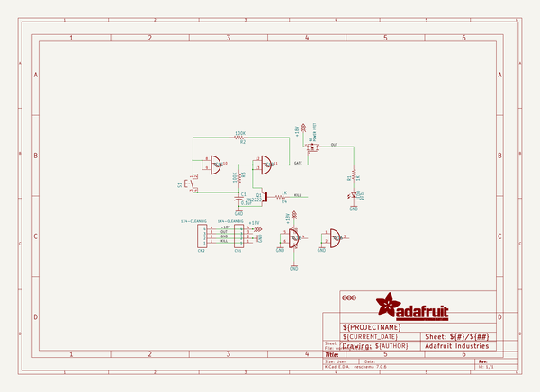
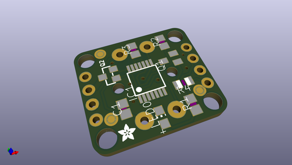
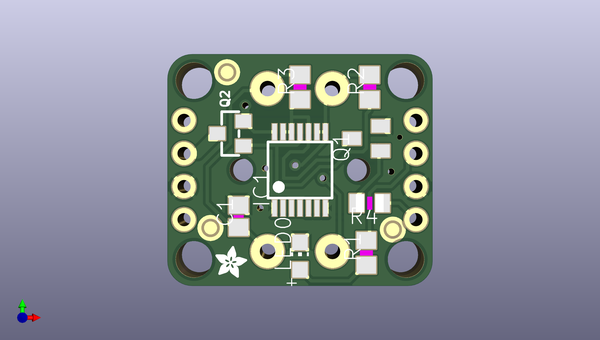
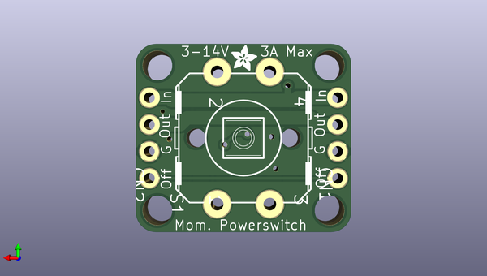

# adafruit_push_button_power_switch_pcb
 
## summary 
* id: adafruit_adafruit_push_button_power_switch_pcb_adafruit_power_switch
* user: adafruit
* name: adafruit_push_button_power_switch_pcb
* board: adafruit_power_switch
* repo: https://github.com/adafruit/Adafruit-Push-Button-Power-Switch-PCB

* src_file_repo_sch: 
* src_file_repo_sch_link: https://github.com/adafruit/Adafruit-Push-Button-Power-Switch-PCB/tree/master/
* full details link: https://github.com/oomlout/oomlout_oomp_project_bot_v_2/tree/main/projects/adafruit_adafruit_push_button_power_switch_pcb_adafruit_power_switch/current_version/working  

## schematic  
  
[schematic (pdf)](working_schematic.pdf) 

## pcb  
 
  
  
  
[board (pdf)](working.pdf)  

## working_bom
| Id | Designator | Footprint | Quantity | Designation | Supplier and ref |  | None | 
| --- | --- | --- | --- | --- | --- | --- | --- | 
| 1 | FID1,FID3,FID2 | FIDUCIAL_1MM | 3 | FIDUCIAL" |  |  | [''] | 
| 2 | @HOLE2,@HOLE3,@HOLE0,@HOLE1 |  | 4 |  |  |  | [''] | 
| 3 | R4,R1 | R0805 | 2 | 1K |  |  | [''] | 
| 4 | R2,R3 | R0805 | 2 | 100K |  |  | [''] | 
| 5 | Q2 | SOT23-WIDE | 1 | POWER PFET |  |  | [''] | 
| 6 | U$2,U$1 | ADAFRUIT_2.5MM | 2 |  |  |  | [''] | 
| 7 | C1 | C0805 | 1 | 0.1uF |  |  | [''] | 
| 8 | IC1 | MC14093B-TSSOP14 | 1 | 4093DT |  |  | [''] | 
| 9 | LED0 | CHIP-LED0805 | 1 | RED |  |  | [''] | 
| 10 | Q1 | SOT23-BEC | 1 | 2N2222 |  |  | [''] | 
| 11 | CN2,CN1 | 1X04-CLEANBIG | 2 | 1X4-CLEANBIG |  |  | [''] | 
| 12 | S1 | B3F-40XX-ROUND | 1 |  |  |  | [''] | 

## bom_schematic
| Ref | Qnty | Value | Cmp name | Footprint | Description | Vendor | DNP | 
| --- | --- | --- | --- | --- | --- | --- | --- | 
| C1 | 1 | 0.1uF | C-USC0805 | working:C0805 |  |  |  | 
| CN1, CN2 | 2 | 1X4-CLEANBIG | 1X4-CLEANBIG | working:1X04-CLEANBIG |  |  |  | 
| FID1, FID2, FID3 | 3 | FIDUCIAL"" | FIDUCIAL{dblquote}{dblquote} | working:FIDUCIAL_1MM |  |  |  | 
| IC1 | 1 | 4093DT | 4093DT | working:MC14093B-TSSOP14 |  |  |  | 
| LED0 | 1 | RED | LEDCHIP-LED0805 | working:CHIP-LED0805 |  |  |  | 
| Q1 | 1 | 2N2222 | -NPN-SOT23-BEC | working:SOT23-BEC |  |  |  | 
| Q2 | 1 | POWER PFET | MOSFET-PWIDE | working:SOT23-WIDE |  |  |  | 
| R1, R4 | 2 | 1K | R-US_R0805 | working:R0805 |  |  |  | 
| R2, R3 | 2 | 100K | rcl_R-US_R0805 | working:R0805 |  |  |  | 
| S1 | 1 | 40-XX-ROUND | 40-XX-ROUND | working:B3F-40XX-ROUND |  |  |  | 

