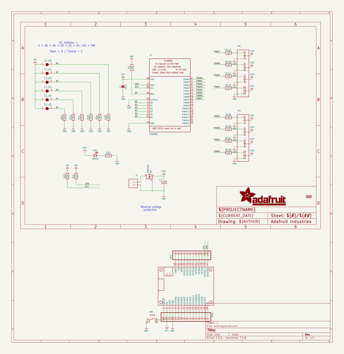
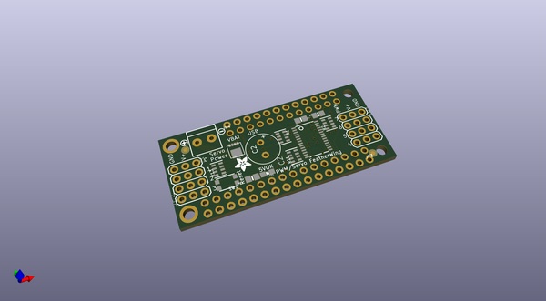
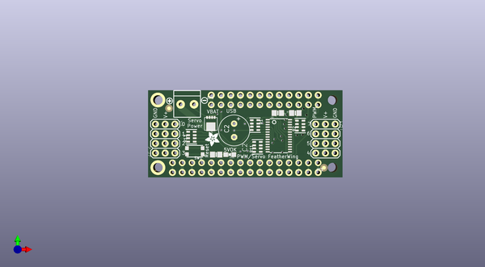
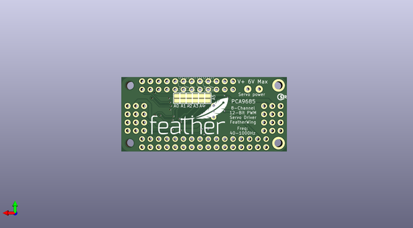

# adafruit_pwm_servo_featherwing_pcb
 
## summary 
* id: adafruit_adafruit_pwm_servo_featherwing_pcb_pwmservo_featherwing_rev_b
* user: adafruit
* name: adafruit_pwm_servo_featherwing_pcb
* board: pwmservo_featherwing_rev_b
* repo: https://github.com/adafruit/Adafruit-PWM-Servo-FeatherWing-PCB

* src_file_repo_sch: 
* src_file_repo_sch_link: https://github.com/adafruit/Adafruit-PWM-Servo-FeatherWing-PCB/tree/master/
* full details link: https://github.com/oomlout/oomlout_oomp_project_bot_v_2/tree/main/projects/adafruit_adafruit_pwm_servo_featherwing_pcb_pwmservo_featherwing_rev_b/current_version/working  

## schematic  
  
[schematic (pdf)](working_schematic.pdf) 

## pcb  
 
  
  
  
[board (pdf)](working.pdf)  

## working_bom
| Id | Designator | Footprint | Quantity | Designation | Supplier and ref |  | None | 
| --- | --- | --- | --- | --- | --- | --- | --- | 
| 1 | LED1 | CHIPLED_0805_NOOUTLINE | 1 | GREEN |  |  | [''] | 
| 2 | JP3 | 1X16_ROUND | 1 |  |  |  | [''] | 
| 3 | R11,R13 | RESPACK_4X0603 | 2 | 220 |  |  | [''] | 
| 4 | R7 | 0805-NO | 1 | 10K |  |  | [''] | 
| 5 | Q1 | POWERDI3333 | 1 | AON7401 |  |  | [''] | 
| 6 | J1 | TERMBLOCK_1X2-3.5MM | 1 |  |  |  | [''] | 
| 7 | C1 | 0805-NO | 1 | 10uF |  |  | [''] | 
| 8 | JP4 | 1X12_ROUND | 1 |  |  |  | [''] | 
| 9 | R2,R1 | RESPACK_4X0603 | 2 | 10K |  |  | [''] | 
| 10 | JP1,JP2 | 3X04 | 2 |  |  |  | [''] | 
| 11 | FID2,FID1 | FIDUCIAL_1MM | 2 | FIDUCIAL" |  |  | [''] | 
| 12 | MS1 | FEATHERWING | 1 | FEATHERWING |  |  | [''] | 
| 13 | SW1 | BTN_KMR2_4.6X2.8 | 1 |  |  |  | [''] | 
| 14 | C2 | E3,5-8 | 1 |  |  |  | [''] | 
| 15 | U$14 | ADAFRUIT_3.5MM | 1 |  |  |  | [''] | 
| 16 | R10 | 0805-NO | 1 | 470 |  |  | [''] | 
| 17 | U1 | TSSOP28 | 1 | PCA9685 |  |  | [''] | 
| 18 | U$12 | SYMBOL_MINUS | 1 |  |  |  | [''] | 
| 19 | U$11 | SYMBOL_PLUS | 1 |  |  |  | [''] | 
| 20 | SJ_A4,SJ_A3,SJ_A5,SJ_A1,SJ_A0,SJ_A2 | SOLDERJUMPER_REFLOW_NOPASTE | 6 |  |  |  | [''] | 
| 21 | U$16 | PCBFEAT-REV-040 | 1 |  |  |  | [''] | 
| 22 | U$15 | FEATHERLOGO | 1 |  |  |  | [''] | 

## bom_schematic
| Ref | Qnty | Value | Cmp name | Footprint | Description | Vendor | DNP | 
| --- | --- | --- | --- | --- | --- | --- | --- | 
| C1 | 1 | 10uF | CAP_CERAMIC0805-NOOUTLINE | working:0805-NO |  |  |  | 
| C2 | 1 | CPOL-USE3.5-8 | CPOL-USE3.5-8 | working:E3,5-8 |  |  |  | 
| FID1, FID2 | 2 | FIDUCIAL"" | FIDUCIAL{dblquote}{dblquote} | working:FIDUCIAL_1MM |  |  |  | 
| J1 | 1 | TERMBLOCK_1X2 | TERMBLOCK_1X2 | working:TERMBLOCK_1X2-3.5MM |  |  |  | 
| JP1, JP2 | 2 | HEADER-3X04 | HEADER-3X04 | working:3X04 |  |  |  | 
| JP3 | 1 | HEADER-1X16ROUND | HEADER-1X16ROUND | working:1X16_ROUND |  |  |  | 
| JP4 | 1 | HEADER-1X12 | HEADER-1X12 | working:1X12_ROUND |  |  |  | 
| LED1 | 1 | GREEN | LED0805_NOOUTLINE | working:CHIPLED_0805_NOOUTLINE |  |  |  | 
| MS1 | 1 | FEATHERWING | FEATHERWING | working:FEATHERWING |  |  |  | 
| Q1 | 1 | AON7401 | MOSFET-P-POWERDI3333 | working:POWERDI3333 |  |  |  | 
| R1, R2 | 2 | 10K | RESISTOR_4PACK | working:RESPACK_4X0603 |  |  |  | 
| R7 | 1 | 10K | RESISTOR0805_NOOUTLINE | working:0805-NO |  |  |  | 
| R10 | 1 | 470 | RESISTOR0805_NOOUTLINE | working:0805-NO |  |  |  | 
| R11, R13 | 2 | 220 | RESISTOR_4PACK | working:RESPACK_4X0603 |  |  |  | 
| SJ_A0, SJ_A1, SJ_A2, SJ_A3, SJ_A4, SJ_A5 | 6 | SOLDERJUMPERREFLOW_NOPASTE | SOLDERJUMPERREFLOW_NOPASTE | working:SOLDERJUMPER_REFLOW_NOPASTE |  |  |  | 
| SW1 | 1 | SWITCH_TACT_SMT4.6X2.8 | SWITCH_TACT_SMT4.6X2.8 | working:BTN_KMR2_4.6X2.8 |  |  |  | 
| U1 | 1 | PCA9685 | PCA9685 | working:TSSOP28 |  |  |  | 

