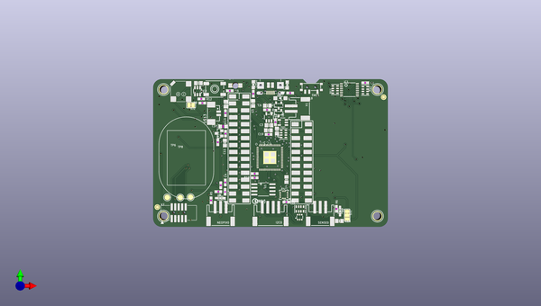

# adafruit_pybadge_pcb
 
## summary 
* id: adafruit_adafruit_pybadge_pcb_adafruit_pybadge
* user: adafruit
* name: adafruit_pybadge_pcb
* board: adafruit_pybadge
* repo: https://github.com/adafruit/Adafruit-PyBadge-PCB

* src_file_repo_sch: 
* src_file_repo_sch_link: https://github.com/adafruit/Adafruit-PyBadge-PCB/tree/master/
* full details link: https://github.com/oomlout/oomlout_oomp_project_bot_v_2/tree/main/projects/adafruit_adafruit_pybadge_pcb_adafruit_pybadge/current_version/working  

## schematic  
  
[schematic (pdf)](working_schematic.pdf) 

## pcb  
 
  
  
  
[board (pdf)](working.pdf)  

## working_bom
| Id | Designator | Footprint | Quantity | Designation | Supplier and ref |  | None | 
| --- | --- | --- | --- | --- | --- | --- | --- | 
| 1 | MS1 | FEATHERWING_SMT_NOHOLES | 1 | FEATHERWING_SMTDUALNOHOLES |  |  | [''] | 
| 2 | U4 | ALS-PT26-21C | 1 | ALS-PT21 |  |  | [''] | 
| 3 | C8,C6,C3 | 0805-NO | 3 | 10µF |  |  | [''] | 
| 4 | SJ2 | SOLDERJUMPER_CLOSEDWIRE | 1 |  |  |  | [''] | 
| 5 | U$17,U$15,U$5,U$6 | MOUNTINGHOLE_3.0_PLATEDTHIN | 4 | MOUNTINGHOLE3.0THIN |  |  | [''] | 
| 6 | X1 | JSTPH2 | 1 | JSTPH |  |  | [''] | 
| 7 | C10,C5,C15,C14,C18,C11 | 0805-NO | 6 | 10uF |  |  | [''] | 
| 8 | X2 | 2X05_1.27MM_BOX_POSTS | 1 | 2x5 0.05 SWD" |  |  | [''] | 
| 9 | R14,R15,R3 | 0603-NO | 3 | 10K |  |  | [''] | 
| 10 | FB1 | 0805-NO | 1 | Ferrite |  |  | [''] | 
| 11 | Q1,Q2 | SOT23-R | 2 | DMG3405 |  |  | [''] | 
| 12 | D2,D1 | SOD-323 | 2 | 3.6V |  |  | [''] | 
| 13 | R1,R10,R11 | RESPACK_4X0603 | 3 | 100K |  |  | [''] | 
| 14 | R17,R19 | 0603-NO | 2 | 100K |  |  | [''] | 
| 15 | R7 | 0603-NO | 1 | 2.2K |  |  | [''] | 
| 16 | L0 | CHIPLED_0805_NOOUTLINE | 1 | RED |  |  | [''] | 
| 17 | NEOPIX0,SENSE0 | JSTPH3 | 2 | JST PH 3 |  |  | [''] | 
| 18 | C7,C1,C4,C12,C2,C13,C19 | 0603-NO | 7 | 1uF |  |  | [''] | 
| 19 | R8 | 0603-NO | 1 | 4.7K |  |  | [''] | 
| 20 | IC2 | SOT23-6 | 1 | PAM8301 |  |  | [''] | 
| 21 | U1 | SOIC8_208MIL | 1 | GD25Q16 |  |  | [''] | 
| 22 | SJ1 | SOLDERJUMPER_2WAY_OPEN_NOPASTE | 1 |  |  |  | [''] | 
| 23 | IC4 | LGA16_3X3MM | 1 | LIS3DH |  |  | [''] | 
| 24 | R16 | 0603-NO | 1 | 10 |  |  | [''] | 
| 25 | TP7,TP6,TP8 | TESTPOINT_ROUND_2MM | 3 |  |  |  | [''] | 
| 26 | C16 | _0805MP | 1 | 10µF |  |  | [''] | 
| 27 | IC1 | TSSOP16 | 1 | 74165TSSOP |  |  | [''] | 
| 28 | C17,C9 | 0603-NO | 2 | 0.1uF |  |  | [''] | 
| 29 | U$13 | 53398-0271 | 1 | CON_MOLEX_2P |  |  | [''] | 
| 30 | Q4 | SOT363 | 1 | BSS138 |  |  | [''] | 
| 31 | R6,R5,R2 | 0603-NO | 3 | 1K |  |  | [''] | 
| 32 | U$8 | SPEAKER_OVAL8OHM | 1 |  |  |  | [''] | 
| 33 | U$34,U$35,U$42,U$43 | FIDUCIAL_1MM | 4 | FIDUCIAL_1MM |  |  | [''] | 
| 34 | D4 | SOD-123 | 1 | MBR0540 |  |  | [''] | 
| 35 | CHG0 | CHIPLED_0805_NOOUTLINE | 1 | ORANGE |  |  | [''] | 
| 36 | R12 | 0603-NO | 1 | 47K |  |  | [''] | 
| 37 | SW1 | EVQ-Q2_SMALLER | 1 | SPST_TACT-EVQQ2 |  |  | [''] | 
| 38 | U$32 | PYBADGE_BOT | 1 |  |  |  | [''] | 
| 39 | U$37 | PCBFEAT-REV-040 | 1 |  |  |  | [''] | 
| 40 | X3 | 4UCONN_20329_V2 | 1 | microUSB |  |  | [''] | 
| 41 | U2 | SOT23-5 | 1 | AP2112-3.3 |  |  | [''] | 
| 42 | SW11 | SPDT_SMT_SSSS811101 | 1 |  |  |  | [''] | 
| 43 | SP1 | BUZZER_SMT_7.5MM | 1 | SPEAKER_7.5MM |  |  | [''] | 
| 44 | U3 | SOT23-5 | 1 | MCP73831T-2ACI/OT |  |  | [''] | 
| 45 | I2C0 | JSTPH4 | 1 | JST PH 4 |  |  | [''] | 
| 46 | Q3 | SOT23-WIDE | 1 | BSS138 |  |  | [''] | 
| 47 | R4 | RESPACK_4X0603 | 1 | 10K |  |  | [''] | 
| 48 | U$24 | PQFN64-1 | 1 | ATSAMD51J19 |  |  | [''] | 
| 49 | LED3,LED4,LED1,LED5,LED2 | LED3535 | 5 | WS2812B3535 |  |  | [''] | 
| 50 | B0,RIGHT0,A0,LEFT0,START0,DOWN0,SELECT0,UP0 | 6MM_SMT | 8 |  |  |  | [''] | 
| 51 | U$18 | PYBADGE_TOP | 1 |  |  |  | [''] | 
| 52 | LCD1 | JD-T1800 | 1 | DISP_LCD_JDT1800 |  |  | [''] | 
| 53 | R9 | 0603-NO | 1 | DNP |  |  | [''] | 

## bom_schematic
| Ref | Qnty | Value | Cmp name | Footprint | Description | Vendor | DNP | 
| --- | --- | --- | --- | --- | --- | --- | --- | 
| A0 | 1 | SWITCH_TACT_SMT_6MMSMALL | SWITCH_TACT_SMT_6MMSMALL | working:6MM_SMT |  |  |  | 
| B0 | 1 | SWITCH_TACT_SMT_6MMSMALL | SWITCH_TACT_SMT_6MMSMALL | working:6MM_SMT |  |  |  | 
| C1, C2, C4, C7, C12, C13, C19 | 7 | 1uF | CAP_CERAMIC0603_NO | working:0603-NO |  |  |  | 
| C3, C6, C8 | 3 | 10µF | CAP_CERAMIC0805-NOOUTLINE | working:0805-NO |  |  |  | 
| C5, C10, C11, C14, C15, C18 | 6 | 10uF | CAP_CERAMIC0805-NOOUTLINE | working:0805-NO |  |  |  | 
| C9, C17 | 2 | 0.1uF | CAP_CERAMIC0603_NO | working:0603-NO |  |  |  | 
| C16 | 1 | 10µF | CAP_CERAMIC_0805MP | working:_0805MP |  |  |  | 
| CHG0 | 1 | ORANGE | LED0805_NOOUTLINE | working:CHIPLED_0805_NOOUTLINE |  |  |  | 
| D1, D2 | 2 | 3.6V | DIODE-ZENERSOD323 | working:SOD-323 |  |  |  | 
| D4 | 1 | MBR0540 | DIODE-SCHOTTKYSOD-123 | working:SOD-123 |  |  |  | 
| DOWN0 | 1 | SWITCH_TACT_SMT_6MMSMALL | SWITCH_TACT_SMT_6MMSMALL | working:6MM_SMT |  |  |  | 
| FB1 | 1 | Ferrite | FERRITE-0805NO | working:0805-NO |  |  |  | 
| I2C0 | 1 | STEMMA_I2C_RASMT | STEMMA_I2C_RASMT | working:JSTPH4 |  |  |  | 
| IC1 | 1 | 74165TSSOP | 74165TSSOP | working:TSSOP16 |  |  |  | 
| IC2 | 1 | PAM8301 | PAM8301 | working:SOT23-6 |  |  |  | 
| IC4 | 1 | LIS3DH | ACCEL_LIS3DHTR | working:LGA16_3X3MM |  |  |  | 
| L0 | 1 | RED | LED0805_NOOUTLINE | working:CHIPLED_0805_NOOUTLINE |  |  |  | 
| LCD1 | 1 | DISP_LCD_JDT1800 | DISP_LCD_JDT1800 | working:JD-T1800 |  |  |  | 
| LED1, LED2, LED3, LED4, LED5 | 5 | WS2812B3535 | WS2812B3535 | working:LED3535 |  |  |  | 
| LEFT0 | 1 | SWITCH_TACT_SMT_6MMSMALL | SWITCH_TACT_SMT_6MMSMALL | working:6MM_SMT |  |  |  | 
| MS1 | 1 | FEATHERWING_SMTDUALNOHOLES | FEATHERWING_SMTDUALNOHOLES | working:FEATHERWING_SMT_NOHOLES |  |  |  | 
| NEOPIX0 | 1 | JST PH 3 | CON_JST_PH_3PIN | working:JSTPH3 |  |  |  | 
| Q1, Q2 | 2 | DMG3405 | MOSFET-P | working:SOT23-R |  |  |  | 
| Q3 | 1 | BSS138 | MOSFET-NWIDE | working:SOT23-WIDE |  |  |  | 
| Q4 | 1 | BSS138 | MOSFET-N_DUAL | working:SOT363 |  |  |  | 
| R1, R10, R11 | 3 | 100K | RESISTOR_4PACK | working:RESPACK_4X0603 |  |  |  | 
| R2, R5, R6 | 3 | 1K | RESISTOR_0603_NOOUT | working:0603-NO |  |  |  | 
| R3, R14, R15 | 3 | 10K | RESISTOR_0603_NOOUT | working:0603-NO |  |  |  | 
| R4 | 1 | 10K | RESISTOR_4PACK | working:RESPACK_4X0603 |  |  |  | 
| R7 | 1 | 2.2K | RESISTOR_0603_NOOUT | working:0603-NO |  |  |  | 
| R8 | 1 | 4.7K | RESISTOR_0603_NOOUT | working:0603-NO |  |  |  | 
| R9 | 1 | DNP | RESISTOR_0603_NOOUT | working:0603-NO |  |  |  | 
| R12 | 1 | 47K | RESISTOR_0603_NOOUT | working:0603-NO |  |  |  | 
| R16 | 1 | 10 | RESISTOR_0603_NOOUT | working:0603-NO |  |  |  | 
| R17, R19 | 2 | 100K | RESISTOR_0603_NOOUT | working:0603-NO |  |  |  | 
| RIGHT0 | 1 | SWITCH_TACT_SMT_6MMSMALL | SWITCH_TACT_SMT_6MMSMALL | working:6MM_SMT |  |  |  | 
| SELECT0 | 1 | SWITCH_TACT_SMT_6MMSMALL | SWITCH_TACT_SMT_6MMSMALL | working:6MM_SMT |  |  |  | 
| SENSE0 | 1 | JST PH 3 | CON_JST_PH_3PIN | working:JSTPH3 |  |  |  | 
| SJ1 | 1 | SOLDERJUMPER_2WAY | SOLDERJUMPER_2WAY | working:SOLDERJUMPER_2WAY_OPEN_NOPASTE |  |  |  | 
| SJ2 | 1 | SOLDERJUMPERCLOSED | SOLDERJUMPERCLOSED | working:SOLDERJUMPER_CLOSEDWIRE |  |  |  | 
| SP1 | 1 | SPEAKER_7.5MM | SPEAKER_7.5MM | working:BUZZER_SMT_7.5MM |  |  |  | 
| START0 | 1 | SWITCH_TACT_SMT_6MMSMALL | SWITCH_TACT_SMT_6MMSMALL | working:6MM_SMT |  |  |  | 
| SW1 | 1 | SPST_TACT-EVQQ2 | SWITCH_TACT_SMT_EVQQ2_SMALL | working:EVQ-Q2_SMALLER |  |  |  | 
| SW11 | 1 | SWITCH_SPDT | SWITCH_SPDT | working:SPDT_SMT_SSSS811101 |  |  |  | 
| TP6, TP7, TP8 | 3 | TESTPOINTROUND2MM | TESTPOINTROUND2MM | working:TESTPOINT_ROUND_2MM |  |  |  | 
| U1 | 1 | GD25Q16 | SPIFLASH_8PIN208MIL | working:SOIC8_208MIL |  |  |  | 
| U2 | 1 | AP2112-3.3 | VREG_SOT23-5 | working:SOT23-5 |  |  |  | 
| U3 | 1 | MCP73831T-2ACI/OT | MCP73831/2 | working:SOT23-5 |  |  |  | 
| U4 | 1 | ALS-PT21 | PHOTOTRANSISTOR_PT26-21C | working:ALS-PT26-21C |  |  |  | 
| U$5, U$6, U$15, U$17 | 4 | MOUNTINGHOLE3.0THIN | MOUNTINGHOLE3.0THIN | working:MOUNTINGHOLE_3.0_PLATEDTHIN |  |  |  | 
| U$13 | 1 | CON_MOLEX_2P | CON_MOLEX_2P | working:53398-0271 |  |  |  | 
| U$24 | 1 | ATSAMD51J | ATSAMD51J | working:PQFN64-1 |  |  |  | 
| U$34, U$35, U$42, U$43 | 4 | FIDUCIAL_1MM | FIDUCIAL_1MM | working:FIDUCIAL_1MM |  |  |  | 
| UP0 | 1 | SWITCH_TACT_SMT_6MMSMALL | SWITCH_TACT_SMT_6MMSMALL | working:6MM_SMT |  |  |  | 
| X1 | 1 | JSTPH | CON_JST_PH_2PIN | working:JSTPH2 |  |  |  | 
| X2 | 1 | 2x5 0.05" SWD | JTAG-CORTEXBOXPOSTS | working:2X05_1.27MM_BOX_POSTS |  |  |  | 
| X3 | 1 | microUSB | USB_MICRO_20329_V2 | working:4UCONN_20329_V2 |  |  |  | 

## mounting_holes
| x | y | package | value | ref | size | 
| --- | --- | --- | --- | --- | --- | 
| 0.0 | 46.36 | MOUNTINGHOLE_3.0_PLATEDTHIN | MOUNTINGHOLE3.0THIN | U$5 | m3 | 
| 78.1 | 46.36 | MOUNTINGHOLE_3.0_PLATEDTHIN | MOUNTINGHOLE3.0THIN | U$6 | m3 | 
| 0.0 | 0.0 | MOUNTINGHOLE_3.0_PLATEDTHIN | MOUNTINGHOLE3.0THIN | U$15 | m3 | 
| 78.1 | 0.0 | MOUNTINGHOLE_3.0_PLATEDTHIN | MOUNTINGHOLE3.0THIN | U$17 | m3 | 

