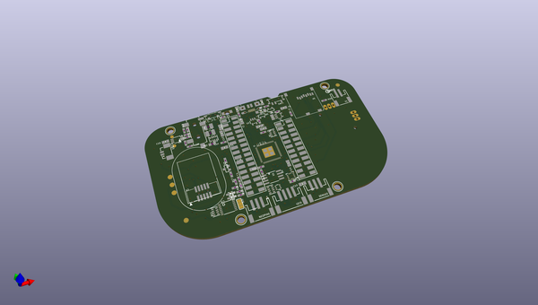
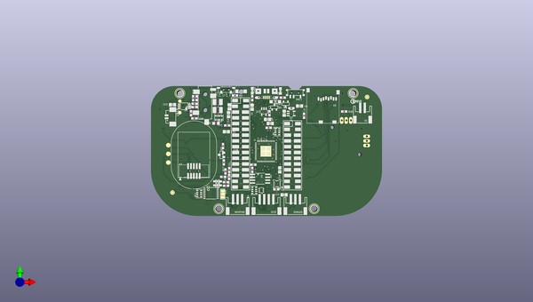
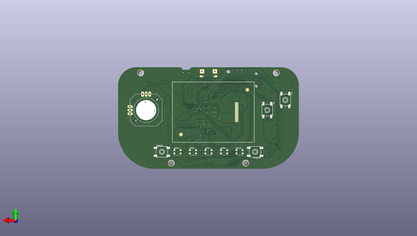

# adafruit_pygamer_pcb
 
## summary 
* id: adafruit_adafruit_pygamer_pcb_adafruit_pygamer
* user: adafruit
* name: adafruit_pygamer_pcb
* board: adafruit_pygamer
* repo: https://github.com/adafruit/Adafruit-PyGamer-PCB

* src_file_repo_sch: 
* src_file_repo_sch_link: https://github.com/adafruit/Adafruit-PyGamer-PCB/tree/master/
* full details link: https://github.com/oomlout/oomlout_oomp_project_bot_v_2/tree/main/projects/adafruit_adafruit_pygamer_pcb_adafruit_pygamer/current_version/working  

## schematic  
  
[schematic (pdf)](working_schematic.pdf) 

## pcb  
 
  
  
  
[board (pdf)](working.pdf)  

## working_bom
| Id | Designator | Footprint | Quantity | Designation | Supplier and ref |  | None | 
| --- | --- | --- | --- | --- | --- | --- | --- | 
| 1 | SW11 | SPDT_SMT_SSSS811101 | 1 |  |  |  | [''] | 
| 2 | R14,R15,R20,R3 | 0603-NO | 4 | 10K |  |  | [''] | 
| 3 | TP8,TP6,TP7 | TESTPOINT_ROUND_2MM_NO | 3 |  |  |  | [''] | 
| 4 | U$18,U$5,U$6,U$17 | MOUNTINGHOLE_3.0_PLATEDTHIN | 4 | MOUNTINGHOLE3.0THIN |  |  | [''] | 
| 5 | R11,R1 | RESPACK_4X0603 | 2 | 100K |  |  | [''] | 
| 6 | C17 | 0603-NO | 1 | 0.1uF |  |  | [''] | 
| 7 | R17,R19 | 0603-NO | 2 | 100K |  |  | [''] | 
| 8 | L0 | CHIPLED_0805_NOOUTLINE | 1 | RED |  |  | [''] | 
| 9 | R9,R12 | 0603-NO | 2 | 100 |  |  | [''] | 
| 10 | R13,R18,R7 | 0603-NO | 3 | 2.2K |  |  | [''] | 
| 11 | C10,C18,C15,C13,C14,C11,C5 | 0805-NO | 7 | 10uF |  |  | [''] | 
| 12 | U1 | SOIC8_208MIL | 1 | GD25Q64 |  |  | [''] | 
| 13 | Q2,Q1 | SOT23-R | 2 | DMG2305 |  |  | [''] | 
| 14 | R8 | 0603-NO | 1 | 4.7K |  |  | [''] | 
| 15 | U2 | SOT23-5 | 1 | AP2112-3.3 |  |  | [''] | 
| 16 | C9,C4,C16,C19,C20,C7,C1,C12,C2 | 0603-NO | 9 | 1uF |  |  | [''] | 
| 17 | R5,R6,R2 | 0603-NO | 3 | 1K |  |  | [''] | 
| 18 | U$24 | PQFN64-1 | 1 | ATSAMD51J19 |  |  | [''] | 
| 19 | X2 | 2X05_1.27MM_BOX_POSTS | 1 | 2x5 0.05 SWD" |  |  | [''] | 
| 20 | D4 | SOD-123 | 1 | MBR0540 |  |  | [''] | 
| 21 | IC4 | LGA16_3X3MM | 1 | LIS3DH |  |  | [''] | 
| 22 | IC1 | TSSOP16 | 1 | 74165TSSOP |  |  | [''] | 
| 23 | C6,C8,C3 | 0805-NO | 3 | 10µF |  |  | [''] | 
| 24 | X5 | MICROSD | 1 | MicroSD |  |  | [''] | 
| 25 | NEOPIX0,SENSE0 | JSTPH3 | 2 | JST PH 3 |  |  | [''] | 
| 26 | U3 | SOT23-5 | 1 | MCP73831T-2ACI/OT |  |  | [''] | 
| 27 | U$13 | 53398-0271 | 1 | CON_MOLEX_2P |  |  | [''] | 
| 28 | I2C0 | JSTPH4 | 1 | JST PH 4 |  |  | [''] | 
| 29 | FB1 | 0805-NO | 1 | Ferrite |  |  | [''] | 
| 30 | U5 | MSOP8_0.65MM | 1 | PAM8302AASCR |  |  | [''] | 
| 31 | U$37 | PCBFEAT-REV-040 | 1 |  |  |  | [''] | 
| 32 | TP2,TP1 | TESTPOINT_ROUND_1.5MM_NO | 2 |  |  |  | [''] | 
| 33 | SJ1 | SOLDERJUMPER_2WAY_OPEN_NOPASTE | 1 |  |  |  | [''] | 
| 34 | Q4 | SOT363 | 1 | BSS138 |  |  | [''] | 
| 35 | U$34,U$35,U$46,U$43 | FIDUCIAL_1MM | 4 | FIDUCIAL_1MM |  |  | [''] | 
| 36 | R10 | RESPACK_4X0603 | 1 | 100 |  |  | [''] | 
| 37 | D1,D2 | SOD-323 | 2 | 3.6V |  |  | [''] | 
| 38 | R16 | 0603-NO | 1 | 10 |  |  | [''] | 
| 39 | FB2 | _0805MP | 1 | Ferrite |  |  | [''] | 
| 40 | CHG0 | CHIPLED_0805_NOOUTLINE | 1 | ORANGE |  |  | [''] | 
| 41 | R4 | RESPACK_4X0603 | 1 | 10K |  |  | [''] | 
| 42 | C22,C23 | C1210 | 2 | 100uF |  |  | [''] | 
| 43 | MS1 | FEATHERWING_SMT_NOHOLES | 1 | FEATHERWING_SMTDUALNOHOLES |  |  | [''] | 
| 44 | X1 | JSTPH2 | 1 | JSTPH |  |  | [''] | 
| 45 | RESET0 | SPST_TACTILE_RA | 1 |  |  |  | [''] | 
| 46 | X3 | 4UCONN_20329_V2 | 1 | microUSB |  |  | [''] | 
| 47 | U4 | ALS-PT26-21C | 1 | ALS-PT21 |  |  | [''] | 
| 48 | X6 | 4UCONN_19269 | 1 |  |  |  | [''] | 
| 49 | Q3 | SOT23-WIDE | 1 | BSS138 |  |  | [''] | 
| 50 | U$8 | SPEAKER_OVAL8OHM | 1 |  |  |  | [''] | 
| 51 | U$47 | PYGAMER_BACK | 1 |  |  |  | [''] | 
| 52 | U$48 | PYGAMER_FRONT | 1 |  |  |  | [''] | 
| 53 | LED5,LED3,LED2,LED4,LED1 | LED3535 | 5 | WS2812B3535 |  |  | [''] | 
| 54 | JOY1 | JOYSTICK_ANALOG_MINITHM | 1 | JOYSTICK_ANALOG_XY |  |  | [''] | 
| 55 | START0,B0,A0,SELECT0 | 6MM_SMT_6MMCAP | 4 |  |  |  | [''] | 
| 56 | LCD1 | JD-T1800 | 1 | DISP_LCD_JDT1800 |  |  | [''] | 

## bom_schematic
| Ref | Qnty | Value | Cmp name | Footprint | Description | Vendor | DNP | 
| --- | --- | --- | --- | --- | --- | --- | --- | 
| A0 | 1 | SWITCH_TACT_SMT_6MM8MMCAP | SWITCH_TACT_SMT_6MM8MMCAP | working:6MM_SMT_6MMCAP |  |  |  | 
| B0 | 1 | SWITCH_TACT_SMT_6MM8MMCAP | SWITCH_TACT_SMT_6MM8MMCAP | working:6MM_SMT_6MMCAP |  |  |  | 
| C1, C2, C4, C7, C9, C12, C16, C19, C20 | 9 | 1uF | CAP_CERAMIC0603_NO | working:0603-NO |  |  |  | 
| C3, C6, C8 | 3 | 10µF | CAP_CERAMIC0805-NOOUTLINE | working:0805-NO |  |  |  | 
| C5, C10, C11, C13, C14, C15, C18 | 7 | 10uF | CAP_CERAMIC0805-NOOUTLINE | working:0805-NO |  |  |  | 
| C17 | 1 | 0.1uF | CAP_CERAMIC0603_NO | working:0603-NO |  |  |  | 
| C22, C23 | 2 | 100uF | C-USC1210 | working:C1210 |  |  |  | 
| CHG0 | 1 | ORANGE | LED0805_NOOUTLINE | working:CHIPLED_0805_NOOUTLINE |  |  |  | 
| D1, D2 | 2 | 3.6V | DIODE-ZENERSOD323 | working:SOD-323 |  |  |  | 
| D4 | 1 | MBR0540 | DIODE-SCHOTTKYSOD-123 | working:SOD-123 |  |  |  | 
| FB1 | 1 | Ferrite | FERRITE-0805NO | working:0805-NO |  |  |  | 
| FB2 | 1 | Ferrite | FERRITE_0805MP | working:_0805MP |  |  |  | 
| I2C0 | 1 | STEMMA_I2C_RASMT | STEMMA_I2C_RASMT | working:JSTPH4 |  |  |  | 
| IC1 | 1 | 74165TSSOP | 74165TSSOP | working:TSSOP16 |  |  |  | 
| IC4 | 1 | LIS3DH | ACCEL_LIS3DHTR | working:LGA16_3X3MM |  |  |  | 
| JOY1 | 1 | JOYSTICK_ANALOG_XY | JOYSTICK_ANALOG_XY | working:JOYSTICK_ANALOG_MINITHM |  |  |  | 
| L0 | 1 | RED | LED0805_NOOUTLINE | working:CHIPLED_0805_NOOUTLINE |  |  |  | 
| LCD1 | 1 | DISP_LCD_JDT1800 | DISP_LCD_JDT1800 | working:JD-T1800 |  |  |  | 
| LED1, LED2, LED3, LED4, LED5 | 5 | WS2812B3535 | WS2812B3535 | working:LED3535 |  |  |  | 
| MS1 | 1 | FEATHERWING_SMTDUALNOHOLES | FEATHERWING_SMTDUALNOHOLES | working:FEATHERWING_SMT_NOHOLES |  |  |  | 
| NEOPIX0 | 1 | JST PH 3 | CON_JST_PH_3PIN | working:JSTPH3 |  |  |  | 
| Q1, Q2 | 2 | DMG2305 | MOSFET-P | working:SOT23-R |  |  |  | 
| Q3 | 1 | BSS138 | MOSFET-NWIDE | working:SOT23-WIDE |  |  |  | 
| Q4 | 1 | BSS138 | MOSFET-N_DUAL | working:SOT363 |  |  |  | 
| R1, R11 | 2 | 100K | RESISTOR_4PACK | working:RESPACK_4X0603 |  |  |  | 
| R2, R5, R6 | 3 | 1K | RESISTOR_0603_NOOUT | working:0603-NO |  |  |  | 
| R3, R14, R15, R20 | 4 | 10K | RESISTOR_0603_NOOUT | working:0603-NO |  |  |  | 
| R4 | 1 | 10K | RESISTOR_4PACK | working:RESPACK_4X0603 |  |  |  | 
| R7, R13, R18 | 3 | 2.2K | RESISTOR_0603_NOOUT | working:0603-NO |  |  |  | 
| R8 | 1 | 4.7K | RESISTOR_0603_NOOUT | working:0603-NO |  |  |  | 
| R9, R12 | 2 | 100 | RESISTOR_0603_NOOUT | working:0603-NO |  |  |  | 
| R10 | 1 | 100 | RESISTOR_4PACK | working:RESPACK_4X0603 |  |  |  | 
| R16 | 1 | 10 | RESISTOR_0603_NOOUT | working:0603-NO |  |  |  | 
| R17, R19 | 2 | 100K | RESISTOR_0603_NOOUT | working:0603-NO |  |  |  | 
| RESET0 | 1 | SWITCH_SPST_TACT_RA | SWITCH_SPST_TACT_RA | working:SPST_TACTILE_RA |  |  |  | 
| SELECT0 | 1 | SWITCH_TACT_SMT_6MM8MMCAP | SWITCH_TACT_SMT_6MM8MMCAP | working:6MM_SMT_6MMCAP |  |  |  | 
| SENSE0 | 1 | JST PH 3 | CON_JST_PH_3PIN | working:JSTPH3 |  |  |  | 
| SJ1 | 1 | SOLDERJUMPER_2WAY | SOLDERJUMPER_2WAY | working:SOLDERJUMPER_2WAY_OPEN_NOPASTE |  |  |  | 
| START0 | 1 | SWITCH_TACT_SMT_6MM8MMCAP | SWITCH_TACT_SMT_6MM8MMCAP | working:6MM_SMT_6MMCAP |  |  |  | 
| SW11 | 1 | SWITCH_SPDT | SWITCH_SPDT | working:SPDT_SMT_SSSS811101 |  |  |  | 
| TP1, TP2 | 2 | TESTPOINTROUND1.5MMNO | TESTPOINTROUND1.5MMNO | working:TESTPOINT_ROUND_1.5MM_NO |  |  |  | 
| TP6, TP7, TP8 | 3 | TESTPOINTROUND2MMNO | TESTPOINTROUND2MMNO | working:TESTPOINT_ROUND_2MM_NO |  |  |  | 
| U1 | 1 | GD25Q64 | SPIFLASH_8PIN208MIL | working:SOIC8_208MIL |  |  |  | 
| U2 | 1 | AP2112-3.3 | VREG_SOT23-5 | working:SOT23-5 |  |  |  | 
| U3 | 1 | MCP73831T-2ACI/OT | MCP73831/2 | working:SOT23-5 |  |  |  | 
| U4 | 1 | ALS-PT21 | PHOTOTRANSISTOR_PT26-21C | working:ALS-PT26-21C |  |  |  | 
| U5 | 1 | PAM8302AASCR | AUDIOAMP_PAM8302A | working:MSOP8_0.65MM |  |  |  | 
| U$5, U$6, U$17, U$18 | 4 | MOUNTINGHOLE3.0THIN | MOUNTINGHOLE3.0THIN | working:MOUNTINGHOLE_3.0_PLATEDTHIN |  |  |  | 
| U$13 | 1 | CON_MOLEX_2P | CON_MOLEX_2P | working:53398-0271 |  |  |  | 
| U$24 | 1 | ATSAMD51J | ATSAMD51J | working:PQFN64-1 |  |  |  | 
| U$34, U$35, U$43, U$46 | 4 | FIDUCIAL_1MM | FIDUCIAL_1MM | working:FIDUCIAL_1MM |  |  |  | 
| X1 | 1 | JSTPH | CON_JST_PH_2PIN | working:JSTPH2 |  |  |  | 
| X2 | 1 | 2x5 0.05" SWD | JTAG-CORTEXBOXPOSTS | working:2X05_1.27MM_BOX_POSTS |  |  |  | 
| X3 | 1 | microUSB | USB_MICRO_20329_V2 | working:4UCONN_20329_V2 |  |  |  | 
| X5 | 1 | MicroSD | MICROSD | working:MICROSD |  |  |  | 
| X6 | 1 | AUDIO_3.5MMJACK | AUDIO_3.5MMJACK | working:4UCONN_19269 |  |  |  | 

## mounting_holes
| x | y | package | value | ref | size | 
| --- | --- | --- | --- | --- | --- | 
| 0.0 | 50.8 | MOUNTINGHOLE_3.0_PLATEDTHIN | MOUNTINGHOLE3.0THIN | U$5 | m3 | 
| 59.05 | 0.0 | MOUNTINGHOLE_3.0_PLATEDTHIN | MOUNTINGHOLE3.0THIN | U$6 | m3 | 
| 17.14 | 0.0 | MOUNTINGHOLE_3.0_PLATEDTHIN | MOUNTINGHOLE3.0THIN | U$17 | m3 | 
| 76.2 | 50.8 | MOUNTINGHOLE_3.0_PLATEDTHIN | MOUNTINGHOLE3.0THIN | U$18 | m3 | 

