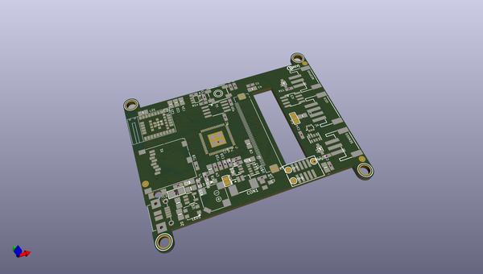
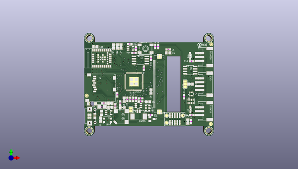
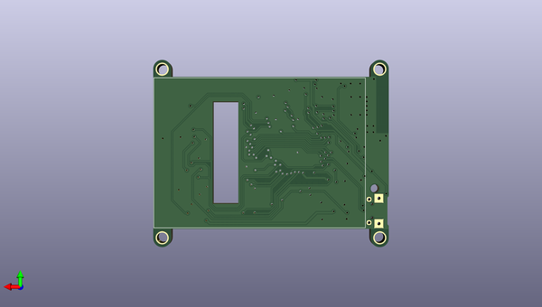

# adafruit_pyportal_pcb
 
## summary 
* id: adafruit_adafruit_pyportal_pcb_adafruit_pyportal_pynt
* user: adafruit
* name: adafruit_pyportal_pcb
* board: adafruit_pyportal_pynt
* repo: https://github.com/adafruit/Adafruit-PyPortal-PCB

* src_file_repo_sch: 
* src_file_repo_sch_link: https://github.com/adafruit/Adafruit-PyPortal-PCB/tree/master/
* full details link: https://github.com/oomlout/oomlout_oomp_project_bot_v_2/tree/main/projects/adafruit_adafruit_pyportal_pcb_adafruit_pyportal_pynt/current_version/working  

## schematic  
  
[schematic (pdf)](working_schematic.pdf)  

## pcb  
 
  
  
  
[board (pdf)](working.pdf)  

## working_bom
| Id | Designator | Footprint | Quantity | Designation | Supplier and ref |  | None | 
| --- | --- | --- | --- | --- | --- | --- | --- | 
| 1 | LED1 | LED3535 | 1 | WS2812B3535 |  |  | [''] | 
| 2 | U$9,U$11,U$23 | FIDUCIAL_1MM | 3 | FIDUCIAL_1MM |  |  | [''] | 
| 3 | U2 | SOIC8_208MIL | 1 | GD25Q64 |  |  | [''] | 
| 4 | C17,C1,C19 | 0603-NO | 3 | 0.1uF |  |  | [''] | 
| 5 | C8,C6,C3,C23,C18,C20,C13,C2,C24,C22,C5,C21,C7 | 0805-NO | 13 | 10uF |  |  | [''] | 
| 6 | R22,R21 | 0603-NO | 2 | 47K |  |  | [''] | 
| 7 | D2,D1 | SOD-323 | 2 | 3.6V |  |  | [''] | 
| 8 | U$16,U$15,U$7,U$17 | MOUNTINGHOLE_3.0_PLATEDTHIN | 4 | MOUNTINGHOLE3.0THIN |  |  | [''] | 
| 9 | SJ1 | SOLDERJUMPER_2WAY_OPEN_NOPASTE | 1 |  |  |  | [''] | 
| 10 | IC3 | SOIC8_150MIL | 1 | ATECCX08 |  |  | [''] | 
| 11 | TP7,TP9,TP8 | TESTPOINT_ROUND_1.5MM | 3 |  |  |  | [''] | 
| 12 | I2C0 | JSTPH4 | 1 | JST PH 4 |  |  | [''] | 
| 13 | C4 | 0805-NO | 1 | 0.1uF |  |  | [''] | 
| 14 | R6,R20,R8,R9,R15,R18,R19 | 0603-NO | 7 | 10K |  |  | [''] | 
| 15 | R10,R12,R5,R11 | 0603-NO | 4 | 1K |  |  | [''] | 
| 16 | X1 | MICROSD | 1 | microSD |  |  | [''] | 
| 17 | L0 | CHIPLED_0805_NOOUTLINE | 1 | RED |  |  | [''] | 
| 18 | NEOPIX0,SENSE0 | JSTPH3 | 2 | JST PH 3 |  |  | [''] | 
| 19 | SJ4 | SOLDERJUMPER_CLOSEDWIRE | 1 |  |  |  | [''] | 
| 20 | X4 | 4UCONN_20329_NARROW | 1 | microUSB |  |  | [''] | 
| 21 | PTC1 | 1206 | 1 | 500mA |  |  | [''] | 
| 22 | U1 | SOT23-5 | 1 | AP2112-3.3 |  |  | [''] | 
| 23 | C11,C14,C15,C16,C12,C10 | 0603-NO | 6 | .1u |  |  | [''] | 
| 24 | U3 | ARDUINO-UCS&SOCS_NINA-W1X | 1 | NINA-W102 |  |  | [''] | 
| 25 | CON1 | 53398-0271 | 1 | CON_MOLEX_2P |  |  | [''] | 
| 26 | SP1 | BUZZER_SMT_7.5MM | 1 | 7.5mm SPK |  |  | [''] | 
| 27 | Q1 | SOT23-BEC | 1 | MMBT2222 |  |  | [''] | 
| 28 | RESET0 | EVQ-Q2_SMALLER | 1 | EVQQ 6mm |  |  | [''] | 
| 29 | R4 | RESPACK_4X0603 | 1 | 10K |  |  | [''] | 
| 30 | X3 | 2X05_1.27MM_SMT | 1 | 2x5 0.05 SWD" |  |  | [''] | 
| 31 | R13 | RESPACK_4X0603 | 1 | 100 |  |  | [''] | 
| 32 | U$19 | PYPORTALPYNT_TOP | 1 |  |  |  | [''] | 
| 33 | U4 | ALS-PT26-21C | 1 | ALS-PT21 |  |  | [''] | 
| 34 | IC2 | SOT23-6 | 1 | PAM8301 |  |  | [''] | 
| 35 | C9 | 0603-NO | 1 | 1uF |  |  | [''] | 
| 36 | Q4 | SOT363 | 1 | BSS138 |  |  | [''] | 
| 37 | U$63 | PCBFEAT-REV-040 | 1 |  |  |  | [''] | 
| 38 | IC1 | SOT23-5L | 1 | 74AHC1G125 |  |  | [''] | 
| 39 | U$2 | PQFN64-1 | 1 | ATSAMD51J20 |  |  | [''] | 
| 40 | U$54 | PYPORTALPYNT_BOT | 1 |  |  |  | [''] | 
| 41 | U$55 | TFT_2.4IN_240X320_50PIN | 1 | DISP_LCD_240X320_50PIN-2.4IN |  |  | [''] | 

## bom_schematic
| Ref | Qnty | Value | Cmp name | Footprint | Description | Vendor | DNP | 
| --- | --- | --- | --- | --- | --- | --- | --- | 
| C1, C17, C19 | 3 | 0.1uF | CAP_CERAMIC0603_NO | working:0603-NO |  |  |  | 
| C2, C3, C5, C6, C7, C8, C13, C18, C20, C21, C22, C23, C24 | 13 | 10uF | CAP_CERAMIC0805-NOOUTLINE | working:0805-NO |  |  |  | 
| C4 | 1 | 0.1uF | CAP_CERAMIC0805-NOOUTLINE | working:0805-NO |  |  |  | 
| C9 | 1 | 1uF | CAP_CERAMIC0603_NO | working:0603-NO |  |  |  | 
| C10, C11, C12, C14, C15, C16 | 6 | .1u | CAP_CERAMIC0603_NO | working:0603-NO |  |  |  | 
| CON1 | 1 | CON_MOLEX_2P | CON_MOLEX_2P | working:53398-0271 |  |  |  | 
| D1, D2 | 2 | 3.6V | DIODE-ZENERSOD323 | working:SOD-323 |  |  |  | 
| I2C0 | 1 | STEMMA_I2C_RASMT | STEMMA_I2C_RASMT | working:JSTPH4 |  |  |  | 
| IC1 | 1 | 74AHC1G125 | 74AHC1G125 | working:SOT23-5L |  |  |  | 
| IC2 | 1 | PAM8301 | PAM8301 | working:SOT23-6 |  |  |  | 
| IC3 | 1 | ATECCX08 | ATECCX08 | working:SOIC8_150MIL |  |  |  | 
| L0 | 1 | RED | LED0805_NOOUTLINE | working:CHIPLED_0805_NOOUTLINE |  |  |  | 
| LED1 | 1 | WS2812B3535 | WS2812B3535 | working:LED3535 |  |  |  | 
| NEOPIX0 | 1 | JST PH 3 | CON_JST_PH_3PIN | working:JSTPH3 |  |  |  | 
| PTC1 | 1 | 500mA | PTC1206 | working:1206 |  |  |  | 
| Q1 | 1 | MMBT2222 | -NPN-SOT23-BEC | working:SOT23-BEC |  |  |  | 
| Q4 | 1 | BSS138 | MOSFET-N_DUAL | working:SOT363 |  |  |  | 
| R4 | 1 | 10K | RESISTOR_4PACK | working:RESPACK_4X0603 |  |  |  | 
| R5, R10, R11, R12 | 4 | 1K | RESISTOR_0603_NOOUT | working:0603-NO |  |  |  | 
| R6, R8, R9, R15, R18, R19, R20 | 7 | 10K | RESISTOR_0603_NOOUT | working:0603-NO |  |  |  | 
| R13 | 1 | 100 | RESISTOR_4PACK | working:RESPACK_4X0603 |  |  |  | 
| R21, R22 | 2 | 47K | RESISTOR_0603_NOOUT | working:0603-NO |  |  |  | 
| RESET0 | 1 | EVQQ 6mm | SWITCH_TACT_SMT_EVQQ2_SMALL | working:EVQ-Q2_SMALLER |  |  |  | 
| SENSE0 | 1 | JST PH 3 | CON_JST_PH_3PIN | working:JSTPH3 |  |  |  | 
| SJ1 | 1 | SOLDERJUMPER_2WAY | SOLDERJUMPER_2WAY | working:SOLDERJUMPER_2WAY_OPEN_NOPASTE |  |  |  | 
| SJ4 | 1 | SOLDERJUMPERCLOSED | SOLDERJUMPERCLOSED | working:SOLDERJUMPER_CLOSEDWIRE |  |  |  | 
| SP1 | 1 | SPEAKER_7.5MM | SPEAKER_7.5MM | working:BUZZER_SMT_7.5MM |  |  |  | 
| TP7, TP8, TP9 | 3 | TESTPOINTROUND1.5MM | TESTPOINTROUND1.5MM | working:TESTPOINT_ROUND_1.5MM |  |  |  | 
| U1 | 1 | AP2112-3.3 | VREG_SOT23-5 | working:SOT23-5 |  |  |  | 
| U2 | 1 | GD25Q64 | SPIFLASH_8PIN208MIL | working:SOIC8_208MIL |  |  |  | 
| U3 | 1 | NINA-W10XNINA-W10X | NINA-W10XNINA-W10X | working:ARDUINO-UCS&SOCS_NINA-W1X |  |  |  | 
| U4 | 1 | ALS-PT21 | PHOTOTRANSISTOR_PT26-21C | working:ALS-PT26-21C |  |  |  | 
| U$2 | 1 | ATSAMD51J | ATSAMD51J | working:PQFN64-1 |  |  |  | 
| U$7, U$15, U$16, U$17 | 4 | MOUNTINGHOLE3.0THIN | MOUNTINGHOLE3.0THIN | working:MOUNTINGHOLE_3.0_PLATEDTHIN |  |  |  | 
| U$9, U$11, U$23 | 3 | FIDUCIAL_1MM | FIDUCIAL_1MM | working:FIDUCIAL_1MM |  |  |  | 
| U$55 | 1 | DISP_LCD_240X320_50PIN-2.4IN | DISP_LCD_240X320_50PIN-2.4IN | working:TFT_2.4IN_240X320_50PIN |  |  |  | 
| X1 | 1 | microSD | MICROSD | working:MICROSD |  |  |  | 
| X3 | 1 | 2x5 0.05" SWD | JTAG-CORTEX | working:2X05_1.27MM_SMT |  |  |  | 
| X4 | 1 | microUSB | USB_MICRO_NARROW | working:4UCONN_20329_NARROW |  |  |  | 

## mounting_holes
| x | y | package | value | ref | size | 
| --- | --- | --- | --- | --- | --- | 
| 61.721999999999994 | 0.0 | MOUNTINGHOLE_3.0_PLATEDTHIN | MOUNTINGHOLE3.0THIN | U$7 | m3 | 
| 61.721999999999994 | 47.87899999999999 | MOUNTINGHOLE_3.0_PLATEDTHIN | MOUNTINGHOLE3.0THIN | U$15 | m3 | 
| 0.0 | 0.0 | MOUNTINGHOLE_3.0_PLATEDTHIN | MOUNTINGHOLE3.0THIN | U$16 | m3 | 
| 0.0 | 47.87899999999999 | MOUNTINGHOLE_3.0_PLATEDTHIN | MOUNTINGHOLE3.0THIN | U$17 | m3 | 

