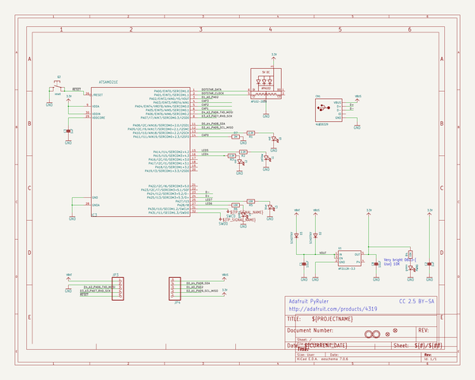
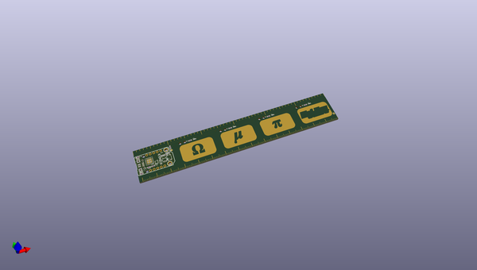
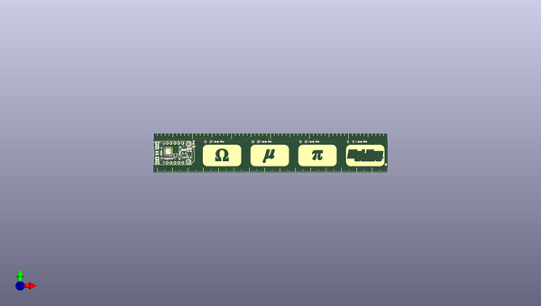
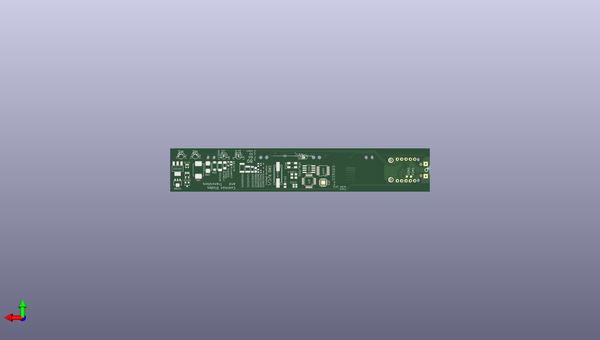

# adafruit_pyruler_pcb
 
## summary 
* id: adafruit_adafruit_pyruler_pcb_adafruit_pyruler
* user: adafruit
* name: adafruit_pyruler_pcb
* board: adafruit_pyruler
* repo: https://github.com/adafruit/Adafruit-PyRuler-PCB

* src_file_repo_sch: 
* src_file_repo_sch_link: https://github.com/adafruit/Adafruit-PyRuler-PCB/tree/master/
* full details link: https://github.com/oomlout/oomlout_oomp_project_bot_v_2/tree/main/projects/adafruit_adafruit_pyruler_pcb_adafruit_pyruler/current_version/working  

## schematic  
  
[schematic (pdf)](working_schematic.pdf) 

## pcb  
 
  
  
  
[board (pdf)](working.pdf)  

## working_bom
| Id | Designator | Footprint | Quantity | Designation | Supplier and ref |  | None | 
| --- | --- | --- | --- | --- | --- | --- | --- | 
| 1 | @HOLE1,@HOLE0 |  | 2 |  |  |  | [''] | 
| 2 | E$18,E$21,E$17,E$20,E$22,E$19 | EDGE-INCHES-TENTH | 6 |  |  |  | [''] | 
| 3 | JP4,JP3 | 1X05_ROUND_70 | 2 |  |  |  | [''] | 
| 4 | E$8,E$11,E$7,E$6,E$12,E$15,E$9,E$5,E$13,E$1,E$3,E$2,E$14,E$10,E$4 | EDGE-MILLIMETERS | 15 |  |  |  | [''] | 
| 5 | C3,C2 | 0603-NO | 2 | 1uF |  |  | [''] | 
| 6 | U1 | SOT23-5 | 1 | AP2112K-3.3 |  |  | [''] | 
| 7 | R1,R2,R3 | 0603-NO | 3 | 2.2K |  |  | [''] | 
| 8 | U$8,U$9 | MOUNTINGHOLE_2.0_PLATED | 2 | MOUNTINGHOLE2.0 |  |  | [''] | 
| 9 | Q2 | BTN_KMR2_4.6X2.8 | 1 | reset |  |  | [''] | 
| 10 | LED1 | APA102_2020 | 1 | AP102-2020 |  |  | [''] | 
| 11 | U$6,U$1 | FIDUCIAL_1MM | 2 | FIDUCIAL_1MM |  |  | [''] | 
| 12 | D2,D3 | SOD-123FL | 2 | SCHOTTKY |  |  | [''] | 
| 13 | U$20 | TRINKET_M0_TOP | 1 |  |  |  | [''] | 
| 14 | C1,C8 | 0805-NO | 2 | 10uF |  |  | [''] | 
| 15 | CN1 | 4UCONN_20329_NARROW | 1 | 4U#20329 |  |  | [''] | 
| 16 | R7 | 0603-NO | 1 | 2M |  |  | [''] | 
| 17 | L4,PWR0 | CHIPLED_0603_NOOUTLINE | 2 | green |  |  | [''] | 
| 18 | IC3 | QFN32_5MM | 1 | ATSAMD21E |  |  | [''] | 
| 19 | L2,L0 | CHIPLED_0603_NOOUTLINE | 2 | red |  |  | [''] | 
| 20 | L1 | CHIPLED_0603_NOOUTLINE | 1 | yellow |  |  | [''] | 
| 21 | U$14 | PYRULER_TOP | 1 |  |  |  | [''] | 
| 22 | L3 | CHIPLED_0603_NOOUTLINE | 1 | blue |  |  | [''] | 
| 23 | R5,R6,R4 | 0603-NO | 3 | 10K |  |  | [''] | 
| 24 | E$57 | SO08 | 1 |  |  |  | [''] | 
| 25 | U$2 | PYRULER_BOTTOM | 1 |  |  |  | [''] | 
| 26 | E$25 | 0805 | 1 |  |  |  | [''] | 
| 27 | E$38 | CRYSTAL-SMD-2.5X2 | 1 |  |  |  | [''] | 
| 28 | E$27 | 1210 | 1 |  |  |  | [''] | 
| 29 | E$32 | SOT89 | 1 |  |  |  | [''] | 
| 30 | E$53 | LED-GUIDE | 1 |  |  |  | [''] | 
| 31 | U$7 | PCBFEAT-REV-040 | 1 |  |  |  | [''] | 
| 32 | E$16,E$63,E$60 | 0201 | 3 |  |  |  | [''] | 
| 33 | E$31 | SOT223 | 1 |  |  |  | [''] | 
| 34 | E$40 | XTAL-2X1.2 | 1 |  |  |  | [''] | 
| 35 | E$50 | NMOS-SYMB | 1 |  |  |  | [''] | 
| 36 | E$39 | HC49UP | 1 |  |  |  | [''] | 
| 37 | E$33 | SOT23-5 | 1 |  |  |  | [''] | 
| 38 | E$36 | CRYSTAL-SMD-5X3.2 | 1 |  |  |  | [''] | 
| 39 | E$24,E$62 | 0603 | 2 |  |  |  | [''] | 
| 40 | SWD0,SWC0 | B1,27 | 2 | TPB1,27 |  |  | [''] | 
| 41 | E$54 | NPN-SYMB | 1 |  |  |  | [''] | 
| 42 | E$35 | SC70 | 1 |  |  |  | [''] | 
| 43 | E$49 | SOD80C | 1 |  |  |  | [''] | 
| 44 | E$55 | QFN-24 | 1 |  |  |  | [''] | 
| 45 | E$52 | DIODE-SYMB | 1 |  |  |  | [''] | 
| 46 | E$34 | SOT23-3 | 1 |  |  |  | [''] | 
| 47 | E$43 | SMA-DIODE | 1 |  |  |  | [''] | 
| 48 | E$41 | MICROMELF-R | 1 |  |  |  | [''] | 
| 49 | E$37 | CRYSTAL-SMD-3.2X2.5 | 1 |  |  |  | [''] | 
| 50 | E$28 | 2010 | 1 |  |  |  | [''] | 
| 51 | E$58 | TQFP32-5MM | 1 |  |  |  | [''] | 
| 52 | E$51 | PMOS-SYMB | 1 |  |  |  | [''] | 
| 53 | E$61,E$23 | 0402 | 2 |  |  |  | [''] | 
| 54 | E$44 | SMB-DIODE | 1 |  |  |  | [''] | 
| 55 | E$45 | SMC | 1 |  |  |  | [''] | 
| 56 | E$59 | PNP-SYMB | 1 |  |  |  | [''] | 
| 57 | E$26 | 1206 | 1 |  |  |  | [''] | 
| 58 | E$47 | SOD-128 | 1 |  |  |  | [''] | 
| 59 | E$48 | SOD-323 | 1 |  |  |  | [''] | 
| 60 | E$56 | TSSOP16 | 1 |  |  |  | [''] | 
| 61 | E$42 | SC79_INFINEON | 1 |  |  |  | [''] | 

## bom_schematic
| Ref | Qnty | Value | Cmp name | Footprint | Description | Vendor | DNP | 
| --- | --- | --- | --- | --- | --- | --- | --- | 
| C1, C8 | 2 | 10uF | CAP_CERAMIC0805-NOOUTLINE | working:0805-NO |  |  |  | 
| C2, C3 | 2 | 1uF | CAP_CERAMIC0603_NO | working:0603-NO |  |  |  | 
| CN1 | 1 | 4U#20329 | USB_MICRO_NARROW | working:4UCONN_20329_NARROW |  |  |  | 
| D2, D3 | 2 | SCHOTTKY | DIODE_SOD-123FL | working:SOD-123FL |  |  |  | 
| IC3 | 1 | ATSAMD21E | ATSAMD21E | working:QFN32_5MM |  |  |  | 
| JP3, JP4 | 2 | HEADER-1X570MIL | HEADER-1X570MIL | working:1X05_ROUND_70 |  |  |  | 
| L0, L2 | 2 | red | LED0603_NOOUTLINE | working:CHIPLED_0603_NOOUTLINE |  |  |  | 
| L1 | 1 | yellow | LED0603_NOOUTLINE | working:CHIPLED_0603_NOOUTLINE |  |  |  | 
| L3 | 1 | blue | LED0603_NOOUTLINE | working:CHIPLED_0603_NOOUTLINE |  |  |  | 
| L4 | 1 | green | LED0603_NOOUTLINE | working:CHIPLED_0603_NOOUTLINE |  |  |  | 
| LED1 | 1 | AP102-2020 | APA1022020 | working:APA102_2020 |  |  |  | 
| PWR0 | 1 | green | LED0603_NOOUTLINE | working:CHIPLED_0603_NOOUTLINE |  |  |  | 
| Q2 | 1 | reset | SWITCH_TACT_SMT4.6X2.8 | working:BTN_KMR2_4.6X2.8 |  |  |  | 
| R1, R2, R3 | 3 | 2.2K | RESISTOR_0603_NOOUT | working:0603-NO |  |  |  | 
| R4, R5, R6 | 3 | 10K | RESISTOR_0603_NOOUT | working:0603-NO |  |  |  | 
| R7 | 1 | 2M | RESISTOR_0603_NOOUT | working:0603-NO |  |  |  | 
| SWC0 | 1 | TPB1,27 | TPB1,27 | working:B1,27 |  |  |  | 
| SWD0 | 1 | TPB1,27 | TPB1,27 | working:B1,27 |  |  |  | 
| U1 | 1 | AP2112K-3.3 | VREG_SOT23-5 | working:SOT23-5 |  |  |  | 
| U$1, U$6 | 2 | FIDUCIAL_1MM | FIDUCIAL_1MM | working:FIDUCIAL_1MM |  |  |  | 
| U$8, U$9 | 2 | MOUNTINGHOLE2.0 | MOUNTINGHOLE2.0 | working:MOUNTINGHOLE_2.0_PLATED |  |  |  | 

## mounting_holes
| x | y | package | value | ref | size | 
| --- | --- | --- | --- | --- | --- | 
| 0.0 | 0.0 | MOUNTINGHOLE_2.0_PLATED | MOUNTINGHOLE2.0 | U$8 | m3 | 
| 0.0 | 11.43 | MOUNTINGHOLE_2.0_PLATED | MOUNTINGHOLE2.0 | U$9 | m3 | 

