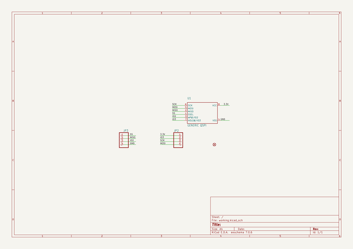
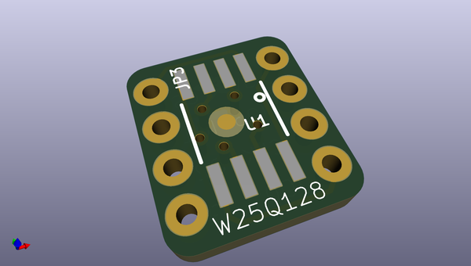
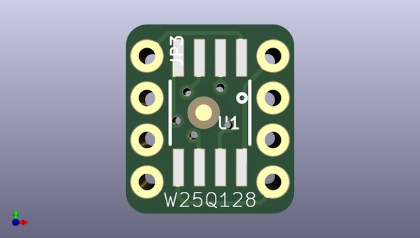
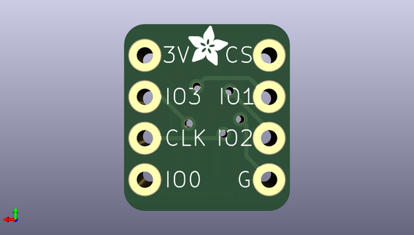

# adafruit_qspi_dip_breakout_pcb
 
## summary 
* id: adafruit_adafruit_qspi_dip_breakout_pcb_adafruit_qspi_dip_breakout
* user: adafruit
* name: adafruit_qspi_dip_breakout_pcb
* board: adafruit_qspi_dip_breakout
* repo: https://github.com/adafruit/Adafruit-QSPI-DIP-Breakout-PCB

* src_file_repo_sch: 
* src_file_repo_sch_link: https://github.com/adafruit/Adafruit-QSPI-DIP-Breakout-PCB/tree/main/
* full details link: https://github.com/oomlout/oomlout_oomp_project_bot_v_2/tree/main/projects/adafruit_adafruit_qspi_dip_breakout_pcb_adafruit_qspi_dip_breakout/current_version/working  

## schematic  
  
[schematic (pdf)](working_schematic.pdf)  

## pcb  
 
  
  
  
[board (pdf)](working.pdf)  

## working_bom
| Id | Designator | Footprint | Quantity | Designation | Supplier and ref |  | None | 
| --- | --- | --- | --- | --- | --- | --- | --- | 
| 1 | JP3,JP2 | 1X04_ROUND_76 | 2 |  |  |  | [''] | 
| 2 | FID1 | FIDUCIAL_1MM | 1 | FIDUCIAL_1MM |  |  | [''] | 
| 3 | U1 | SOIC8_208MIL | 1 | GENERIC QSPI |  |  | [''] | 
| 4 | U$4 | ADAFRUIT_2.5MM | 1 |  |  |  | [''] | 

## bom_schematic
| Ref | Qnty | Value | Cmp name | Footprint | Description | Vendor | DNP | 
| --- | --- | --- | --- | --- | --- | --- | --- | 
| FID1 | 1 | FIDUCIAL_1MM | FIDUCIAL_1MM | working:FIDUCIAL_1MM |  |  |  | 
| JP2, JP3 | 2 | HEADER-1X476MIL | HEADER-1X476MIL | working:1X04_ROUND_76 |  |  |  | 
| U1 | 1 | GENERIC QSPI | SPIFLASH_8PIN208MIL | working:SOIC8_208MIL |  |  |  | 

