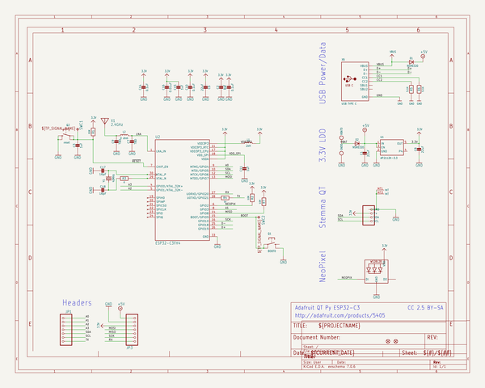
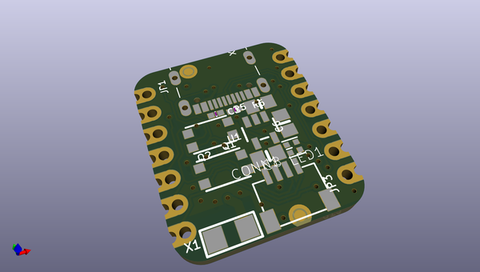
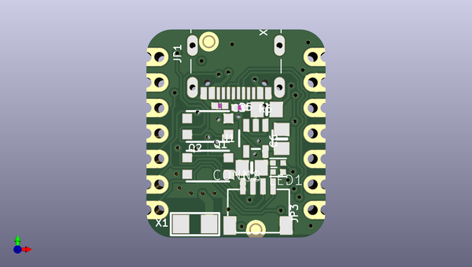
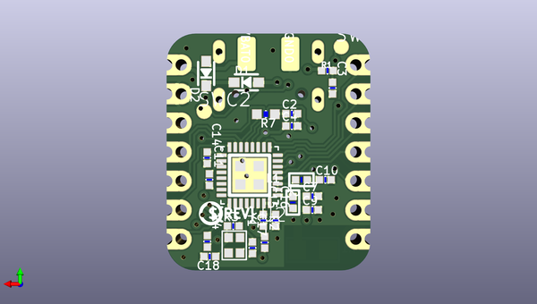

# adafruit_qt_py_esp32_c3_pcb
 
## summary 
* id: adafruit_adafruit_qt_py_esp32_c3_pcb_adafruit_qt_py_esp32_c3
* user: adafruit
* name: adafruit_qt_py_esp32_c3_pcb
* board: adafruit_qt_py_esp32_c3
* repo: https://github.com/adafruit/Adafruit-QT-Py-ESP32-C3-PCB

* src_file_repo_sch: 
* src_file_repo_sch_link: https://github.com/adafruit/Adafruit-QT-Py-ESP32-C3-PCB/tree/main/
* full details link: https://github.com/oomlout/oomlout_oomp_project_bot_v_2/tree/main/projects/adafruit_adafruit_qt_py_esp32_c3_pcb_adafruit_qt_py_esp32_c3/current_version/working  

## schematic  
  
[schematic (pdf)](working_schematic.pdf)  

## pcb  
 
  
  
  
[board (pdf)](working.pdf)  

## working_bom
| Id | Designator | Footprint | Quantity | Designation | Supplier and ref |  | None | 
| --- | --- | --- | --- | --- | --- | --- | --- | 
| 1 | C8,C1,C6 | 0805-NO | 3 | 22uF |  |  | [''] | 
| 2 | JP3,JP1 | 1X07_CASTEL | 2 |  |  |  | [''] | 
| 3 | Q2 | BTN_KMR2_SLIM | 1 | reset |  |  | [''] | 
| 4 | LED1 | SK6805_1515 | 1 | WS2812B_SK6805_1515 |  |  | [''] | 
| 5 | U1 | SOT23-5 | 1 | AP2112K-3.3 |  |  | [''] | 
| 6 | R5,R6 | _0402NO | 2 | 5.1K |  |  | [''] | 
| 7 | U$3 | QTPYC3_TOP | 1 |  |  |  | [''] | 
| 8 | X6 | USB_C_CUSB31-CFM2AX-01-X | 1 | USB TYPE C |  |  | [''] | 
| 9 | Q1 | BTN_KMR2_4.6X2.8 | 1 | BOOT0 |  |  | [''] | 
| 10 | U$8,U$6 | FIDUCIAL_1MM | 2 | FIDUCIAL_1MM |  |  | [''] | 
| 11 | X1 | ANT_2450AT18B100 | 1 | 2.4GHz |  |  | [''] | 
| 12 | CONN1 | JST_SH4_SKINNY | 1 | STEMMA_I2C_QTSKINNY |  |  | [''] | 
| 13 | C14,C4,C10 | _0402NO | 3 | 0.1uF |  |  | [''] | 
| 14 | GND0 | TESTPOINT_MINUS_1X3MM | 1 |  |  |  | [''] | 
| 15 | C3,C11,C2,C15 | _0402NO | 4 | 1uF |  |  | [''] | 
| 16 | SWC1,SWC2 | B1,27 | 2 | TPB1,27 |  |  | [''] | 
| 17 | L1 | _0402 | 1 | 2nH |  |  | [''] | 
| 18 | R3 | _0402NO | 1 | 0 |  |  | [''] | 
| 19 | R1,R2 | _0402NO | 2 | 10K |  |  | [''] | 
| 20 | VBAT0 | TESTPOINT_PLUS_1X3MM | 1 |  |  |  | [''] | 
| 21 | C16 | _0402NO | 1 | 0.01uF |  |  | [''] | 
| 22 | C18,C17 | _0402NO | 2 | 16pF |  |  | [''] | 
| 23 | Y1 | CRYSTAL_2X1.6 | 1 | 40MHz |  |  | [''] | 
| 24 | L2 | _0402 | 1 | 0 ohm |  |  | [''] | 
| 25 | U$18 | QTPYC3_BOT | 1 |  |  |  | [''] | 
| 26 | U$12 | PCBFEAT-REV-040 | 1 |  |  |  | [''] | 
| 27 | U2 | QFN32_5MM | 1 | ESP32-C3FH4 |  |  | [''] | 
| 28 | D1,D2 | SOD-323_MINI | 2 |   NSR0320 |  |  | [''] | 
| 29 | C9,C7 | _0402NO | 2 | TBD |  |  | [''] | 
| 30 | R7 | _0603MP_TWO6MIL | 1 | 10K |  |  | [''] | 
| 31 | R4 | _0402NO | 1 | 1k |  |  | [''] | 

## bom_schematic
| Ref | Qnty | Value | Cmp name | Footprint | Description | Vendor | DNP | 
| --- | --- | --- | --- | --- | --- | --- | --- | 
| C1, C6, C8 | 3 | 22uF | CAP_CERAMIC0805-NOOUTLINE | working:0805-NO |  |  |  | 
| C2, C3, C11, C15 | 4 | 1uF | CAP_CERAMIC_0402NO | working:_0402NO |  |  |  | 
| C4, C10, C14 | 3 | 0.1uF | CAP_CERAMIC_0402NO | working:_0402NO |  |  |  | 
| C7, C9 | 2 | TBD | CAP_CERAMIC_0402NO | working:_0402NO |  |  |  | 
| C16 | 1 | 0.01uF | CAP_CERAMIC_0402NO | working:_0402NO |  |  |  | 
| C17, C18 | 2 | 16pF | CAP_CERAMIC_0402NO | working:_0402NO |  |  |  | 
| CONN1 | 1 | STEMMA_I2C_QTSKINNY | STEMMA_I2C_QTSKINNY | working:JST_SH4_SKINNY |  |  |  | 
| D1, D2 | 2 |   NSR0320 | DIODE_SOD323MINI | working:SOD-323_MINI |  |  |  | 
| GND0 | 1 | TESTPOINT_MINUS | TESTPOINT_MINUS | working:TESTPOINT_MINUS_1X3MM |  |  |  | 
| JP1, JP3 | 2 | HEADER-1X7_CASTEL | HEADER-1X7_CASTEL | working:1X07_CASTEL |  |  |  | 
| L1 | 1 | 2nH | INDUCTOR_0402 | working:_0402 |  |  |  | 
| L2 | 1 | 0 ohm | INDUCTOR_0402 | working:_0402 |  |  |  | 
| LED1 | 1 | WS2812B_SK6805_1515 | WS2812B_SK6805_1515 | working:SK6805_1515 |  |  |  | 
| Q1 | 1 | BOOT0 | SWITCH_TACT_SMT4.6X2.8 | working:BTN_KMR2_4.6X2.8 |  |  |  | 
| Q2 | 1 | reset | SWITCH_TACT_SMT_KMR2SLIM | working:BTN_KMR2_SLIM |  |  |  | 
| R1, R2 | 2 | 10K | RESISTOR_0402NO | working:_0402NO |  |  |  | 
| R3 | 1 | 0 | RESISTOR_0402NO | working:_0402NO |  |  |  | 
| R4 | 1 | 1k | RESISTOR_0402NO | working:_0402NO |  |  |  | 
| R5, R6 | 2 | 5.1K | RESISTOR_0402NO | working:_0402NO |  |  |  | 
| R7 | 1 | 10K | RESISTOR_TWO6MIL | working:_0603MP_TWO6MIL |  |  |  | 
| SWC1, SWC2 | 2 | TPB1,27 | TPB1,27 | working:B1,27 |  |  |  | 
| U1 | 1 | AP2112K-3.3 | VREG_SOT23-5 | working:SOT23-5 |  |  |  | 
| U2 | 1 | ESP32-C3FH4 | ESP32-C3FH4 | working:QFN32_5MM |  |  |  | 
| U$6, U$8 | 2 | FIDUCIAL_1MM | FIDUCIAL_1MM | working:FIDUCIAL_1MM |  |  |  | 
| VBAT0 | 1 | TESTPOINT_PLUS13 | TESTPOINT_PLUS13 | working:TESTPOINT_PLUS_1X3MM |  |  |  | 
| X1 | 1 | 2.4GHz | ANTENNA_JOHANSON_2450AT18B100 | working:ANT_2450AT18B100 |  |  |  | 
| X6 | 1 | USB TYPE C | USB_C | working:USB_C_CUSB31-CFM2AX-01-X |  |  |  | 
| Y1 | 1 | 40MHz | CRYSTAL_2X1.6MM | working:CRYSTAL_2X1.6 |  |  |  | 

