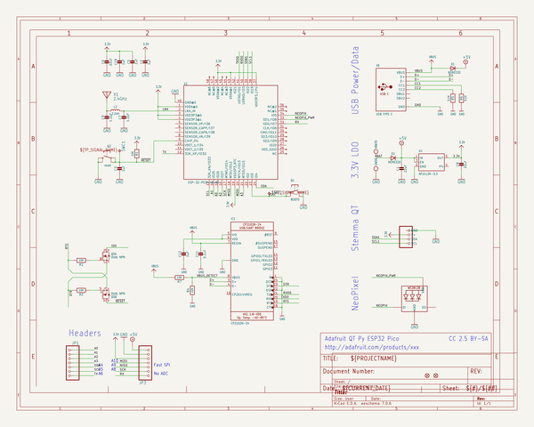
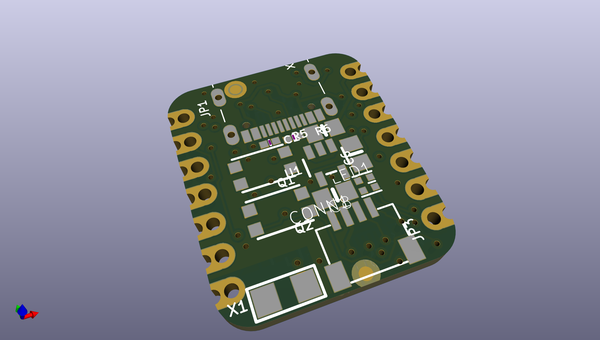
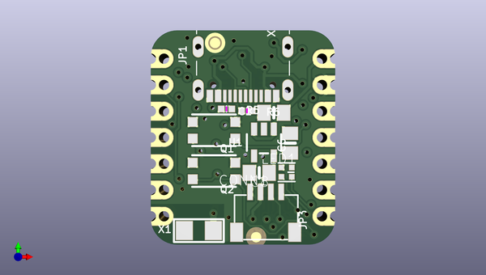
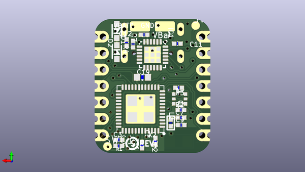

# adafruit_qt_py_esp32_pico_pcb
 
## summary 
* id: adafruit_adafruit_qt_py_esp32_pico_pcb_adafruit_qt_py_esp32_pico
* user: adafruit
* name: adafruit_qt_py_esp32_pico_pcb
* board: adafruit_qt_py_esp32_pico
* repo: https://github.com/adafruit/Adafruit-QT-Py-ESP32-Pico-PCB

* src_file_repo_sch: 
* src_file_repo_sch_link: https://github.com/adafruit/Adafruit-QT-Py-ESP32-Pico-PCB/tree/main/
* full details link: https://github.com/oomlout/oomlout_oomp_project_bot_v_2/tree/main/projects/adafruit_adafruit_qt_py_esp32_pico_pcb_adafruit_qt_py_esp32_pico/current_version/working  

## schematic  
  
[schematic (pdf)](working_schematic.pdf)  

## pcb  
 
  
  
  
[board (pdf)](working.pdf)  

## working_bom
| Id | Designator | Footprint | Quantity | Designation | Supplier and ref |  | None | 
| --- | --- | --- | --- | --- | --- | --- | --- | 
| 1 | Q2 | BTN_KMR2_4.6X2.8 | 1 | reset |  |  | [''] | 
| 2 | R5,R6 | _0402NO | 2 | 5.1K |  |  | [''] | 
| 3 | C6,C1,C8 | 0805-NO | 3 | 22uF |  |  | [''] | 
| 4 | X6 | USB_C_CUSB31-CFM2AX-01-X | 1 | USB TYPE C |  |  | [''] | 
| 5 | X1 | ANT_2450AT18B100 | 1 | 2.4GHz |  |  | [''] | 
| 6 | U$22 | QTPY_ESP32_TOP | 1 |  |  |  | [''] | 
| 7 | JP3,JP1 | 1X07_CASTEL | 2 |  |  |  | [''] | 
| 8 | U1 | SOT23-5 | 1 | AP2112K-3.3 |  |  | [''] | 
| 9 | LED1 | SK6805_1515 | 1 | WS2812B_SK6805_1515 |  |  | [''] | 
| 10 | U$8,U$6 | FIDUCIAL_1MM | 2 | FIDUCIAL_1MM |  |  | [''] | 
| 11 | Q1 | BTN_KMR2_4.6X2.8 | 1 | BOOT0 |  |  | [''] | 
| 12 | CONN1 | JST_SH4_SKINNY | 1 | STEMMA_I2C_QTSKINNY |  |  | [''] | 
| 13 | R7,R3,R1,R2 | _0402NO | 4 | 10K |  |  | [''] | 
| 14 | VBAT0 | TESTPOINT_PLUS_1X3MM | 1 |  |  |  | [''] | 
| 15 | GND0 | TESTPOINT_MINUS_1X3MM | 1 |  |  |  | [''] | 
| 16 | C9,C7 | _0402NO | 2 | 1.2pF |  |  | [''] | 
| 17 | L2 | _0402 | 1 | 2.2nH |  |  | [''] | 
| 18 | SWC1,SWC2 | B1,27 | 2 | TPB1,27 |  |  | [''] | 
| 19 | C5 | _0402NO | 1 | .1uF |  |  | [''] | 
| 20 | D1,D2 | SOD-323_MINI | 2 |   NSR0320 |  |  | [''] | 
| 21 | R4 | _0402NO | 1 | 22K |  |  | [''] | 
| 22 | C2,C3,C12 | _0402NO | 3 | 1uF |  |  | [''] | 
| 23 | U$12 | PCBFEAT-REV-040 | 1 |  |  |  | [''] | 
| 24 | IC1 | QFN24_4MM_SMSC | 1 | CP2102N-24 |  |  | [''] | 
| 25 | C11 | _0402NO | 1 | 0.1uF |  |  | [''] | 
| 26 | X2 | QFN48_7X7 | 1 | ESP-32-PICO-V3-02 |  |  | [''] | 
| 27 | Q5 | SOT363 | 1 | DUAL NPN |  |  | [''] | 
| 28 | U$3 | QTPY_ESP32_BOT | 1 |  |  |  | [''] | 
| 29 | C19 | 0603-NO_WIDE | 1 | 1uF |  |  | [''] | 

## bom_schematic
| Ref | Qnty | Value | Cmp name | Footprint | Description | Vendor | DNP | 
| --- | --- | --- | --- | --- | --- | --- | --- | 
| C1, C6, C8 | 3 | 22uF | CAP_CERAMIC0805-NOOUTLINE | working:0805-NO |  |  |  | 
| C2, C3, C12 | 3 | 1uF | CAP_CERAMIC_0402NO | working:_0402NO |  |  |  | 
| C5 | 1 | .1uF | CAP_CERAMIC_0402NO | working:_0402NO |  |  |  | 
| C7, C9 | 2 | 1.2pF | CAP_CERAMIC_0402NO | working:_0402NO |  |  |  | 
| C11 | 1 | 0.1uF | CAP_CERAMIC_0402NO | working:_0402NO |  |  |  | 
| C19 | 1 | 1uF | CAP_CERAMIC_0603WIDE | working:0603-NO_WIDE |  |  |  | 
| CONN1 | 1 | STEMMA_I2C_QTSKINNY | STEMMA_I2C_QTSKINNY | working:JST_SH4_SKINNY |  |  |  | 
| D1, D2 | 2 |   NSR0320 | DIODE_SOD323MINI | working:SOD-323_MINI |  |  |  | 
| GND0 | 1 | TESTPOINT_MINUS | TESTPOINT_MINUS | working:TESTPOINT_MINUS_1X3MM |  |  |  | 
| IC1 | 1 | CP2102N-24 | CP2102N-24 | working:QFN24_4MM_SMSC |  |  |  | 
| JP1, JP3 | 2 | HEADER-1X7_CASTEL | HEADER-1X7_CASTEL | working:1X07_CASTEL |  |  |  | 
| L2 | 1 | 2.2nH | INDUCTOR_0402 | working:_0402 |  |  |  | 
| LED1 | 1 | WS2812B_SK6805_1515 | WS2812B_SK6805_1515 | working:SK6805_1515 |  |  |  | 
| Q1 | 1 | BOOT0 | SWITCH_TACT_SMT4.6X2.8 | working:BTN_KMR2_4.6X2.8 |  |  |  | 
| Q2 | 1 | reset | SWITCH_TACT_SMT4.6X2.8 | working:BTN_KMR2_4.6X2.8 |  |  |  | 
| Q5 | 1 | DUAL NPN | MOSFET-N_DUAL | working:SOT363 |  |  |  | 
| R1, R2, R3, R7 | 4 | 10K | RESISTOR_0402NO | working:_0402NO |  |  |  | 
| R4 | 1 | 22K | RESISTOR_0402NO | working:_0402NO |  |  |  | 
| R5, R6 | 2 | 5.1K | RESISTOR_0402NO | working:_0402NO |  |  |  | 
| SWC1, SWC2 | 2 | TPB1,27 | TPB1,27 | working:B1,27 |  |  |  | 
| U1 | 1 | AP2112K-3.3 | VREG_SOT23-5 | working:SOT23-5 |  |  |  | 
| U$6, U$8 | 2 | FIDUCIAL_1MM | FIDUCIAL_1MM | working:FIDUCIAL_1MM |  |  |  | 
| VBAT0 | 1 | TESTPOINT_PLUS13 | TESTPOINT_PLUS13 | working:TESTPOINT_PLUS_1X3MM |  |  |  | 
| X1 | 1 | 2.4GHz | ANTENNA_JOHANSON_2450AT18B100 | working:ANT_2450AT18B100 |  |  |  | 
| X2 | 1 | ESP-32-PICO-V3-02 | ESP-32-PICO-V3-02 | working:QFN48_7X7 |  |  |  | 
| X6 | 1 | USB TYPE C | USB_C | working:USB_C_CUSB31-CFM2AX-01-X |  |  |  | 

