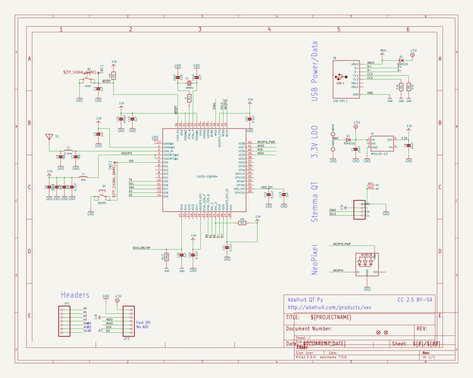
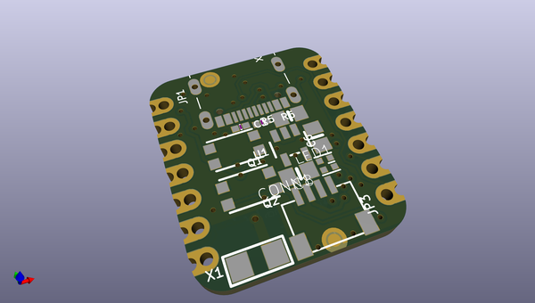
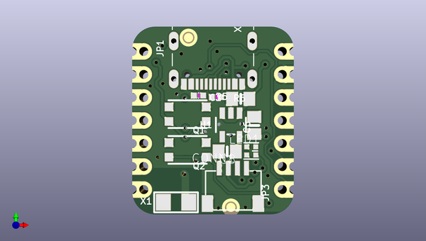
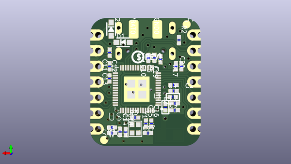

# adafruit_qt_py_esp32_s2_pcb
 
## summary 
* id: adafruit_adafruit_qt_py_esp32_s2_pcb_adafruit_qt_py_esp32_s2
* user: adafruit
* name: adafruit_qt_py_esp32_s2_pcb
* board: adafruit_qt_py_esp32_s2
* repo: https://github.com/adafruit/Adafruit-QT-Py-ESP32-S2-PCB

* src_file_repo_sch: 
* src_file_repo_sch_link: https://github.com/adafruit/Adafruit-QT-Py-ESP32-S2-PCB/tree/main/
* full details link: https://github.com/oomlout/oomlout_oomp_project_bot_v_2/tree/main/projects/adafruit_adafruit_qt_py_esp32_s2_pcb_adafruit_qt_py_esp32_s2/current_version/working  

## schematic  
  
[schematic (pdf)](working_schematic.pdf)  

## pcb  
 
  
  
  
[board (pdf)](working.pdf)  

## working_bom
| Id | Designator | Footprint | Quantity | Designation | Supplier and ref |  | None | 
| --- | --- | --- | --- | --- | --- | --- | --- | 
| 1 | JP3,JP1 | 1X07_CASTEL | 2 |  |  |  | [''] | 
| 2 | R5,R6 | _0402NO | 2 | 5.1K |  |  | [''] | 
| 3 | C1,C6,C8 | 0805-NO | 3 | 22uF |  |  | [''] | 
| 4 | U$6,U$8 | FIDUCIAL_1MM | 2 | FIDUCIAL_1MM |  |  | [''] | 
| 5 | X6 | USB_C_CUSB31-CFM2AX-01-X | 1 | USB TYPE C |  |  | [''] | 
| 6 | Q1 | BTN_KMR2_4.6X2.8 | 1 | BOOT0 |  |  | [''] | 
| 7 | CONN1 | JST_SH4_SKINNY | 1 | STEMMA_I2C_QTSKINNY |  |  | [''] | 
| 8 | U1 | SOT23-5 | 1 | AP2112K-3.3 |  |  | [''] | 
| 9 | Q2 | BTN_KMR2_4.6X2.8 | 1 | reset |  |  | [''] | 
| 10 | U$13 | QTPY_ESP32_TOP | 1 |  |  |  | [''] | 
| 11 | LED1 | SK6805_1515 | 1 | WS2812B_SK6805_1515 |  |  | [''] | 
| 12 | X1 | ANT_2450AT18B100 | 1 |  |  |  | [''] | 
| 13 | D1,D2 | SOD-323_MINI | 2 |   NSR0320 |  |  | [''] | 
| 14 | U$12 | PCBFEAT-REV-040 | 1 |  |  |  | [''] | 
| 15 | C19,C3,C5,C13,C2,C15,C20 | _0402NO | 7 | 1uF |  |  | [''] | 
| 16 | C17,C18 | _0402NO | 2 | 16pF |  |  | [''] | 
| 17 | C16 | _0402NO | 1 | 100pF |  |  | [''] | 
| 18 | U$7 | QTPYS2_BOT | 1 |  |  |  | [''] | 
| 19 | L1 | _0402 | 1 | 2nH |  |  | [''] | 
| 20 | C9,C7 | _0402NO | 2 | TBD |  |  | [''] | 
| 21 | U$15 | QFN56_7X7 | 1 | ESP32-S2QFN54 |  |  | [''] | 
| 22 | VBAT0 | TESTPOINT_PLUS_1X3MM | 1 |  |  |  | [''] | 
| 23 | GND0 | TESTPOINT_MINUS_1X3MM | 1 |  |  |  | [''] | 
| 24 | R2,R1 | _0402NO | 2 | 10K |  |  | [''] | 
| 25 | C11,C10,C4,C12,C14 | _0402NO | 5 | 0.1uF |  |  | [''] | 
| 26 | L2 | _0402 | 1 | 0 ohm |  |  | [''] | 
| 27 | SWC1,SWC2 | B1,27 | 2 | TPB1,27 |  |  | [''] | 
| 28 | Y1 | CRYSTAL_2X1.6 | 1 | 40MHz |  |  | [''] | 
| 29 | R17 | _0402NO | 1 | 1Meg |  |  | [''] | 
| 30 | R3 | _0402NO | 1 | 0 |  |  | [''] | 

## bom_schematic
| Ref | Qnty | Value | Cmp name | Footprint | Description | Vendor | DNP | 
| --- | --- | --- | --- | --- | --- | --- | --- | 
| C1, C6, C8 | 3 | 22uF | CAP_CERAMIC0805-NOOUTLINE | working:0805-NO |  |  |  | 
| C2, C3, C5, C13, C15, C19, C20 | 7 | 1uF | CAP_CERAMIC_0402NO | working:_0402NO |  |  |  | 
| C4, C10, C11, C12, C14 | 5 | 0.1uF | CAP_CERAMIC_0402NO | working:_0402NO |  |  |  | 
| C7, C9 | 2 | TBD | CAP_CERAMIC_0402NO | working:_0402NO |  |  |  | 
| C16 | 1 | 100pF | CAP_CERAMIC_0402NO | working:_0402NO |  |  |  | 
| C17, C18 | 2 | 16pF | CAP_CERAMIC_0402NO | working:_0402NO |  |  |  | 
| CONN1 | 1 | STEMMA_I2C_QTSKINNY | STEMMA_I2C_QTSKINNY | working:JST_SH4_SKINNY |  |  |  | 
| D1, D2 | 2 |   NSR0320 | DIODE_SOD323MINI | working:SOD-323_MINI |  |  |  | 
| GND0 | 1 | TESTPOINT_MINUS | TESTPOINT_MINUS | working:TESTPOINT_MINUS_1X3MM |  |  |  | 
| JP1, JP3 | 2 | HEADER-1X7_CASTEL | HEADER-1X7_CASTEL | working:1X07_CASTEL |  |  |  | 
| L1 | 1 | 2nH | INDUCTOR_0402 | working:_0402 |  |  |  | 
| L2 | 1 | 0 ohm | INDUCTOR_0402 | working:_0402 |  |  |  | 
| LED1 | 1 | WS2812B_SK6805_1515 | WS2812B_SK6805_1515 | working:SK6805_1515 |  |  |  | 
| Q1 | 1 | BOOT0 | SWITCH_TACT_SMT4.6X2.8 | working:BTN_KMR2_4.6X2.8 |  |  |  | 
| Q2 | 1 | reset | SWITCH_TACT_SMT4.6X2.8 | working:BTN_KMR2_4.6X2.8 |  |  |  | 
| R1, R2 | 2 | 10K | RESISTOR_0402NO | working:_0402NO |  |  |  | 
| R3 | 1 | 0 | RESISTOR_0402NO | working:_0402NO |  |  |  | 
| R5, R6 | 2 | 5.1K | RESISTOR_0402NO | working:_0402NO |  |  |  | 
| R17 | 1 | 1Meg | RESISTOR_0402NO | working:_0402NO |  |  |  | 
| SWC1, SWC2 | 2 | TPB1,27 | TPB1,27 | working:B1,27 |  |  |  | 
| U1 | 1 | AP2112K-3.3 | VREG_SOT23-5 | working:SOT23-5 |  |  |  | 
| U$6, U$8 | 2 | FIDUCIAL_1MM | FIDUCIAL_1MM | working:FIDUCIAL_1MM |  |  |  | 
| U$15 | 1 | ESP32-S2QFN54 | ESP32-S2QFN54 | working:QFN56_7X7 |  |  |  | 
| VBAT0 | 1 | TESTPOINT_PLUS13 | TESTPOINT_PLUS13 | working:TESTPOINT_PLUS_1X3MM |  |  |  | 
| X1 | 1 | ANTENNA_JOHANSON_2450AT18B100 | ANTENNA_JOHANSON_2450AT18B100 | working:ANT_2450AT18B100 |  |  |  | 
| X6 | 1 | USB TYPE C | USB_C | working:USB_C_CUSB31-CFM2AX-01-X |  |  |  | 
| Y1 | 1 | 40MHz | CRYSTAL_2X1.6MM | working:CRYSTAL_2X1.6 |  |  |  | 

