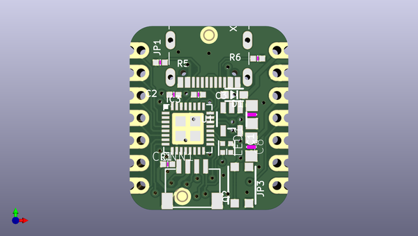

# adafruit_qt_py_pcb
 
## summary 
* id: adafruit_adafruit_qt_py_pcb_adafruit_qt_py
* user: adafruit
* name: adafruit_qt_py_pcb
* board: adafruit_qt_py
* repo: https://github.com/adafruit/Adafruit-QT-Py-PCB

* src_file_repo_sch: 
* src_file_repo_sch_link: https://github.com/adafruit/Adafruit-QT-Py-PCB/tree/master/
* full details link: https://github.com/oomlout/oomlout_oomp_project_bot_v_2/tree/main/projects/adafruit_adafruit_qt_py_pcb_adafruit_qt_py/current_version/working  

## schematic  
  
[schematic (pdf)](working_schematic.pdf) 

## pcb  
 
  
  
  
[board (pdf)](working.pdf)  

## working_bom
| Id | Designator | Footprint | Quantity | Designation | Supplier and ref |  | None | 
| --- | --- | --- | --- | --- | --- | --- | --- | 
| 1 | LED1 | SK6805_1515 | 1 | WS2812B_SK6805_1515 |  |  | [''] | 
| 2 | R5,R6,R1 | _0402NO | 3 | 5.1K |  |  | [''] | 
| 3 | JP3,JP1 | 1X07_CASTEL | 2 |  |  |  | [''] | 
| 4 | C2,C3 | _0402NO | 2 | 1uF |  |  | [''] | 
| 5 | C1,C8 | _0805MP | 2 | 10uF |  |  | [''] | 
| 6 | U1 | SOT23-5 | 1 | AP2112K-3.3 |  |  | [''] | 
| 7 | X6 | USB_C_CUSB31-CFM2AX-01-X | 1 | USB TYPE C |  |  | [''] | 
| 8 | Q2 | BTN_KMR2_4.6X2.8 | 1 | reset |  |  | [''] | 
| 9 | U$6,U$8 | FIDUCIAL_1MM | 2 | FIDUCIAL_1MM |  |  | [''] | 
| 10 | CONN1 | JST_SH4_SKINNY | 1 | STEMMA_I2C_QTSKINNY |  |  | [''] | 
| 11 | D1 | SOD-323_MINI | 1 |   NSR0320 |  |  | [''] | 
| 12 | IC3 | QFN32_5MM | 1 | ATSAMD21E |  |  | [''] | 
| 13 | U$13 | QTPY_TOP | 1 |  |  |  | [''] | 
| 14 | SWC1,SWD0,SWC0 | B1,27 | 3 | TPB1,27 |  |  | [''] | 
| 15 | TP1,TP2 | TESTPOINT_RECT_1X3MM | 2 |  |  |  | [''] | 
| 16 | U$12 | PCBFEAT-REV-040 | 1 |  |  |  | [''] | 
| 17 | U2 | SOIC8_150MIL | 1 |  |  |  | [''] | 
| 18 | U$11 | QTPY_BOT | 1 |  |  |  | [''] | 

## bom_schematic
| Ref | Qnty | Value | Cmp name | Footprint | Description | Vendor | DNP | 
| --- | --- | --- | --- | --- | --- | --- | --- | 
| C1, C8 | 2 | 10uF | CAP_CERAMIC_0805MP | working:_0805MP |  |  |  | 
| C2, C3 | 2 | 1uF | CAP_CERAMIC_0402NO | working:_0402NO |  |  |  | 
| CONN1 | 1 | STEMMA_I2C_QTSKINNY | STEMMA_I2C_QTSKINNY | working:JST_SH4_SKINNY |  |  |  | 
| D1 | 1 |   NSR0320 | DIODE_SOD323MINI | working:SOD-323_MINI |  |  |  | 
| IC3 | 1 | ATSAMD21E | ATSAMD21E | working:QFN32_5MM |  |  |  | 
| JP1, JP3 | 2 | HEADER-1X7_CASTEL | HEADER-1X7_CASTEL | working:1X07_CASTEL |  |  |  | 
| LED1 | 1 | WS2812B_SK6805_1515 | WS2812B_SK6805_1515 | working:SK6805_1515 |  |  |  | 
| Q2 | 1 | reset | SWITCH_TACT_SMT4.6X2.8 | working:BTN_KMR2_4.6X2.8 |  |  |  | 
| R1, R5, R6 | 3 | 5.1K | RESISTOR_0402NO | working:_0402NO |  |  |  | 
| SWC0, SWC1 | 2 | TPB1,27 | TPB1,27 | working:B1,27 |  |  |  | 
| SWD0 | 1 | TPB1,27 | TPB1,27 | working:B1,27 |  |  |  | 
| TP1, TP2 | 2 | TESTPOINT_1X3 | TESTPOINT_1X3 | working:TESTPOINT_RECT_1X3MM |  |  |  | 
| U1 | 1 | AP2112K-3.3 | VREG_SOT23-5 | working:SOT23-5 |  |  |  | 
| U2 | 1 | SPIFLASH_8PIN | SPIFLASH_8PIN | working:SOIC8_150MIL |  |  |  | 
| U$6, U$8 | 2 | FIDUCIAL_1MM | FIDUCIAL_1MM | working:FIDUCIAL_1MM |  |  |  | 
| X6 | 1 | USB TYPE C | USB_C | working:USB_C_CUSB31-CFM2AX-01-X |  |  |  | 

