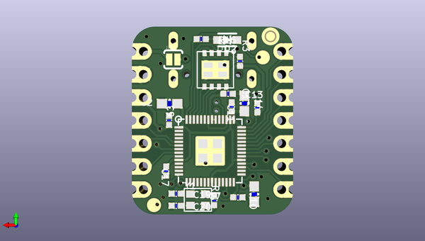

# adafruit_qt_py_rp2040_pcb
 
## summary 
* id: adafruit_adafruit_qt_py_rp2040_pcb_adafruit_qt_py_rp2040
* user: adafruit
* name: adafruit_qt_py_rp2040_pcb
* board: adafruit_qt_py_rp2040
* repo: https://github.com/adafruit/Adafruit-QT-Py-RP2040-PCB

* src_file_repo_sch: 
* src_file_repo_sch_link: https://github.com/adafruit/Adafruit-QT-Py-RP2040-PCB/tree/main/
* full details link: https://github.com/oomlout/oomlout_oomp_project_bot_v_2/tree/main/projects/adafruit_adafruit_qt_py_rp2040_pcb_adafruit_qt_py_rp2040/current_version/working  

## schematic  
  
[schematic (pdf)](working_schematic.pdf) 

## pcb  
 
  
  
  
[board (pdf)](working.pdf)  

## working_bom
| Id | Designator | Footprint | Quantity | Designation | Supplier and ref |  | None | 
| --- | --- | --- | --- | --- | --- | --- | --- | 
| 1 | R9,R3 | _0402NO | 2 | 10K |  |  | [''] | 
| 2 | U$8,U$6 | FIDUCIAL_1MM | 2 | FIDUCIAL_1MM |  |  | [''] | 
| 3 | CONN1 | JST_SH4_SKINNY | 1 | STEMMA_I2C_QTSKINNY |  |  | [''] | 
| 4 | C1,C8 | 0805-NO | 2 | 10uF |  |  | [''] | 
| 5 | U$2 | QTPICO_TOP | 1 |  |  |  | [''] | 
| 6 | SW2,SW1 | BTN_KMR2_4.6X2.8 | 2 | KMR2 |  |  | [''] | 
| 7 | D1,D2 | SOD-323_MINI | 2 |   NSR0320 |  |  | [''] | 
| 8 | LED1 | SK6805_1515 | 1 | WS2812B_SK6805_1515 |  |  | [''] | 
| 9 | R13,R12 | _0402NO | 2 | 5.1K |  |  | [''] | 
| 10 | X2 | USB_C_CUSB31-CFM2AX-01-X | 1 | USB Type C |  |  | [''] | 
| 11 | JP1,JP3 | 1X07_CASTEL | 2 |  |  |  | [''] | 
| 12 | R15,R14 | _0402NO | 2 | 27 |  |  | [''] | 
| 13 | U1 | SOT23-5 | 1 | AP2112K-3.3 |  |  | [''] | 
| 14 | C16,C17,C9,C13,C11,C14,C7 | _0402NO | 7 | 0.1uF |  |  | [''] | 
| 15 | U5 | USON8_4X4 | 1 | 8MB QSPI Flash |  |  | [''] | 
| 16 | IC2 | QFN56_7MM_REDUCEDEPAD | 1 | RP2040_QFN56 |  |  | [''] | 
| 17 | C10,C2,C12 | 0603-NO | 3 | 1uF |  |  | [''] | 
| 18 | C20,C19 | _0402NO | 2 | 22pF |  |  | [''] | 
| 19 | R16,R6 | _0402NO | 2 | 1K |  |  | [''] | 
| 20 | Y1 | CRYSTAL_2.5X2 | 1 | 12MHZ |  |  | [''] | 
| 21 | U$1 | QTPICO_BOT | 1 |  |  |  | [''] | 
| 22 | TP3,TP4 | TESTPOINT_ROUND_1.5MM_NO | 2 |  |  |  | [''] | 
| 23 | JP2 | SJ_2S-NO | 1 |  |  |  | [''] | 

## bom_schematic
| Ref | Qnty | Value | Cmp name | Footprint | Description | Vendor | DNP | 
| --- | --- | --- | --- | --- | --- | --- | --- | 
| C1, C8 | 2 | 10uF | CAP_CERAMIC0805-NOOUTLINE | working:0805-NO |  |  |  | 
| C2, C10, C12 | 3 | 1uF | CAP_CERAMIC0603_NO | working:0603-NO |  |  |  | 
| C7, C9, C11, C13, C14, C16, C17 | 7 | 0.1uF | CAP_CERAMIC_0402NO | working:_0402NO |  |  |  | 
| C19, C20 | 2 | 22pF | CAP_CERAMIC_0402NO | working:_0402NO |  |  |  | 
| CONN1 | 1 | STEMMA_I2C_QTSKINNY | STEMMA_I2C_QTSKINNY | working:JST_SH4_SKINNY |  |  |  | 
| D1, D2 | 2 |   NSR0320 | DIODE_SOD323MINI | working:SOD-323_MINI |  |  |  | 
| IC2 | 1 | RP2040_QFN56 | RP2040_QFN56 | working:QFN56_7MM_REDUCEDEPAD |  |  |  | 
| JP1, JP3 | 2 | HEADER-1X7_CASTEL | HEADER-1X7_CASTEL | working:1X07_CASTEL |  |  |  | 
| JP2 | 1 | JUMPER-2SMD-NO | JUMPER-2SMD-NO | working:SJ_2S-NO |  |  |  | 
| LED1 | 1 | WS2812B_SK6805_1515 | WS2812B_SK6805_1515 | working:SK6805_1515 |  |  |  | 
| R3, R9 | 2 | 10K | RESISTOR_0402NO | working:_0402NO |  |  |  | 
| R6, R16 | 2 | 1K | RESISTOR_0402NO | working:_0402NO |  |  |  | 
| R12, R13 | 2 | 5.1K | RESISTOR_0402NO | working:_0402NO |  |  |  | 
| R14, R15 | 2 | 27 | RESISTOR_0402NO | working:_0402NO |  |  |  | 
| SW1, SW2 | 2 | KMR2 | SWITCH_TACT_SMT4.6X2.8 | working:BTN_KMR2_4.6X2.8 |  |  |  | 
| TP3, TP4 | 2 | TESTPOINTROUND1.5MMNO | TESTPOINTROUND1.5MMNO | working:TESTPOINT_ROUND_1.5MM_NO |  |  |  | 
| U1 | 1 | AP2112K-3.3 | VREG_SOT23-5 | working:SOT23-5 |  |  |  | 
| U5 | 1 | 8MB QSPI Flash | SPIFLASH_8PIN_4X4 | working:USON8_4X4 |  |  |  | 
| U$6, U$8 | 2 | FIDUCIAL_1MM | FIDUCIAL_1MM | working:FIDUCIAL_1MM |  |  |  | 
| X2 | 1 | USB Type C | USB_C | working:USB_C_CUSB31-CFM2AX-01-X |  |  |  | 
| Y1 | 1 | 12MHZ | CRYSTAL2.5X2.0 | working:CRYSTAL_2.5X2 |  |  |  | 

