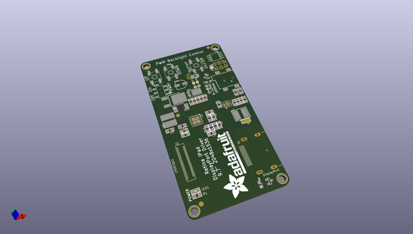

# adafruit_qualia_driver_pcb
 
## summary 
* id: adafruit_adafruit_qualia_driver_pcb_adafruit_qualia_driver
* user: adafruit
* name: adafruit_qualia_driver_pcb
* board: adafruit_qualia_driver
* repo: https://github.com/adafruit/Adafruit-Qualia-Driver-PCB

* src_file_repo_sch: 
* src_file_repo_sch_link: https://github.com/adafruit/Adafruit-Qualia-Driver-PCB/tree/master/
* full details link: https://github.com/oomlout/oomlout_oomp_project_bot_v_2/tree/main/projects/adafruit_adafruit_qualia_driver_pcb_adafruit_qualia_driver/current_version/working  

## schematic  
  
[schematic (pdf)](working_schematic.pdf)  

## pcb  
 
  
  
  
[board (pdf)](working.pdf)  

## working_bom
| Id | Designator | Footprint | Quantity | Designation | Supplier and ref |  | None | 
| --- | --- | --- | --- | --- | --- | --- | --- | 
| 1 | C3 | _0805 | 1 | 4.7nF |  |  | [''] | 
| 2 | U$32,U$33,U$34,U$11 | MOUNTINGHOLE_3.0_PLATEDTHIN | 4 | MOUNTINGHOLE3.0THIN |  |  | [''] | 
| 3 | C7,C8,C6,C2,C4,C5 | _0805 | 6 | 4.7uF/50V |  |  | [''] | 
| 4 | FID2,FID1,FID3 | FIDUCIAL_1MM | 3 | FIDUCIAL" |  |  | [''] | 
| 5 | Q1 | DPAK | 1 | IRLR024NTRPBF |  |  | [''] | 
| 6 | ISP1 | AVRISP | 1 | AVRISP-6 |  |  | [''] | 
| 7 | C9,C10 | _0805 | 2 | 10uF/16V |  |  | [''] | 
| 8 | SJ1 | SOLDERJUMPER_2WAY_OPEN_NOPASTE | 1 |  |  |  | [''] | 
| 9 | SW2,SW1,SW3 | EVQ-Q2 | 3 | SPST_TACT-EVQQ2 |  |  | [''] | 
| 10 | R6,R7 | _0805MP | 2 | 20K |  |  | [''] | 
| 11 | IC1 | SOIC8 | 1 | ATTINY85-20S |  |  | [''] | 
| 12 | TP2 | TESTPOINT_ROUND_1MM | 1 | VIN |  |  | [''] | 
| 13 | R10,R8 | _0805 | 2 | 47K |  |  | [''] | 
| 14 | C16 | PANASONIC_C | 1 | 47uF 25V |  |  | [''] | 
| 15 | U$39 | ADAFRUIT_TEXT_30MM | 1 |  |  |  | [''] | 
| 16 | X2 | FPC_51PIN_502250-5191_EXT | 1 | 502250-5191 |  |  | [''] | 
| 17 | R4,R9,R14 | _0805 | 3 | 20K |  |  | [''] | 
| 18 | R2,R3 | _0805 | 2 | 100K |  |  | [''] | 
| 19 | R11 | _0805 | 1 | 15K |  |  | [''] | 
| 20 | ON/OFF0 | EG1390 | 1 | EG1390 |  |  | [''] | 
| 21 | JP1 | 1X01-CLEANBIG | 1 |  |  |  | [''] | 
| 22 | TP3 | TESTPOINT_ROUND_1MM | 1 | 20V |  |  | [''] | 
| 23 | D1 | POWERDI-5 | 1 | PDS560-13 |  |  | [''] | 
| 24 | R13 | 2512 | 1 | 0.058 |  |  | [''] | 
| 25 | U$10 | SYMBOL_POSITIVE_CENTER-M | 1 |  |  |  | [''] | 
| 26 | C15,C14 | _0805 | 2 | 0.1uF |  |  | [''] | 
| 27 | C12,C13,C1 | _0805 | 3 | 10uF |  |  | [''] | 
| 28 | TP1,TP4 | TESTPOINT_ROUND_1MM | 2 | GND |  |  | [''] | 
| 29 | T2,T1 | SOT-23 | 2 | IRLML2246 |  |  | [''] | 
| 30 | LED1 | CHIPLED_0805 | 1 | green |  |  | [''] | 
| 31 | L2 | INDUCTOR_5X5MM_TDK_VLC5045 | 1 | 4.7uH (445-6526-1-ND) |  |  | [''] | 
| 32 | R12 | _0805 | 1 | 7.5K |  |  | [''] | 
| 33 | R1 | _0805 | 1 | 470 |  |  | [''] | 
| 34 | L1 | INDUCTOR_6X6MM_SUMIDA_CDRH5D28 | 1 | 22uH |  |  | [''] | 
| 35 | C11 | _0805 | 1 | 22nF |  |  | [''] | 
| 36 | D2 | SOD-323 | 1 | 1N4148 |  |  | [''] | 
| 37 | R5 | _0805 | 1 | 27K |  |  | [''] | 
| 38 | X1 | DISPLAYPORT_0472720001 | 1 | 0472720001 |  |  | [''] | 
| 39 | U2 | QFN16_3MM | 1 | MCP16321T-330E/NG  |  |  | [''] | 
| 40 | X3 | DCJACK_2MM_SMT | 1 | 2.1mm |  |  | [''] | 
| 41 | U1 | QFN32_5MM | 1 | LT3754 |  |  | [''] | 

## bom_schematic
| Ref | Qnty | Value | Cmp name | Footprint | Description | Vendor | DNP | 
| --- | --- | --- | --- | --- | --- | --- | --- | 
| C1, C12, C13 | 3 | 10uF | CAP_CERAMIC_0805 | working:_0805 |  |  |  | 
| C2, C4, C5, C6, C7, C8 | 6 | 4.7uF/50V | CAP_CERAMIC_0805 | working:_0805 |  |  |  | 
| C3 | 1 | 4.7nF | CAP_CERAMIC_0805 | working:_0805 |  |  |  | 
| C9, C10 | 2 | 10uF/16V | CAP_CERAMIC_0805 | working:_0805 |  |  |  | 
| C11 | 1 | 22nF | CAP_CERAMIC_0805 | working:_0805 |  |  |  | 
| C14, C15 | 2 | 0.1uF | CAP_CERAMIC_0805 | working:_0805 |  |  |  | 
| C16 | 1 | 47uF 25V | CAP_ELECTROLYTICPANASONIC_C | working:PANASONIC_C |  |  |  | 
| D1 | 1 | PDS560-13 | DIODEPOWERDI | working:POWERDI-5 |  |  |  | 
| D2 | 1 | 1N4148 | DIODESOD-323 | working:SOD-323 |  |  |  | 
| FID1, FID2, FID3 | 3 | FIDUCIAL"" | FIDUCIAL{dblquote}{dblquote} | working:FIDUCIAL_1MM |  |  |  | 
| IC1 | 1 | ATTINY85S | ATTINY85S | working:SOIC8 |  |  |  | 
| ISP1 | 1 | AVRISP-6 | AVRISP-6 | working:AVRISP |  |  |  | 
| JP1 | 1 | PINHD-1X1CB | PINHD-1X1CB | working:1X01-CLEANBIG |  |  |  | 
| L1 | 1 | 22uH | INDUCTORCDRH5D28 | working:INDUCTOR_6X6MM_SUMIDA_CDRH5D28 |  |  |  | 
| L2 | 1 | 4.7uH (445-6526-1-ND) | INDUCTORTDK_VLC5045 | working:INDUCTOR_5X5MM_TDK_VLC5045 |  |  |  | 
| LED1 | 1 | green | LED0805 | working:CHIPLED_0805 |  |  |  | 
| ON/OFF0 | 1 | EG1390 | DPDT-EG1390 | working:EG1390 |  |  |  | 
| Q1 | 1 | IRLR024NTRPBF | MOSFET-NDPAK | working:DPAK |  |  |  | 
| R1 | 1 | 470 | RESISTOR_0805 | working:_0805 |  |  |  | 
| R2, R3 | 2 | 100K | RESISTOR_0805 | working:_0805 |  |  |  | 
| R4, R9, R14 | 3 | 20K | RESISTOR_0805 | working:_0805 |  |  |  | 
| R5 | 1 | 27K | RESISTOR_0805 | working:_0805 |  |  |  | 
| R6, R7 | 2 | 20K | RESISTOR_0805MP | working:_0805MP |  |  |  | 
| R8, R10 | 2 | 47K | RESISTOR_0805 | working:_0805 |  |  |  | 
| R11 | 1 | 15K | RESISTOR_0805 | working:_0805 |  |  |  | 
| R12 | 1 | 7.5K | RESISTOR_0805 | working:_0805 |  |  |  | 
| R13 | 1 | 0.058 | RESISTOR2512 | working:2512 |  |  |  | 
| SJ1 | 1 | SOLDERJUMPER_2WAY | SOLDERJUMPER_2WAY | working:SOLDERJUMPER_2WAY_OPEN_NOPASTE |  |  |  | 
| SW1, SW2, SW3 | 3 | SPST_TACT-EVQQ2 | SPST_TACT-EVQQ2 | working:EVQ-Q2 |  |  |  | 
| T1, T2 | 2 | IRLML2246 | PMOSSOT23 | working:SOT-23 |  |  |  | 
| TP1, TP4 | 2 | GND | TESTPOINTROUND1MM | working:TESTPOINT_ROUND_1MM |  |  |  | 
| TP2 | 1 | VIN | TESTPOINTROUND1MM | working:TESTPOINT_ROUND_1MM |  |  |  | 
| TP3 | 1 | 20V | TESTPOINTROUND1MM | working:TESTPOINT_ROUND_1MM |  |  |  | 
| U1 | 1 | LT3754 | VREG_LT3754 | working:QFN32_5MM |  |  |  | 
| U2 | 1 | MCP16321T-330E/NG  | VREG_MCP16321/2 | working:QFN16_3MM |  |  |  | 
| U$11, U$32, U$33, U$34 | 4 | MOUNTINGHOLE3.0THIN | MOUNTINGHOLE3.0THIN | working:MOUNTINGHOLE_3.0_PLATEDTHIN |  |  |  | 
| X1 | 1 | 0472720001 | DISPLAYPORTSINKSIDE | working:DISPLAYPORT_0472720001 |  |  |  | 
| X2 | 1 | 502250-5191 | DISP_DISPLAYPORT_LP097QX1-SPA1HANDSOLDERING | working:FPC_51PIN_502250-5191_EXT |  |  |  | 
| X3 | 1 | 2.1mm | DCBARRELSMT_CORRECT | working:DCJACK_2MM_SMT |  |  |  | 

## mounting_holes
| x | y | package | value | ref | size | 
| --- | --- | --- | --- | --- | --- | 
| 39.0 | 0.0 | MOUNTINGHOLE_3.0_PLATEDTHIN | MOUNTINGHOLE3.0THIN | U$11 | m3 | 
| 39.0 | 79.0 | MOUNTINGHOLE_3.0_PLATEDTHIN | MOUNTINGHOLE3.0THIN | U$32 | m3 | 
| 0.0 | 79.0 | MOUNTINGHOLE_3.0_PLATEDTHIN | MOUNTINGHOLE3.0THIN | U$33 | m3 | 
| 0.0 | 0.0 | MOUNTINGHOLE_3.0_PLATEDTHIN | MOUNTINGHOLE3.0THIN | U$34 | m3 | 

