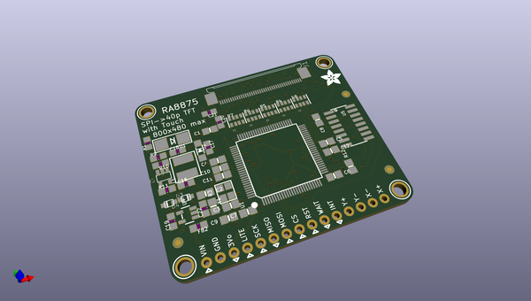

# adafruit_ra8875_breakout_board_pcb
 
## summary 
* id: adafruit_adafruit_ra8875_breakout_board_pcb_adafruit_ra8875_tft_breakout
* user: adafruit
* name: adafruit_ra8875_breakout_board_pcb
* board: adafruit_ra8875_tft_breakout
* repo: https://github.com/adafruit/Adafruit-RA8875-Breakout-Board-PCB

* src_file_repo_sch: 
* src_file_repo_sch_link: https://github.com/adafruit/Adafruit-RA8875-Breakout-Board-PCB/tree/master/
* full details link: https://github.com/oomlout/oomlout_oomp_project_bot_v_2/tree/main/projects/adafruit_adafruit_ra8875_breakout_board_pcb_adafruit_ra8875_tft_breakout/current_version/working  

## schematic  
  
[schematic (pdf)](working_schematic.pdf)  

## pcb  
 
  
  
  
[board (pdf)](working.pdf)  

## working_bom
| Id | Designator | Footprint | Quantity | Designation | Supplier and ref |  | None | 
| --- | --- | --- | --- | --- | --- | --- | --- | 
| 1 | U$23,U$21,U$22,U$24 | MOUNTINGHOLE_2.5_PLATED | 4 | MOUNTINGHOLE2.5 |  |  | [''] | 
| 2 | R3 | 0805-NO | 1 | 1M |  |  | [''] | 
| 3 | FID2,FID3,FID1 | FIDUCIAL_1MM | 3 | FIDUCIAL" |  |  | [''] | 
| 4 | C1,C6,C8,C4,C7,C10,C5,C12,C9,C11 | 0805-NO | 10 | 0.1uF |  |  | [''] | 
| 5 | C16,C22 | _0805MP | 2 | 10uF |  |  | [''] | 
| 6 | U5 | SOIC16 | 1 | 74HC4050 |  |  | [''] | 
| 7 | L1 | INDUCTOR_5X5MM_NR5040_NOTHERMALS | 1 | 6.8uH large inductor |  |  | [''] | 
| 8 | R7,R5,R8,R6,R4 | RESPACK_4X0603 | 5 | 33 |  |  | [''] | 
| 9 | R12 | 0805-NO | 1 | 10K |  |  | [''] | 
| 10 | C20,C17 | _0805MP | 2 | 1uF |  |  | [''] | 
| 11 | R1 | _0805MP | 1 | 3Ω |  |  | [''] | 
| 12 | R10,R9 | _0805MP | 2 | 12Ω |  |  | [''] | 
| 13 | D1 | SMADIODE | 1 | MM3Z24VT1G |  |  | [''] | 
| 14 | C18 | _0805MP | 1 | 0.1uF |  |  | [''] | 
| 15 | Y1 | CRYSTAL_3.2X2.5 | 1 | 20MHz |  |  | [''] | 
| 16 | D2 | SOD-123 | 1 | MBR0540 |  |  | [''] | 
| 17 | U1 | LQFP100 | 1 | RA8875 |  |  | [''] | 
| 18 | JP1 | 1X15-CB | 1 | Breakout |  |  | [''] | 
| 19 | C2,C3 | 0805-NO | 2 | 20pF |  |  | [''] | 
| 20 | J1 | 4-1734839-0 | 1 | 40PINFPCM4-1734839-0 |  |  | [''] | 
| 21 | U3 | SOT23-5@1 | 1 | FAN5333BSX |  |  | [''] | 
| 22 | U$18 | ADAFRUIT_5MM | 1 |  |  |  | [''] | 
| 23 | C21,C19 | _0805MP | 2 | 10µF |  |  | [''] | 
| 24 | R11 | _0805MP | 1 | 10K |  |  | [''] | 
| 25 | D4,D3 | SOD-323F | 2 | 1N4148 |  |  | [''] | 
| 26 | FB2 | _0805MP | 1 | Ferrite |  |  | [''] | 
| 27 | U4 | SOT23-5 | 1 | MIC5225-3.3v |  |  | [''] | 
| 28 | SJ1 | SOLDERJUMPER_ARROW_NOPASTE | 1 | +25mA |  |  | [''] | 
| 29 | U$25 | ADAFRUIT_TEXT_20MM | 1 |  |  |  | [''] | 
| 30 | SJ2 | SOLDERJUMPER_ARROW_NOPASTE | 1 | +100mA |  |  | [''] | 

## bom_schematic
| Ref | Qnty | Value | Cmp name | Footprint | Description | Vendor | DNP | 
| --- | --- | --- | --- | --- | --- | --- | --- | 
| C1, C4, C5, C6, C7, C8, C9, C10, C11, C12 | 10 | 0.1uF | CAP_CERAMIC0805-NOOUTLINE | working:0805-NO |  |  |  | 
| C2, C3 | 2 | 20pF | CAP_CERAMIC0805-NOOUTLINE | working:0805-NO |  |  |  | 
| C16, C22 | 2 | 10uF | CAP_CERAMIC_0805MP | working:_0805MP |  |  |  | 
| C17, C20 | 2 | 1uF | CAP_CERAMIC_0805MP | working:_0805MP |  |  |  | 
| C18 | 1 | 0.1uF | CAP_CERAMIC_0805MP | working:_0805MP |  |  |  | 
| C19, C21 | 2 | 10µF | CAP_CERAMIC_0805MP | working:_0805MP |  |  |  | 
| D1 | 1 | MM3Z24VT1G | DIODESMA | working:SMADIODE |  |  |  | 
| D2 | 1 | MBR0540 | DIODESOD-123 | working:SOD-123 |  |  |  | 
| D3, D4 | 2 | 1N4148 | DIODESOD-323F | working:SOD-323F |  |  |  | 
| FB2 | 1 | Ferrite | FERRITE_0805MP | working:_0805MP |  |  |  | 
| FID1, FID2, FID3 | 3 | FIDUCIAL"" | FIDUCIAL{dblquote}{dblquote} | working:FIDUCIAL_1MM |  |  |  | 
| J1 | 1 | 40PINFPC4-1734839-0 | 40PINFPC4-1734839-0 | working:4-1734839-0 |  |  |  | 
| JP1 | 1 | Breakout | PINHD-1X15-CB | working:1X15-CB |  |  |  | 
| L1 | 1 | 6.8uH large inductor | INDUCTORNR5040 | working:INDUCTOR_5X5MM_NR5040_NOTHERMALS |  |  |  | 
| R1 | 1 | 3Ω | RESISTOR_0805MP | working:_0805MP |  |  |  | 
| R3 | 1 | 1M | RESISTOR0805_NOOUTLINE | working:0805-NO |  |  |  | 
| R4, R5, R6, R7, R8 | 5 | 33 | RESISTOR_4PACK_US | working:RESPACK_4X0603 |  |  |  | 
| R9, R10 | 2 | 12Ω | RESISTOR_0805MP | working:_0805MP |  |  |  | 
| R11 | 1 | 10K | RESISTOR_0805MP | working:_0805MP |  |  |  | 
| R12 | 1 | 10K | RESISTOR0805_NOOUTLINE | working:0805-NO |  |  |  | 
| SJ1 | 1 | +25mA | SOLDERJUMPER | working:SOLDERJUMPER_ARROW_NOPASTE |  |  |  | 
| SJ2 | 1 | +100mA | SOLDERJUMPER | working:SOLDERJUMPER_ARROW_NOPASTE |  |  |  | 
| U1 | 1 | RA8875 | RA8875 | working:LQFP100 |  |  |  | 
| U3 | 1 | FAN5333BSX | FAN5331 | working:SOT23-5@1 |  |  |  | 
| U4 | 1 | MIC5225-3.3v | VREG_SOT23-5 | working:SOT23-5 |  |  |  | 
| U5 | 1 | 74HC4050 | 74HC4050D | working:SOIC16 |  |  |  | 
| U$21, U$22, U$23, U$24 | 4 | MOUNTINGHOLE2.5 | MOUNTINGHOLE2.5 | working:MOUNTINGHOLE_2.5_PLATED |  |  |  | 
| Y1 | 1 | 20MHz | CRYSTAL3.2X2.5 | working:CRYSTAL_3.2X2.5 |  |  |  | 

## mounting_holes
| x | y | package | value | ref | size | 
| --- | --- | --- | --- | --- | --- | 
| 0.0 | 35.56 | MOUNTINGHOLE_2.5_PLATED | MOUNTINGHOLE2.5 | U$21 | m3 | 
| 43.18000000000001 | 35.56 | MOUNTINGHOLE_2.5_PLATED | MOUNTINGHOLE2.5 | U$22 | m3 | 
| 43.18000000000001 | 0.0 | MOUNTINGHOLE_2.5_PLATED | MOUNTINGHOLE2.5 | U$23 | m3 | 
| 0.0 | 0.0 | MOUNTINGHOLE_2.5_PLATED | MOUNTINGHOLE2.5 | U$24 | m3 | 

