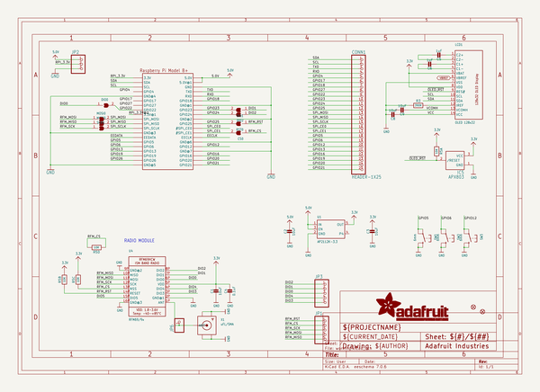
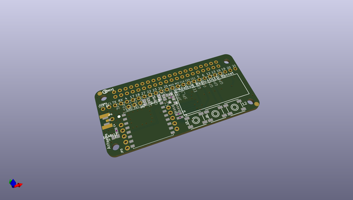
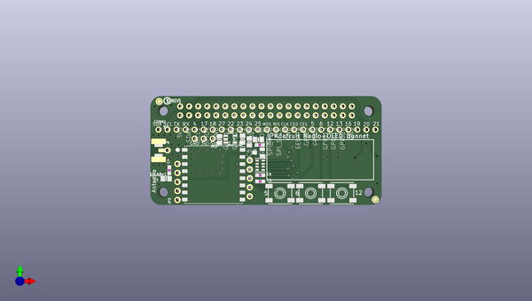
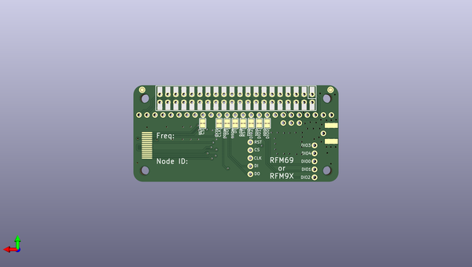

# adafruit_radio_bonnet_pcb
 
## summary 
* id: adafruit_adafruit_radio_bonnet_pcb_adafruit_lora_radio_bonnet_with_oled
* user: adafruit
* name: adafruit_radio_bonnet_pcb
* board: adafruit_lora_radio_bonnet_with_oled
* repo: https://github.com/adafruit/Adafruit-Radio-Bonnet-PCB

* src_file_repo_sch: 
* src_file_repo_sch_link: https://github.com/adafruit/Adafruit-Radio-Bonnet-PCB/tree/master/
* full details link: https://github.com/oomlout/oomlout_oomp_project_bot_v_2/tree/main/projects/adafruit_adafruit_radio_bonnet_pcb_adafruit_lora_radio_bonnet_with_oled/current_version/working  

## schematic  
  
[schematic (pdf)](working_schematic.pdf)  

## pcb  
 
  
  
  
[board (pdf)](working.pdf)  

## working_bom
| Id | Designator | Footprint | Quantity | Designation | Supplier and ref |  | None | 
| --- | --- | --- | --- | --- | --- | --- | --- | 
| 1 | C2,C3,C9,C1,C8 | 0805-NO | 5 | 10uF |  |  | [''] | 
| 2 | IC5 | SOT23 | 1 | APX803 |  |  | [''] | 
| 3 | R3 | 0603-NO | 1 | 390K |  |  | [''] | 
| 4 | SW3,SW1,SW2 | EVQ-Q2_SMALLER | 3 | 6mm |  |  | [''] | 
| 5 | C4 | 0603-NO | 1 | 0.1uF |  |  | [''] | 
| 6 | RPI1 | PI_BONNET_THMSMT | 1 | RASPBERRYPI_BPLUS_BONNET_THMSMT |  |  | [''] | 
| 7 | C5,C6 | 0603-NO | 2 | 1uF |  |  | [''] | 
| 8 | JP1,JP3 | 1X05_ROUND_70 | 2 |  |  |  | [''] | 
| 9 | FID1,FID2 | FIDUCIAL_1MM | 2 | FIDUCIAL_1MM |  |  | [''] | 
| 10 | LCD1 | UG-2832HSWEG02_WRAPUNDER | 1 | OLED 128x32 |  |  | [''] | 
| 11 | U1 | SOT23-5 | 1 | AP2112K-3.3 |  |  | [''] | 
| 12 | JP2 | 1X03_ROUND | 1 |  |  |  | [''] | 
| 13 | U4 | RFMHCW_SMT | 1 | RFM69/9x |  |  | [''] | 
| 14 | JP6 | 1X01_ROUND | 1 |  |  |  | [''] | 
| 15 | X1 | SMA_EDGELAUNCH_UFL | 1 | uFL/SMA |  |  | [''] | 
| 16 | U$22 | PCBFEAT-REV-040 | 1 |  |  |  | [''] | 
| 17 | R5 | RESPACK_4X0603 | 1 | 10K |  |  | [''] | 
| 18 | CONN1 | 1X25_ROUND_70MIL | 1 | HEADER-1X25 |  |  | [''] | 
| 19 | DIO0,DIO1,SCK0,RST0,MOSI0,CS0,MISO0,DIO2 | SOLDERJUMPER_CLOSEDWIRE | 8 |  |  |  | [''] | 

## bom_schematic
| Ref | Qnty | Value | Cmp name | Footprint | Description | Vendor | DNP | 
| --- | --- | --- | --- | --- | --- | --- | --- | 
| C1, C2, C3, C8, C9 | 5 | 10uF | CAP_CERAMIC0805-NOOUTLINE | working:0805-NO |  |  |  | 
| C4 | 1 | 0.1uF | CAP_CERAMIC0603_NO | working:0603-NO |  |  |  | 
| C5, C6 | 2 | 1uF | CAP_CERAMIC0603_NO | working:0603-NO |  |  |  | 
| CONN1 | 1 | HEADER-1X25 | HEADER-1X25 | working:1X25_ROUND_70MIL |  |  |  | 
| CS0 | 1 | SOLDERJUMPERCLOSED | SOLDERJUMPERCLOSED | working:SOLDERJUMPER_CLOSEDWIRE |  |  |  | 
| DIO0, DIO1, DIO2 | 3 | SOLDERJUMPERCLOSED | SOLDERJUMPERCLOSED | working:SOLDERJUMPER_CLOSEDWIRE |  |  |  | 
| FID1, FID2 | 2 | FIDUCIAL_1MM | FIDUCIAL_1MM | working:FIDUCIAL_1MM |  |  |  | 
| IC5 | 1 | APX803 | AXP083-SAG | working:SOT23 |  |  |  | 
| JP1, JP3 | 2 | HEADER-1X570MIL | HEADER-1X570MIL | working:1X05_ROUND_70 |  |  |  | 
| JP2 | 1 | HEADER-1X3ROUND | HEADER-1X3ROUND | working:1X03_ROUND |  |  |  | 
| JP6 | 1 | HEADER-1X1ROUND | HEADER-1X1ROUND | working:1X01_ROUND |  |  |  | 
| LCD1 | 1 | OLED 128x32 | DISP_OLED_UG-2832HSWEG02 | working:UG-2832HSWEG02_WRAPUNDER |  |  |  | 
| MISO0 | 1 | SOLDERJUMPERCLOSED | SOLDERJUMPERCLOSED | working:SOLDERJUMPER_CLOSEDWIRE |  |  |  | 
| MOSI0 | 1 | SOLDERJUMPERCLOSED | SOLDERJUMPERCLOSED | working:SOLDERJUMPER_CLOSEDWIRE |  |  |  | 
| R3 | 1 | 390K | RESISTOR_0603_NOOUT | working:0603-NO |  |  |  | 
| R5 | 1 | 10K | RESISTOR_4PACK | working:RESPACK_4X0603 |  |  |  | 
| RPI1 | 1 | RASPBERRYPI_BPLUS_BONNET_THMSMT | RASPBERRYPI_BPLUS_BONNET_THMSMT | working:PI_BONNET_THMSMT |  |  |  | 
| RST0 | 1 | SOLDERJUMPERCLOSED | SOLDERJUMPERCLOSED | working:SOLDERJUMPER_CLOSEDWIRE |  |  |  | 
| SCK0 | 1 | SOLDERJUMPERCLOSED | SOLDERJUMPERCLOSED | working:SOLDERJUMPER_CLOSEDWIRE |  |  |  | 
| SW1, SW2, SW3 | 3 | 6mm | SWITCH_TACT_SMT_EVQQ2_SMALL | working:EVQ-Q2_SMALLER |  |  |  | 
| U1 | 1 | AP2112K-3.3 | VREG_SOT23-5 | working:SOT23-5 |  |  |  | 
| U4 | 1 | RFM69/9x | RFM69HCW_SMT | working:RFMHCW_SMT |  |  |  | 
| X1 | 1 | uFL/SMA | SMACONNECTOR_EDGE_UFL | working:SMA_EDGELAUNCH_UFL |  |  |  | 

