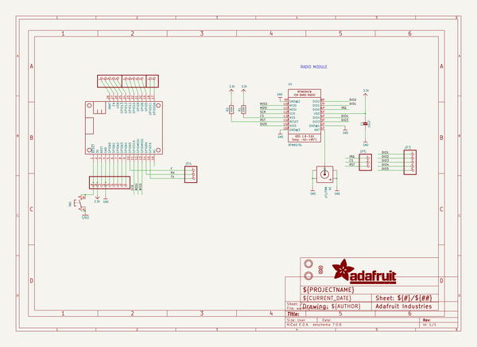
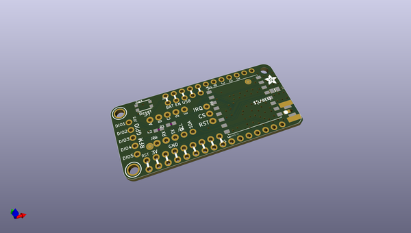
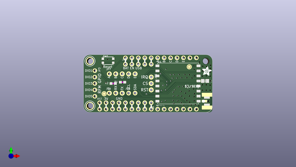
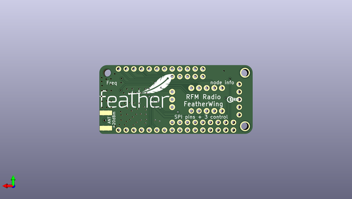

# adafruit_radio_featherwing_pcb
 
## summary 
* id: adafruit_adafruit_radio_featherwing_pcb_adafruit_radio_featherwing
* user: adafruit
* name: adafruit_radio_featherwing_pcb
* board: adafruit_radio_featherwing
* repo: https://github.com/adafruit/Adafruit-Radio-FeatherWing-PCB

* src_file_repo_sch: 
* src_file_repo_sch_link: https://github.com/adafruit/Adafruit-Radio-FeatherWing-PCB/tree/master/
* full details link: https://github.com/oomlout/oomlout_oomp_project_bot_v_2/tree/main/projects/adafruit_adafruit_radio_featherwing_pcb_adafruit_radio_featherwing/current_version/working  

## schematic  
  
[schematic (pdf)](working_schematic.pdf)  

## pcb  
 
  
  
  
[board (pdf)](working.pdf)  

## working_bom
| Id | Designator | Footprint | Quantity | Designation | Supplier and ref |  | None | 
| --- | --- | --- | --- | --- | --- | --- | --- | 
| 1 | JP7 | 1X05_ROUND_76 | 1 |  |  |  | [''] | 
| 2 | U$7,U$8 | MOUNTINGHOLE_2.5_PLATED | 2 | MOUNTINGHOLE2.5 |  |  | [''] | 
| 3 | MS1 | FEATHERWING_NOHOLES | 1 | FEATHERWING_NOHOLES |  |  | [''] | 
| 4 | FID2,FID1 | FIDUCIAL_1MM | 2 | FIDUCIAL" |  |  | [''] | 
| 5 | R2,R1 | 0603-NO | 2 | 100k |  |  | [''] | 
| 6 | C1 | 0805-NO | 1 | 10uF |  |  | [''] | 
| 7 | JP2,JP3 | 1X05_ROUND_70 | 2 |  |  |  | [''] | 
| 8 | JP6 | 1X02_ROUND | 1 |  |  |  | [''] | 
| 9 | JP4,JP5 | 1X03_ROUND_76 | 2 |  |  |  | [''] | 
| 10 | JP1 | 1X09_ROUND_70 | 1 |  |  |  | [''] | 
| 11 | X1 | SMA_EDGELAUNCH_UFL | 1 | uFL/SMA |  |  | [''] | 
| 12 | SW1 | BTN_KMR2_4.6X2.8 | 1 |  |  |  | [''] | 
| 13 | U4 | RFMHCW_SMT | 1 | RFM69/9x |  |  | [''] | 
| 14 | @HOLE0 |  | 1 |  |  |  | [''] | 
| 15 | U$15 | ADAFRUIT_3.5MM | 1 |  |  |  | [''] | 
| 16 | U$16 | FEATHERLOGO | 1 |  |  |  | [''] | 
| 17 | U$14 | PCBFEAT-REV-040 | 1 |  |  |  | [''] | 

## bom_schematic
| Ref | Qnty | Value | Cmp name | Footprint | Description | Vendor | DNP | 
| --- | --- | --- | --- | --- | --- | --- | --- | 
| C1 | 1 | 10uF | CAP_CERAMIC0805-NOOUTLINE | working:0805-NO |  |  |  | 
| FID1, FID2 | 2 | FIDUCIAL"" | FIDUCIAL{dblquote}{dblquote} | working:FIDUCIAL_1MM |  |  |  | 
| JP1 | 1 | HEADER-1X970MIL | HEADER-1X970MIL | working:1X09_ROUND_70 |  |  |  | 
| JP2, JP3 | 2 | HEADER-1X570MIL | HEADER-1X570MIL | working:1X05_ROUND_70 |  |  |  | 
| JP4, JP5 | 2 | HEADER-1X376MIL | HEADER-1X376MIL | working:1X03_ROUND_76 |  |  |  | 
| JP6 | 1 | HEADER-1X2ROUND | HEADER-1X2ROUND | working:1X02_ROUND |  |  |  | 
| JP7 | 1 | HEADER-1X576MIL | HEADER-1X576MIL | working:1X05_ROUND_76 |  |  |  | 
| MS1 | 1 | FEATHERWING_NOHOLES | FEATHERWING_NOHOLES | working:FEATHERWING_NOHOLES |  |  |  | 
| R1, R2 | 2 | 100k | RESISTOR_0603_NOOUT | working:0603-NO |  |  |  | 
| SW1 | 1 | SWITCH_TACT_SMT4.6X2.8 | SWITCH_TACT_SMT4.6X2.8 | working:BTN_KMR2_4.6X2.8 |  |  |  | 
| U4 | 1 | RFM69/9x | RFM69HCW_SMT | working:RFMHCW_SMT |  |  |  | 
| U$7, U$8 | 2 | MOUNTINGHOLE2.5 | MOUNTINGHOLE2.5 | working:MOUNTINGHOLE_2.5_PLATED |  |  |  | 
| X1 | 1 | uFL/SMA | SMACONNECTOR_EDGE_UFL | working:SMA_EDGELAUNCH_UFL |  |  |  | 

## mounting_holes
| x | y | package | value | ref | size | 
| --- | --- | --- | --- | --- | --- | 
| 0.0 | 0.0 | MOUNTINGHOLE_2.5_PLATED | MOUNTINGHOLE2.5 | U$7 | m3 | 
| 0.0 | 17.78 | MOUNTINGHOLE_2.5_PLATED | MOUNTINGHOLE2.5 | U$8 | m3 | 

