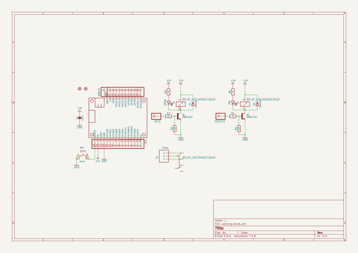
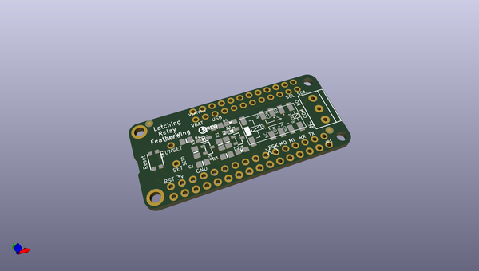
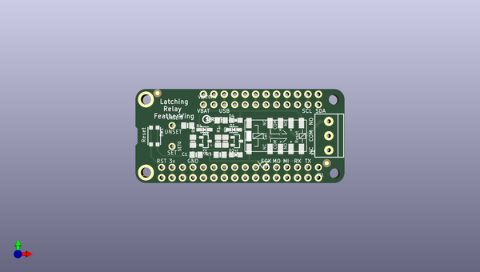
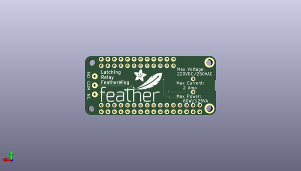

# adafruit_relay_featherwing_pcbs
 
## summary 
* id: adafruit_adafruit_relay_featherwing_pcbs_adafruit_latching_relay_featherwing
* user: adafruit
* name: adafruit_relay_featherwing_pcbs
* board: adafruit_latching_relay_featherwing
* repo: https://github.com/adafruit/Adafruit-Relay-FeatherWing-PCBs

* src_file_repo_sch: 
* src_file_repo_sch_link: https://github.com/adafruit/Adafruit-Relay-FeatherWing-PCBs/tree/master/
* full details link: https://github.com/oomlout/oomlout_oomp_project_bot_v_2/tree/main/projects/adafruit_adafruit_relay_featherwing_pcbs_adafruit_latching_relay_featherwing/current_version/working  

## schematic  
  
[schematic (pdf)](working_schematic.pdf)  

## pcb  
 
  
  
  
[board (pdf)](working.pdf)  

## working_bom
| Id | Designator | Footprint | Quantity | Designation | Supplier and ref |  | None | 
| --- | --- | --- | --- | --- | --- | --- | --- | 
| 1 | SET0,VBAT0,UNSET0 | 1X01_ROUND | 3 |  |  |  | [''] | 
| 2 | D4 | CHIPLED_0805_NOOUTLINE | 1 | RED |  |  | [''] | 
| 3 | R4,R6,R1,R3 | 0805-NO | 4 | 1K |  |  | [''] | 
| 4 | X2 | TERMBLOCK_1X3-3.5MM | 1 | 3.5mm |  |  | [''] | 
| 5 | C1 | 0805-NO | 1 | 10uF |  |  | [''] | 
| 6 | Q2,Q1 | SOT23-R | 2 | MMBT2222 |  |  | [''] | 
| 7 | FID3,FID2 | FIDUCIAL_1MM | 2 | FIDUCIAL" |  |  | [''] | 
| 8 | D1,D3 | SOD-323 | 2 | 1N4148 |  |  | [''] | 
| 9 | R5,R2 | 0805-NO | 2 | 10K |  |  | [''] | 
| 10 | JP4 | 1X11_ROUND | 1 |  |  |  | [''] | 
| 11 | X3 | RELAY_EE2_LATCH | 1 | RELAY_LATCHINGEE2NUH |  |  | [''] | 
| 12 | MS1 | MICROSHIELD | 1 | MICROSHIELD |  |  | [''] | 
| 13 | JP1 | 1X16_ROUND | 1 |  |  |  | [''] | 
| 14 | SW1 | BTN_KMR2_4.6X2.8 | 1 | kmr2 |  |  | [''] | 
| 15 | D2 | CHIPLED_0805_NOOUTLINE | 1 | GREEN |  |  | [''] | 
| 16 | U$8 | PCBFEAT-REV-040 | 1 |  |  |  | [''] | 
| 17 | U$6 | FEATHERLOGO | 1 |  |  |  | [''] | 
| 18 | U$9 | ADAFRUIT_5MM | 1 |  |  |  | [''] | 

## bom_schematic
| Ref | Qnty | Value | Cmp name | Footprint | Description | Vendor | DNP | 
| --- | --- | --- | --- | --- | --- | --- | --- | 
| C1 | 1 | 10uF | CAP_CERAMIC0805-NOOUTLINE | working:0805-NO |  |  |  | 
| D1, D3 | 2 | 1N4148 | DIODESOD-323 | working:SOD-323 |  |  |  | 
| D2 | 1 | GREEN | LED0805_NOOUTLINE | working:CHIPLED_0805_NOOUTLINE |  |  |  | 
| D4 | 1 | RED | LED0805_NOOUTLINE | working:CHIPLED_0805_NOOUTLINE |  |  |  | 
| FID2, FID3 | 2 | FIDUCIAL"" | FIDUCIAL{dblquote}{dblquote} | working:FIDUCIAL_1MM |  |  |  | 
| JP1 | 1 | HEADER-1X16ROUND | HEADER-1X16ROUND | working:1X16_ROUND |  |  |  | 
| JP4 | 1 | HEADER-1X11 | HEADER-1X11 | working:1X11_ROUND |  |  |  | 
| MS1 | 1 | MICROSHIELD | MICROSHIELD | working:MICROSHIELD |  |  |  | 
| Q1, Q2 | 2 | MMBT2222 | TRANSISTOR_NPN | working:SOT23-R |  |  |  | 
| R1, R3, R4, R6 | 4 | 1K | RESISTOR0805_NOOUTLINE | working:0805-NO |  |  |  | 
| R2, R5 | 2 | 10K | RESISTOR0805_NOOUTLINE | working:0805-NO |  |  |  | 
| SET0 | 1 | HEADER-1X1ROUND | HEADER-1X1ROUND | working:1X01_ROUND |  |  |  | 
| SW1 | 1 | kmr2 | SWITCH_TACT_SMT4.6X2.8 | working:BTN_KMR2_4.6X2.8 |  |  |  | 
| UNSET0 | 1 | HEADER-1X1ROUND | HEADER-1X1ROUND | working:1X01_ROUND |  |  |  | 
| VBAT0 | 1 | HEADER-1X1ROUND | HEADER-1X1ROUND | working:1X01_ROUND |  |  |  | 
| X2 | 1 | 3.5mm | TERMBLOCK_1X3 | working:TERMBLOCK_1X3-3.5MM |  |  |  | 
| X3 | 1 | RELAY_LATCHINGEE2NUH | RELAY_LATCHINGEE2NUH | working:RELAY_EE2_LATCH |  |  |  | 

