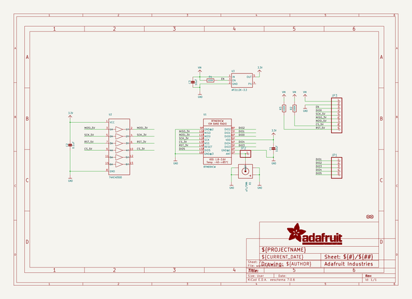
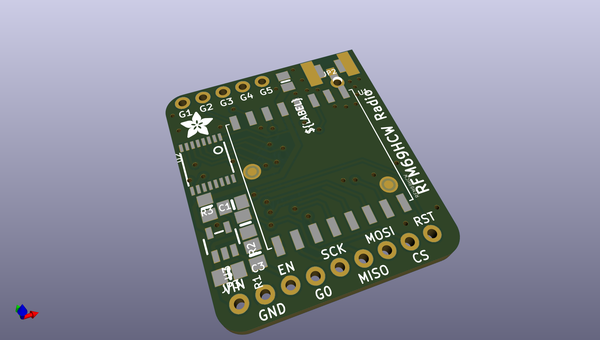
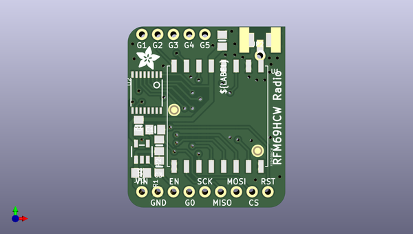
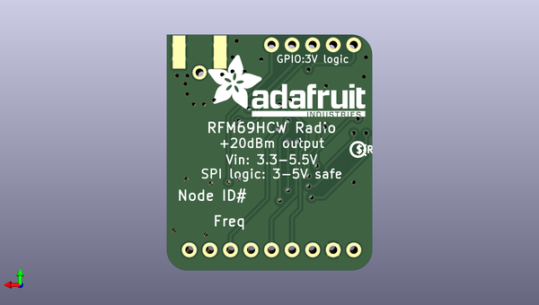

# adafruit_rfm_lora_radio_breakout_pcb
 
## summary 
* id: adafruit_adafruit_rfm_lora_radio_breakout_pcb_adafruit_rfm_lora_breakout
* user: adafruit
* name: adafruit_rfm_lora_radio_breakout_pcb
* board: adafruit_rfm_lora_breakout
* repo: https://github.com/adafruit/Adafruit-RFM-LoRa-Radio-Breakout-PCB

* src_file_repo_sch: 
* src_file_repo_sch_link: https://github.com/adafruit/Adafruit-RFM-LoRa-Radio-Breakout-PCB/tree/master/
* full details link: https://github.com/oomlout/oomlout_oomp_project_bot_v_2/tree/main/projects/adafruit_adafruit_rfm_lora_radio_breakout_pcb_adafruit_rfm_lora_breakout/current_version/working  

## schematic  
  
[schematic (pdf)](working_schematic.pdf)  

## pcb  
 
  
  
  
[board (pdf)](working.pdf)  

## working_bom
| Id | Designator | Footprint | Quantity | Designation | Supplier and ref |  | None | 
| --- | --- | --- | --- | --- | --- | --- | --- | 
| 1 | R1,R2,R3 | 0805-NO | 3 | 100K |  |  | [''] | 
| 2 | C2 | 0805-NO | 1 | 0.1uF |  |  | [''] | 
| 3 | U3 | SOT23-5 | 1 | AP2112K-3.3 |  |  | [''] | 
| 4 | U1 | RFMHCW_SMT | 1 | RFM69HCW |  |  | [''] | 
| 5 | C3,C1 | 0805-NO | 2 | 10uF |  |  | [''] | 
| 6 | JP1 | 1X05_ROUND_70 | 1 |  |  |  | [''] | 
| 7 | U2 | TSSOP16 | 1 | 74HC4050D |  |  | [''] | 
| 8 | JP3 | 1X09_ROUND_70 | 1 |  |  |  | [''] | 
| 9 | FID2,FID1 | FIDUCIAL_1MM | 2 | FIDUCIAL" |  |  | [''] | 
| 10 | X1 | SMA_EDGELAUNCH_UFL | 1 | uFL/SMA |  |  | [''] | 
| 11 | U$8 | ADAFRUIT_3.5MM | 1 |  |  |  | [''] | 
| 12 | JP2 | 1X01_ROUND | 1 |  |  |  | [''] | 
| 13 | U$14 | PCBFEAT-REV-040 | 1 |  |  |  | [''] | 
| 14 | U$19 | ADAFRUIT_TEXT_20MM | 1 |  |  |  | [''] | 

## bom_schematic
| Ref | Qnty | Value | Cmp name | Footprint | Description | Vendor | DNP | 
| --- | --- | --- | --- | --- | --- | --- | --- | 
| C1, C3 | 2 | 10uF | CAP_CERAMIC0805-NOOUTLINE | working:0805-NO |  |  |  | 
| C2 | 1 | 0.1uF | CAP_CERAMIC0805-NOOUTLINE | working:0805-NO |  |  |  | 
| FID1, FID2 | 2 | FIDUCIAL"" | FIDUCIAL{dblquote}{dblquote} | working:FIDUCIAL_1MM |  |  |  | 
| JP1 | 1 | HEADER-1X570MIL | HEADER-1X570MIL | working:1X05_ROUND_70 |  |  |  | 
| JP2 | 1 | HEADER-1X1ROUND | HEADER-1X1ROUND | working:1X01_ROUND |  |  |  | 
| JP3 | 1 | HEADER-1X970MIL | HEADER-1X970MIL | working:1X09_ROUND_70 |  |  |  | 
| R1, R2, R3 | 3 | 100K | RESISTOR0805_NOOUTLINE | working:0805-NO |  |  |  | 
| U1 | 1 | RFM69HCW | RFM69HCW_SMT | working:RFMHCW_SMT |  |  |  | 
| U2 | 1 | 74HC4050D | 74HC4050DTSSOP | working:TSSOP16 |  |  |  | 
| U3 | 1 | AP2112K-3.3 | VREG_SOT23-5 | working:SOT23-5 |  |  |  | 
| X1 | 1 | uFL/SMA | SMACONNECTOR_EDGE_UFL | working:SMA_EDGELAUNCH_UFL |  |  |  | 

