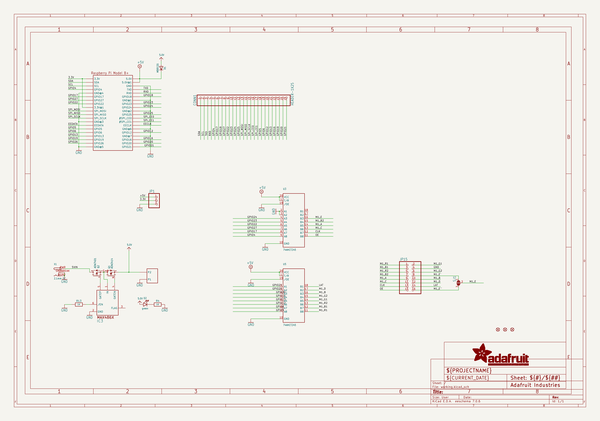
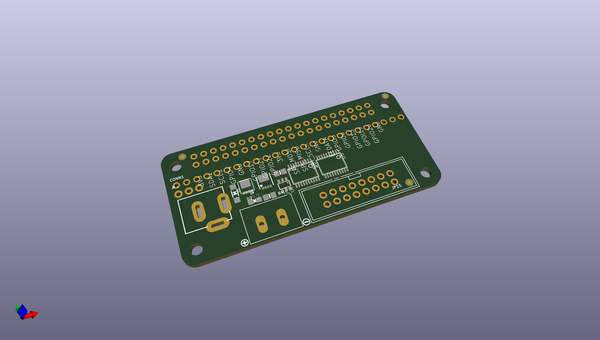
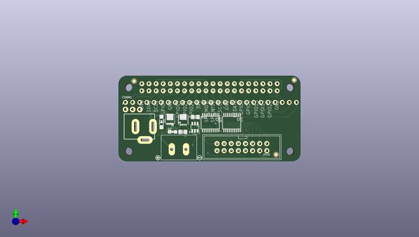
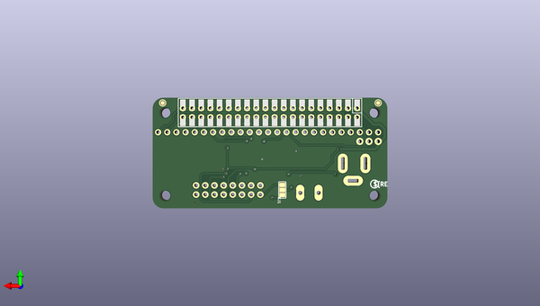

# adafruit_rgb_matrix_bonnet_pcb
 
## summary 
* id: adafruit_adafruit_rgb_matrix_bonnet_pcb_adafruit_rgb_matrix_bonnet
* user: adafruit
* name: adafruit_rgb_matrix_bonnet_pcb
* board: adafruit_rgb_matrix_bonnet
* repo: https://github.com/adafruit/Adafruit-RGB-Matrix-Bonnet-PCB

* src_file_repo_sch: 
* src_file_repo_sch_link: https://github.com/adafruit/Adafruit-RGB-Matrix-Bonnet-PCB/tree/master/
* full details link: https://github.com/oomlout/oomlout_oomp_project_bot_v_2/tree/main/projects/adafruit_adafruit_rgb_matrix_bonnet_pcb_adafruit_rgb_matrix_bonnet/current_version/working  

## schematic  
  
[schematic (pdf)](working_schematic.pdf) 

## pcb  
 
  
  
  
[board (pdf)](working.pdf)  

## working_bom
| Id | Designator | Footprint | Quantity | Designation | Supplier and ref |  | None | 
| --- | --- | --- | --- | --- | --- | --- | --- | 
| 1 | RPI1 | PI_BONNET_THMSMT | 1 | RASPBERRYPI_BPLUS_BONNET_THMSMT |  |  | [''] | 
| 2 | U3,U5 | TSSOP20 | 2 | 74AHCT245 |  |  | [''] | 
| 3 | FID1,FID3,FID2 | FIDUCIAL_1MM | 3 | FIDUCIAL_1MM |  |  | [''] | 
| 4 | U$1 | BONNET_MATRIX_TOP | 1 |  |  |  | [''] | 
| 5 | D2 | CHIPLED_0805_NOOUTLINE | 1 | green |  |  | [''] | 
| 6 | R4,R13 | 0805-NO | 2 | 1K |  |  | [''] | 
| 7 | X1 | DCJACK_2MM_PTH | 1 | 2.1mm DC |  |  | [''] | 
| 8 | U$11 | SYMBOL_MINUS | 1 |  |  |  | [''] | 
| 9 | Q2 | POWERDI3333 | 1 | AON7401 |  |  | [''] | 
| 10 | D1 | SOD-123 | 1 | MBR120 |  |  | [''] | 
| 11 | CONN1 | 1X25_ROUND_70MIL | 1 | HEADER-1X25 |  |  | [''] | 
| 12 | U$10 | SYMBOL_PLUS | 1 |  |  |  | [''] | 
| 13 | IC3 | SOT23-6 | 1 | MAX4866T |  |  | [''] | 
| 14 | JP1 | 1X03_ROUND_76 | 1 |  |  |  | [''] | 
| 15 | JP15 | 2X08_SHROUDED | 1 |  |  |  | [''] | 
| 16 | MATRIX_PWR0 | TERMBLOCK508 | 1 | PINHEAD |  |  | [''] | 
| 17 | Q1 | POWERPAK-1212-8 | 1 | AON3414 |  |  | [''] | 
| 18 | U$3 | PCBFEAT-REV-056 | 1 |  |  |  | [''] | 
| 19 | SJ1 | SOLDERJUMPER_2WAY_OPEN_NOPASTE | 1 |  |  |  | [''] | 
| 20 | U$6 | BONNET_MATRIX_BOT | 1 |  |  |  | [''] | 

## bom_schematic
| Ref | Qnty | Value | Cmp name | Footprint | Description | Vendor | DNP | 
| --- | --- | --- | --- | --- | --- | --- | --- | 
| CONN1 | 1 | HEADER-1X25 | HEADER-1X25 | working:1X25_ROUND_70MIL |  |  |  | 
| D1 | 1 | MBR120 | DIODESOD-123 | working:SOD-123 |  |  |  | 
| D2 | 1 | green | LED0805_NOOUTLINE | working:CHIPLED_0805_NOOUTLINE |  |  |  | 
| FID1, FID2, FID3 | 3 | FIDUCIAL_1MM | FIDUCIAL_1MM | working:FIDUCIAL_1MM |  |  |  | 
| IC3 | 1 | MAX486X/SOT | MAX486X/SOT | working:SOT23-6 |  |  |  | 
| JP1 | 1 | HEADER-1X376MIL | HEADER-1X376MIL | working:1X03_ROUND_76 |  |  |  | 
| JP15 | 1 | HEADER-2X8_SHROUDED | HEADER-2X8_SHROUDED | working:2X08_SHROUDED |  |  |  | 
| MATRIX_PWR0 | 1 | PINHEAD | PINHEAD | working:TERMBLOCK508 |  |  |  | 
| Q1 | 1 | AON3414 | MOSFET-NPOWERPAK-1212-8 | working:POWERPAK-1212-8 |  |  |  | 
| Q2 | 1 | AON7401 | MOSFET-P-POWERDI3333 | working:POWERDI3333 |  |  |  | 
| R4, R13 | 2 | 1K | RESISTOR0805_NOOUTLINE | working:0805-NO |  |  |  | 
| RPI1 | 1 | RASPBERRYPI_BPLUS_BONNET_THMSMT | RASPBERRYPI_BPLUS_BONNET_THMSMT | working:PI_BONNET_THMSMT |  |  |  | 
| SJ1 | 1 | SOLDERJUMPER_2WAY | SOLDERJUMPER_2WAY | working:SOLDERJUMPER_2WAY_OPEN_NOPASTE |  |  |  | 
| U3, U5 | 2 | 74AHCT245 | 74LCX245 | working:TSSOP20 |  |  |  | 
| X1 | 1 | 2.1mm DC | DCBARRELPTH | working:DCJACK_2MM_PTH |  |  |  | 

