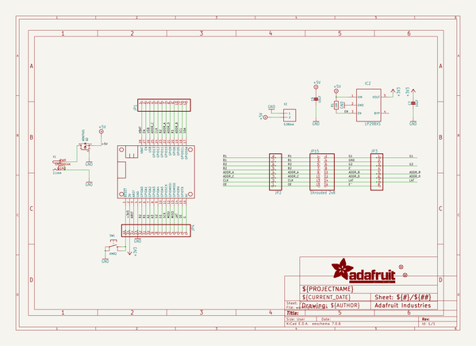
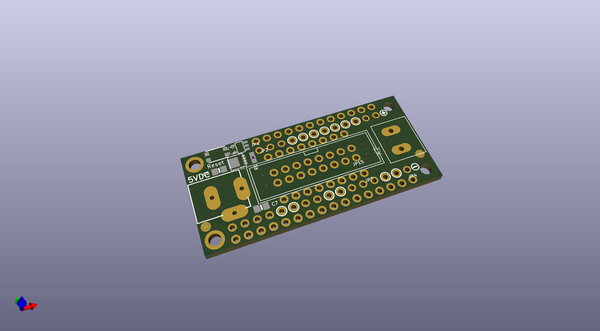
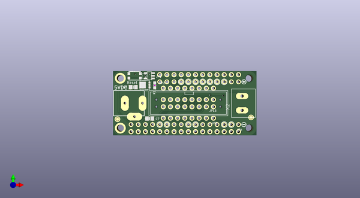
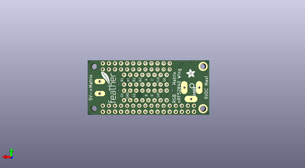

# adafruit_rgb_matrix_featherwing_pcb
 
## summary 
* id: adafruit_adafruit_rgb_matrix_featherwing_pcb_adafruit_rgb_matrix_featherwing_nrf52
* user: adafruit
* name: adafruit_rgb_matrix_featherwing_pcb
* board: adafruit_rgb_matrix_featherwing_nrf52
* repo: https://github.com/adafruit/Adafruit-RGB-Matrix-FeatherWing-PCB

* src_file_repo_sch: 
* src_file_repo_sch_link: https://github.com/adafruit/Adafruit-RGB-Matrix-FeatherWing-PCB/tree/master/
* full details link: https://github.com/oomlout/oomlout_oomp_project_bot_v_2/tree/main/projects/adafruit_adafruit_rgb_matrix_featherwing_pcb_adafruit_rgb_matrix_featherwing_nrf52/current_version/working  

## schematic  
  
[schematic (pdf)](working_schematic.pdf) 

## pcb  
 
  
  
  
[board (pdf)](working.pdf)  

## working_bom
| Id | Designator | Footprint | Quantity | Designation | Supplier and ref |  | None | 
| --- | --- | --- | --- | --- | --- | --- | --- | 
| 1 | IC2 | SOT23-5L | 1 | AP2112K-3.3 |  |  | [''] | 
| 2 | FID1,FID3 | FIDUCIAL_1MM | 2 | FIDUCIAL_1MM |  |  | [''] | 
| 3 | @HOLE3,@HOLE2,@HOLE0,@HOLE1 |  | 4 |  |  |  | [''] | 
| 4 | X2 | TERMBLOCK_508_1X2 | 1 | 5.08mm |  |  | [''] | 
| 5 | U$6 | SYMBOL_MINUS | 1 |  |  |  | [''] | 
| 6 | JP4 | 1X16_ROUND | 1 |  |  |  | [''] | 
| 7 | X1 | DCJACK_2MM_PTH | 1 | 2.1mm |  |  | [''] | 
| 8 | C7,C6 | 0805-NO | 2 | 10uF |  |  | [''] | 
| 9 | MS1 | FEATHERWING | 1 | FEATHERWING |  |  | [''] | 
| 10 | R1 | 0603-NO | 1 | 10K |  |  | [''] | 
| 11 | JP15 | 2X08_SHROUDED | 1 | Shrouded 2x8 |  |  | [''] | 
| 12 | JP3,JP2 | 1X08_ROUND_70 | 2 |  |  |  | [''] | 
| 13 | SW1 | BTN_KMR2_4.6X2.8 | 1 | KMR2 |  |  | [''] | 
| 14 | U$1 | SYMBOL_PLUS | 1 |  |  |  | [''] | 
| 15 | Q2 | POWERDI3333 | 1 | AON7401 |  |  | [''] | 
| 16 | JP1 | 1X12_ROUND | 1 |  |  |  | [''] | 
| 17 | U$3 | FEATHERLOGO_SMALL | 1 |  |  |  | [''] | 
| 18 | U$2 | PCBFEAT-REV-040 | 1 |  |  |  | [''] | 
| 19 | U$7 | ADAFRUIT_3.5MM | 1 |  |  |  | [''] | 

## bom_schematic
| Ref | Qnty | Value | Cmp name | Footprint | Description | Vendor | DNP | 
| --- | --- | --- | --- | --- | --- | --- | --- | 
| C6, C7 | 2 | 10uF | CAP_CERAMIC0805-NOOUTLINE | working:0805-NO |  |  |  | 
| FID1, FID3 | 2 | FIDUCIAL_1MM | FIDUCIAL_1MM | working:FIDUCIAL_1MM |  |  |  | 
| IC2 | 1 | LP298XS | LP298XS | working:SOT23-5L |  |  |  | 
| JP1 | 1 | HEADER-1X12 | HEADER-1X12 | working:1X12_ROUND |  |  |  | 
| JP2, JP3 | 2 | HEADER-1X870MIL | HEADER-1X870MIL | working:1X08_ROUND_70 |  |  |  | 
| JP4 | 1 | HEADER-1X16ROUND | HEADER-1X16ROUND | working:1X16_ROUND |  |  |  | 
| JP15 | 1 | Shrouded 2x8 | HEADER-2X8_SHROUDED | working:2X08_SHROUDED |  |  |  | 
| MS1 | 1 | FEATHERWING | FEATHERWING | working:FEATHERWING |  |  |  | 
| Q2 | 1 | AON7401 | MOSFET-P-POWERDI3333 | working:POWERDI3333 |  |  |  | 
| R1 | 1 | 10K | RESISTOR_0603_NOOUT | working:0603-NO |  |  |  | 
| SW1 | 1 | KMR2 | SWITCH_TACT_SMT4.6X2.8 | working:BTN_KMR2_4.6X2.8 |  |  |  | 
| X1 | 1 | 2.1mm | DCBARRELPTH | working:DCJACK_2MM_PTH |  |  |  | 
| X2 | 1 | 5.08mm | TERMBLOCK_1X2_5.08MM | working:TERMBLOCK_508_1X2 |  |  |  | 

