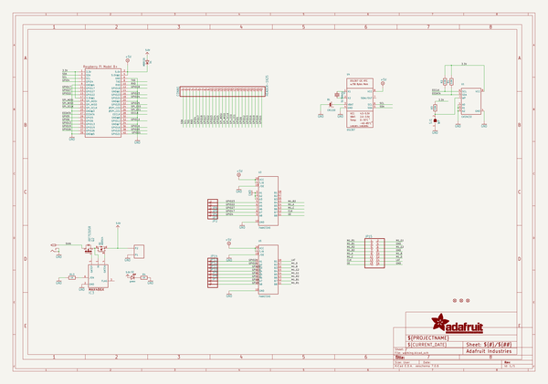
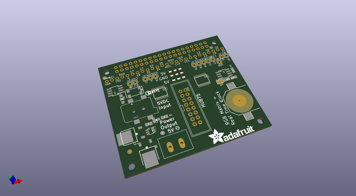
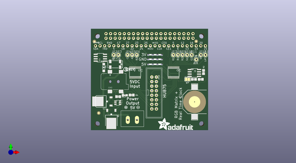
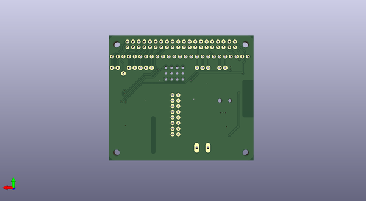

# adafruit_rgb_matrix_hat_pcb
 
## summary 
* id: adafruit_adafruit_rgb_matrix_hat_pcb_adafruit_rgb_matrix_hat
* user: adafruit
* name: adafruit_rgb_matrix_hat_pcb
* board: adafruit_rgb_matrix_hat
* repo: https://github.com/adafruit/Adafruit-RGB-Matrix-HAT-PCB

* src_file_repo_sch: 
* src_file_repo_sch_link: https://github.com/adafruit/Adafruit-RGB-Matrix-HAT-PCB/tree/master/
* full details link: https://github.com/oomlout/oomlout_oomp_project_bot_v_2/tree/main/projects/adafruit_adafruit_rgb_matrix_hat_pcb_adafruit_rgb_matrix_hat/current_version/working  

## schematic  
  
[schematic (pdf)](working_schematic.pdf)  

## pcb  
 
  
  
  
[board (pdf)](working.pdf)  

## working_bom
| Id | Designator | Footprint | Quantity | Designation | Supplier and ref |  | None | 
| --- | --- | --- | --- | --- | --- | --- | --- | 
| 1 | JP7,JP14,JP9,JP12,JP5,JP3,JP10,JP13,JP4,JP11,JP2,JP8,JP6 | 1X01 | 13 |  |  |  | [''] | 
| 2 | R3,R2,R1 | 0805-NO | 3 | 3.9K |  |  | [''] | 
| 3 | IC3 | SOT23-6 | 1 | MAX4866T |  |  | [''] | 
| 4 | U4 | SOIC8_150MIL | 1 | DS1307 |  |  | [''] | 
| 5 | CONN1 | 1X25_ROUND_70MIL | 1 | HEADER-1X25 |  |  | [''] | 
| 6 | FID2,FID3,FID1 | FIDUCIAL_1MM | 3 | FIDUCIAL" |  |  | [''] | 
| 7 | B1 | CR1220 | 1 | CR1220 |  |  | [''] | 
| 8 | R13,R4 | 0805-NO | 2 | 1K |  |  | [''] | 
| 9 | Y1 | CRYSTAL_8X3.8 | 1 | 32.768kHz |  |  | [''] | 
| 10 | U1 | SOIC8_150MIL | 1 | CAT24C32 |  |  | [''] | 
| 11 | U$10 | SYMBOL_PLUS | 1 |  |  |  | [''] | 
| 12 | RPI1 | PI_HAT_SLOTS | 1 | RASPBERRYPI_BPLUS_HATSLOTS |  |  | [''] | 
| 13 | U$11 | SYMBOL_MINUS | 1 |  |  |  | [''] | 
| 14 | Q2 | D-PAK_TO252AA | 1 | AOD417 |  |  | [''] | 
| 15 | D2 | CHIPLED_0805_NOOUTLINE | 1 | green |  |  | [''] | 
| 16 | D1 | SOD-123 | 1 | MBR120 |  |  | [''] | 
| 17 | MATRIX_PWR0 | TERMBLOCK508 | 1 | PINHEAD |  |  | [''] | 
| 18 | U$12 | ADAFRUIT_TEXT_20MM | 1 |  |  |  | [''] | 
| 19 | JP15 | 2X08_SHROUDED | 1 |  |  |  | [''] | 
| 20 | U$3 | PCBFEAT-REV-056 | 1 |  |  |  | [''] | 
| 21 | SJ1 | SOLDERJUMPER_CLOSEDWIRE | 1 | WP |  |  | [''] | 
| 22 | U5,U3 | TSSOP20 | 2 | 74AHCT245 |  |  | [''] | 
| 23 | U2 | DCJACK_2MM_SMT | 1 | 2.1MMJACKSMT |  |  | [''] | 
| 24 | Q1 | TO252 | 1 | AOD514 |  |  | [''] | 

## bom_schematic
| Ref | Qnty | Value | Cmp name | Footprint | Description | Vendor | DNP | 
| --- | --- | --- | --- | --- | --- | --- | --- | 
| B1 | 1 | CR1220 | BATTERYCR1220_SMT | working:CR1220 |  |  |  | 
| CONN1 | 1 | HEADER-1X25 | HEADER-1X25 | working:1X25_ROUND_70MIL |  |  |  | 
| D1 | 1 | MBR120 | DIODESOD-123 | working:SOD-123 |  |  |  | 
| D2 | 1 | green | LED0805_NOOUTLINE | working:CHIPLED_0805_NOOUTLINE |  |  |  | 
| FID1, FID2, FID3 | 3 | FIDUCIAL"" | FIDUCIAL{dblquote}{dblquote} | working:FIDUCIAL_1MM |  |  |  | 
| IC3 | 1 | MAX486X/SOT | MAX486X/SOT | working:SOT23-6 |  |  |  | 
| JP2, JP3, JP4, JP5, JP6, JP7, JP8, JP9, JP10, JP11, JP12, JP13, JP14 | 13 | PINHD-1X1 | PINHD-1X1 | working:1X01 |  |  |  | 
| JP15 | 1 | HEADER-2X8_SHROUDED | HEADER-2X8_SHROUDED | working:2X08_SHROUDED |  |  |  | 
| MATRIX_PWR0 | 1 | PINHEAD | PINHEAD | working:TERMBLOCK508 |  |  |  | 
| Q1 | 1 | AOD514 | MOSFET-N_TO252 | working:TO252 |  |  |  | 
| Q2 | 1 | IRF?5305R | IRF?5305R | working:D-PAK_TO252AA |  |  |  | 
| R1, R2, R3 | 3 | 3.9K | RESISTOR0805_NOOUTLINE | working:0805-NO |  |  |  | 
| R4, R13 | 2 | 1K | RESISTOR0805_NOOUTLINE | working:0805-NO |  |  |  | 
| RPI1 | 1 | RASPBERRYPI_BPLUS_HATSLOTS | RASPBERRYPI_BPLUS_HATSLOTS | working:PI_HAT_SLOTS |  |  |  | 
| SJ1 | 1 | WP | SOLDERJUMPER_CLOSED | working:SOLDERJUMPER_CLOSEDWIRE |  |  |  | 
| U1 | 1 | CAT24C32 | EEPROM_I2C_SOIC8_GENERIC | working:SOIC8_150MIL |  |  |  | 
| U2 | 1 | 2.1MMJACKSMT | 2.1MMJACKSMT | working:DCJACK_2MM_SMT |  |  |  | 
| U3, U5 | 2 | 74AHCT245 | 74LCX245 | working:TSSOP20 |  |  |  | 
| U4 | 1 | DS1307 | RTC_DS1307 | working:SOIC8_150MIL |  |  |  | 
| Y1 | 1 | 32.768kHz | CRYSTAL8.0X3.8 | working:CRYSTAL_8X3.8 |  |  |  | 

