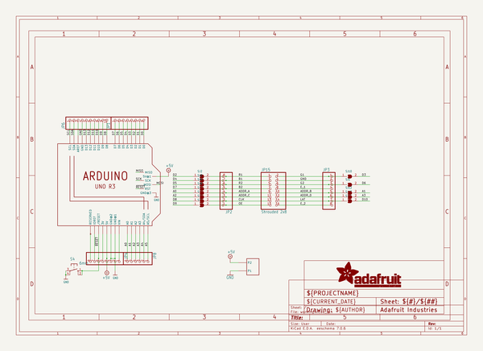
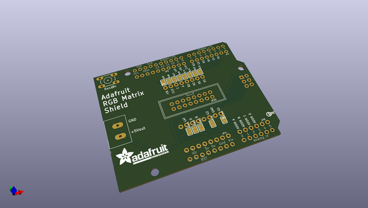
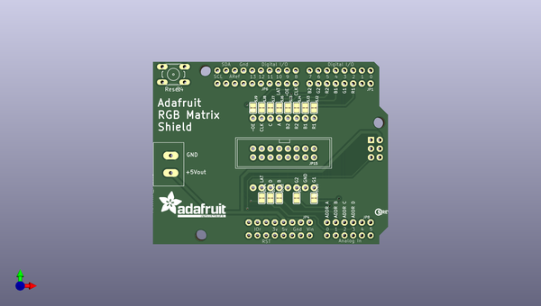
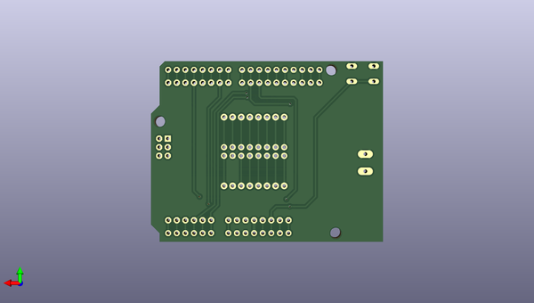

# adafruit_rgb_matrix_shield_pcb
 
## summary 
* id: adafruit_adafruit_rgb_matrix_shield_pcb_adafruit_rgb_matrix_shield
* user: adafruit
* name: adafruit_rgb_matrix_shield_pcb
* board: adafruit_rgb_matrix_shield
* repo: https://github.com/adafruit/Adafruit-RGB-Matrix-Shield-PCB

* src_file_repo_sch: 
* src_file_repo_sch_link: https://github.com/adafruit/Adafruit-RGB-Matrix-Shield-PCB/tree/master/
* full details link: https://github.com/oomlout/oomlout_oomp_project_bot_v_2/tree/main/projects/adafruit_adafruit_rgb_matrix_shield_pcb_adafruit_rgb_matrix_shield/current_version/working  

## schematic  
  
[schematic (pdf)](working_schematic.pdf)  

## pcb  
 
  
  
  
[board (pdf)](working.pdf)  

## working_bom
| Id | Designator | Footprint | Quantity | Designation | Supplier and ref |  | None | 
| --- | --- | --- | --- | --- | --- | --- | --- | 
| 1 | SJ2,SJ6,SJ14,SJ13,SJ12,SJ10,SJ7,SJ3,SJ5,SJ4,SJ9,SJ8,SJ1 | SOLDERJUMPER_CLOSEDWIRE | 13 |  |  |  | [''] | 
| 2 | JP1,JP4 | 1X08-CLEANBIG | 2 |  |  |  | [''] | 
| 3 | U$9 | ADAFRUIT_TEXT_20MM | 1 |  |  |  | [''] | 
| 4 | S4 | B3F-10XX | 1 | 6mm |  |  | [''] | 
| 5 | JP15 | 2X08_SHROUDED | 1 | Shrouded 2x8 |  |  | [''] | 
| 6 | JP3,JP2 | 1X08_ROUND_76 | 2 |  |  |  | [''] | 
| 7 | @HOLE1,@HOLE0,@HOLE2 |  | 3 |  |  |  | [''] | 
| 8 | U$8 | PCBFEAT-REV-040 | 1 |  |  |  | [''] | 
| 9 | JP6 | 1X10_ROUND70 | 1 |  |  |  | [''] | 
| 10 | MATRIX_PWR0 | TERMBLOCK508 | 1 | PINHEAD |  |  | [''] | 
| 11 | U$41 | ARDUINOR3_ICSP_NODIM | 1 | ARDUINO_R3_ICSP_NODIM |  |  | [''] | 
| 12 | JP8 | 1X06-CLEANBIG | 1 |  |  |  | [''] | 

## bom_schematic
| Ref | Qnty | Value | Cmp name | Footprint | Description | Vendor | DNP | 
| --- | --- | --- | --- | --- | --- | --- | --- | 
| JP1, JP4 | 2 | PINHD-1X8CLEANBIG | PINHD-1X8CLEANBIG | working:1X08-CLEANBIG |  |  |  | 
| JP2, JP3 | 2 | HEADER-1X876MIL | HEADER-1X876MIL | working:1X08_ROUND_76 |  |  |  | 
| JP6 | 1 | HEADER-1X1070MIL | HEADER-1X1070MIL | working:1X10_ROUND70 |  |  |  | 
| JP8 | 1 | PINHD-1X6CB | PINHD-1X6CB | working:1X06-CLEANBIG |  |  |  | 
| JP15 | 1 | Shrouded 2x8 | HEADER-2X8_SHROUDED | working:2X08_SHROUDED |  |  |  | 
| MATRIX_PWR0 | 1 | PINHEAD | PINHEAD | working:TERMBLOCK508 |  |  |  | 
| S4 | 1 | 6mm | 10-XX | working:B3F-10XX |  |  |  | 
| SJ1, SJ2, SJ3, SJ4, SJ5, SJ6, SJ7, SJ8, SJ9, SJ10, SJ12, SJ13, SJ14 | 13 | SOLDERJUMPERCLOSED | SOLDERJUMPERCLOSED | working:SOLDERJUMPER_CLOSEDWIRE |  |  |  | 
| U$41 | 1 | ARDUINO_R3_ICSP_NODIM | ARDUINO_R3_ICSP_NODIM | working:ARDUINOR3_ICSP_NODIM |  |  |  | 

