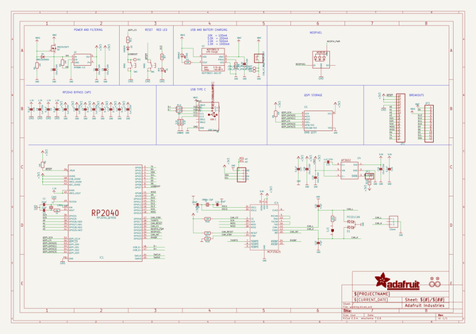

# adafruit_rp2040_can_bus_feather_pcb
 
## summary 
* id: adafruit_adafruit_rp2040_can_bus_feather_pcb_adafruit_rp2040_can_bus_feather
* user: adafruit
* name: adafruit_rp2040_can_bus_feather_pcb
* board: adafruit_rp2040_can_bus_feather
* repo: https://github.com/adafruit/Adafruit-RP2040-CAN-Bus-Feather-PCB

* src_file_repo_sch: 
* src_file_repo_sch_link: https://github.com/adafruit/Adafruit-RP2040-CAN-Bus-Feather-PCB/tree/main/
* full details link: https://github.com/oomlout/oomlout_oomp_project_bot_v_2/tree/main/projects/adafruit_adafruit_rp2040_can_bus_feather_pcb_adafruit_rp2040_can_bus_feather/current_version/working  

## schematic  
  
[schematic (pdf)](working_schematic.pdf)  

## pcb  
 
  
  
  
[board (pdf)](working.pdf)  

## bom_schematic
| Ref | Qnty | Value | Cmp name | Footprint | Description | Vendor | DNP | 
| --- | --- | --- | --- | --- | --- | --- | --- | 
| C1, C4, C5, C16, C19, C20, C28 | 7 | 10uF/16V | CAP_CERAMIC0805-NOOUTLINE | working:0805-NO |  |  |  | 
| C2, C3, C24, C25 | 4 | 22pF | CAP_CERAMIC_0402NO | working:_0402NO |  |  |  | 
| C6, C7, C9, C12, C13, C14, C18, C26, C27 | 9 | 0.1uF | CAP_CERAMIC_0402NO | working:_0402NO |  |  |  | 
| C8, C10, C11, C15, C17, C21 | 6 | 1uF/25V | CAP_CERAMIC_0402NO | working:_0402NO |  |  |  | 
| C22, C23 | 2 | 47pF | CAP_CERAMIC_0402NO | working:_0402NO |  |  |  | 
| CHG0 | 1 | ORANGE | LED0603_NOOUTLINE | working:CHIPLED_0603_NOOUTLINE |  |  |  | 
| CONN1 | 1 | STEMMA_I2C_QTRA | STEMMA_I2C_QTRA | working:JST_SH4_RA |  |  |  | 
| D1 | 1 | PESD1CAN | PESD1CAN | working:SOT23 |  |  |  | 
| D3 | 1 | 1N5819 | DIODE_SOD323MINI | working:SOD-323_MINI |  |  |  | 
| D4 | 1 | PMEG2020AEA | DIODESOD-323F | working:SOD-323F |  |  |  | 
| D+1 | 1 | TPB1,27 | TPB1,27 | working:B1,27 |  |  |  | 
| D-1 | 1 | TPB1,27 | TPB1,27 | working:B1,27 |  |  |  | 
| IC1 | 1 | RP2040_QFN56 | RP2040_QFN56 | working:QFN56_7MM_REDUCEDEPAD |  |  |  | 
| IC4 | 1 | MCP25625 | MCP25625 | working:QFN28-ML_6X6MM |  |  |  | 
| JP1 | 1 | HEADER-1X16ROUND | HEADER-1X16ROUND | working:1X16_ROUND |  |  |  | 
| JP2 | 1 | HEADER-1X12MM | HEADER-1X12MM | working:1X01_2MM |  |  |  | 
| JP3 | 1 | HEADER-1X12 | HEADER-1X12 | working:1X12_ROUND |  |  |  | 
| L0 | 1 | RED | LED0603_NOOUTLINE | working:CHIPLED_0603_NOOUTLINE |  |  |  | 
| LED1 | 1 | WS2812B_SK6805_1515 | WS2812B_SK6805_1515 | working:SK6805_1515 |  |  |  | 
| NEOPIX1 | 1 | 3.5mm | TERMBLOCK_1X3 | working:TERMBLOCK_1X3-3.5MM |  |  |  | 
| Q3 | 1 | DMG3415UFY | MOSFET-P_DFN2015 | working:DFN2015-3 |  |  |  | 
| R1, R2, R3, R4, R5, R7, R16, R17, R18, R19 | 10 | 10K | RESISTOR_0402NO | working:_0402NO |  |  |  | 
| R6, R11 | 2 | 1K | RESISTOR_0402NO | working:_0402NO |  |  |  | 
| R8, R12, R13 | 3 | 5.1K | RESISTOR_0402NO | working:_0402NO |  |  |  | 
| R9, R10 | 2 | 22 ohm | RESISTOR_0402NO | working:_0402NO |  |  |  | 
| R14 | 1 | 120 | RESISTOR_0402NO | working:_0402NO |  |  |  | 
| SJ3 | 1 | SOLDERJUMPER_CLOSED | SOLDERJUMPER_CLOSED | working:SOLDERJUMPER_CLOSEDWIRE |  |  |  | 
| SW1, SW2 | 2 | RKB2 | SWITCH_TACT_SMT_RKB2 | working:BTN_RKB2_4.6X2.8 |  |  |  | 
| TP3 | 1 | TESTPOINTROUND1.5MMNO | TESTPOINTROUND1.5MMNO | working:TESTPOINT_ROUND_1.5MM_NO |  |  |  | 
| U1 | 1 | 8MB QSPI | SPIFLASH_8PIN_4X4 | working:USON8_4X4 |  |  |  | 
| U2 | 1 | RT9080-3.3 | VREG_SOT23-5 | working:SOT23-5 |  |  |  | 
| U3 | 1 | MCP73831T-2ACI/OT | MCP73831/2 | working:SOT23-5 |  |  |  | 
| U4 | 1 | AP3602 | AP3602 | working:SOT23-6 |  |  |  | 
| U$31, U$32 | 2 | MOUNTINGHOLE2.5 | MOUNTINGHOLE2.5 | working:MOUNTINGHOLE_2.5_PLATED |  |  |  | 
| U$34, U$35 | 2 | FIDUCIAL_1MM | FIDUCIAL_1MM | working:FIDUCIAL_1MM |  |  |  | 
| X1 | 1 | CON_JST_PH_2PIN_MT_BATT | CON_JST_PH_2PIN_MT_BATT | working:JSTPH2_BATT |  |  |  | 
| X6 | 1 | USB Type C | USB_C | working:USB_C_CUSB31-CFM2AX-01-X |  |  |  | 
| Y1 | 1 | 12MHz/12pF | CRYSTAL2.5X2.0 | working:CRYSTAL_2.5X2 |  |  |  | 
| Y2 | 1 | 16MHz 12pF | CRYSTAL2.5X2.0 | working:CRYSTAL_2.5X2 |  |  |  | 

