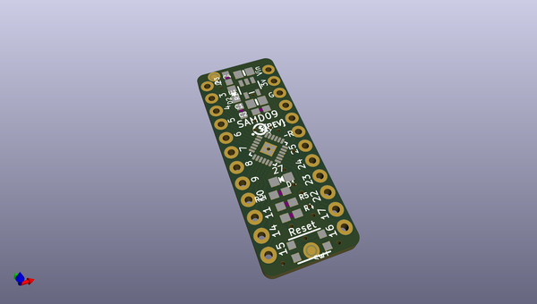

# adafruit_samd09_breakout_pcb
 
## summary 
* id: adafruit_adafruit_samd09_breakout_pcb_atsamd09d14_breakout_rev_b
* user: adafruit
* name: adafruit_samd09_breakout_pcb
* board: atsamd09d14_breakout_rev_b
* repo: https://github.com/adafruit/Adafruit-SAMD09-Breakout-PCB

* src_file_repo_sch: 
* src_file_repo_sch_link: https://github.com/adafruit/Adafruit-SAMD09-Breakout-PCB/tree/master/
* full details link: https://github.com/oomlout/oomlout_oomp_project_bot_v_2/tree/main/projects/adafruit_adafruit_samd09_breakout_pcb_atsamd09d14_breakout_rev_b/current_version/working  

## schematic  
  
[schematic (pdf)](working_schematic.pdf)  

## pcb  
 
  
  
  
[board (pdf)](working.pdf)  

## working_bom
| Id | Designator | Footprint | Quantity | Designation | Supplier and ref |  | None | 
| --- | --- | --- | --- | --- | --- | --- | --- | 
| 1 | JP3,JP1 | 1X12_ROUND_76MIL | 2 |  |  |  | [''] | 
| 2 | R4,R5 | 0603-NO | 2 | 10k |  |  | [''] | 
| 3 | U$12 | PCBFEAT-REV-040 | 1 |  |  |  | [''] | 
| 4 | IC1 | QFN24_4MM | 1 | ATSAMD09D14A-MU |  |  | [''] | 
| 5 | D2 | CHIPLED_0805_NOOUTLINE | 1 | GREEN |  |  | [''] | 
| 6 | C2 | 0603-NO | 1 | 0.1uF |  |  | [''] | 
| 7 | C1,C4 | 0805-NO | 2 | 10uF |  |  | [''] | 
| 8 | FID1,FID2 | FIDUCIAL_1MM | 2 | FIDUCIAL" |  |  | [''] | 
| 9 | SW1 | BTN_KMR2_4.6X2.8 | 1 | KMR2 |  |  | [''] | 
| 10 | R1,R2,R3 | 0603-NO | 3 | 1K |  |  | [''] | 
| 11 | D1 | CHIPLED_0805_NOOUTLINE | 1 | RED |  |  | [''] | 
| 12 | U1 | SOT23-5 | 1 | AP2112K |  |  | [''] | 
| 13 | U$7 | SEESAW_LOGO | 1 |  |  |  | [''] | 

## bom_schematic
| Ref | Qnty | Value | Cmp name | Footprint | Description | Vendor | DNP | 
| --- | --- | --- | --- | --- | --- | --- | --- | 
| C1, C4 | 2 | 10uF | CAP_CERAMIC0805-NOOUTLINE | working:0805-NO |  |  |  | 
| C2 | 1 | 0.1uF | CAP_CERAMIC0603_NO | working:0603-NO |  |  |  | 
| D1 | 1 | RED | LED0805_NOOUTLINE | working:CHIPLED_0805_NOOUTLINE |  |  |  | 
| D2 | 1 | GREEN | LED0805_NOOUTLINE | working:CHIPLED_0805_NOOUTLINE |  |  |  | 
| FID1, FID2 | 2 | FIDUCIAL"" | FIDUCIAL{dblquote}{dblquote} | working:FIDUCIAL_1MM |  |  |  | 
| IC1 | 1 | ATSAMD09D14A-MU | ATSAMD09D14A-MU | working:QFN24_4MM |  |  |  | 
| JP1, JP3 | 2 | HEADER-1X1276MIL | HEADER-1X1276MIL | working:1X12_ROUND_76MIL |  |  |  | 
| R1, R2, R3 | 3 | 1K | RESISTOR_0603_NOOUT | working:0603-NO |  |  |  | 
| R4, R5 | 2 | 10k | RESISTOR_0603_NOOUT | working:0603-NO |  |  |  | 
| SW1 | 1 | KMR2 | SWITCH_TACT_SMT4.6X2.8 | working:BTN_KMR2_4.6X2.8 |  |  |  | 
| U1 | 1 | AP2112K | VREG_SOT23-5 | working:SOT23-5 |  |  |  | 

