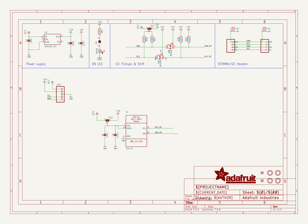
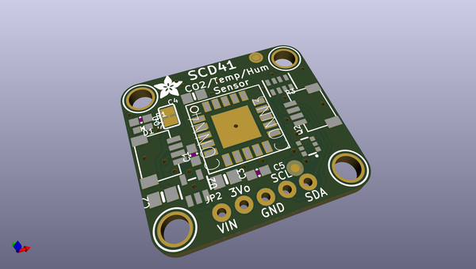
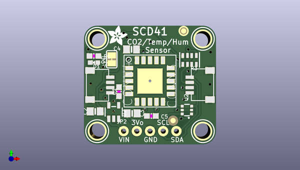
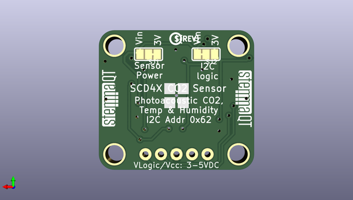

# adafruit_scd_4x_pcb
 
## summary 
* id: adafruit_adafruit_scd_4x_pcb_adafruit_scd_41
* user: adafruit
* name: adafruit_scd_4x_pcb
* board: adafruit_scd_41
* repo: https://github.com/adafruit/Adafruit-SCD-4x-PCB

* src_file_repo_sch: 
* src_file_repo_sch_link: https://github.com/adafruit/Adafruit-SCD-4x-PCB/tree/main/
* full details link: https://github.com/oomlout/oomlout_oomp_project_bot_v_2/tree/main/projects/adafruit_adafruit_scd_4x_pcb_adafruit_scd_41/current_version/working  

## schematic  
  
[schematic (pdf)](working_schematic.pdf)  

## pcb  
 
  
  
  
[board (pdf)](working.pdf)  

## working_bom
| Id | Designator | Footprint | Quantity | Designation | Supplier and ref |  | None | 
| --- | --- | --- | --- | --- | --- | --- | --- | 
| 1 | U$1,U$19,U$21,U$17 | MOUNTINGHOLE_3.0_PLATEDTHIN | 4 | MOUNTINGHOLE3.0THIN |  |  | [''] | 
| 2 | U2 | SOT23-5 | 1 | AP2112K-3.3 |  |  | [''] | 
| 3 | JP2 | 1X05_ROUND_76 | 1 |  |  |  | [''] | 
| 4 | C1,C5 | 0603-NO | 2 | 0.1uF |  |  | [''] | 
| 5 | C2,C4,C3 | 0805-NO | 3 | 10uF |  |  | [''] | 
| 6 | CONN4,CONN3 | JST_SH4 | 2 | STEMMA_I2C_QT |  |  | [''] | 
| 7 | R3 | RESPACK_4X0603 | 1 | 10K |  |  | [''] | 
| 8 | SJ3 | SOLDERJUMPER_CLOSEDWIRE | 1 |  |  |  | [''] | 
| 9 | FID3,FID4 | FIDUCIAL_1MM | 2 | FIDUCIAL_1MM |  |  | [''] | 
| 10 | Q2 | SOT363 | 1 | BSS138 |  |  | [''] | 
| 11 | R1 | 0603-NO | 1 | 10K |  |  | [''] | 
| 12 | X1 | SCD41 | 1 | SCD-41 |  |  | [''] | 
| 13 | D1 | CHIPLED_0603_NOOUTLINE | 1 | GREEN |  |  | [''] | 
| 14 | U$22 | ADAFRUIT_3.5MM | 1 |  |  |  | [''] | 
| 15 | U$30,U$31 | STEMMAQT | 2 |  |  |  | [''] | 
| 16 | SJ1,SJ2 | SOLDERJUMPER_2WAY_OPEN_NOPASTE | 2 |  |  |  | [''] | 
| 17 | U$25 | PCBFEAT-REV-040 | 1 |  |  |  | [''] | 

## bom_schematic
| Ref | Qnty | Value | Cmp name | Footprint | Description | Vendor | DNP | 
| --- | --- | --- | --- | --- | --- | --- | --- | 
| C1, C5 | 2 | 0.1uF | CAP_CERAMIC0603_NO | working:0603-NO |  |  |  | 
| C2, C3, C4 | 3 | 10uF | CAP_CERAMIC0805-NOOUTLINE | working:0805-NO |  |  |  | 
| CONN3, CONN4 | 2 | STEMMA_I2C_QT | STEMMA_I2C_QT | working:JST_SH4 |  |  |  | 
| D1 | 1 | GREEN | LED0603_NOOUTLINE | working:CHIPLED_0603_NOOUTLINE |  |  |  | 
| FID3, FID4 | 2 | FIDUCIAL_1MM | FIDUCIAL_1MM | working:FIDUCIAL_1MM |  |  |  | 
| JP2 | 1 | HEADER-1X576MIL | HEADER-1X576MIL | working:1X05_ROUND_76 |  |  |  | 
| Q2 | 1 | BSS138 | MOSFET-N_DUAL | working:SOT363 |  |  |  | 
| R1 | 1 | 10K | RESISTOR_0603_NOOUT | working:0603-NO |  |  |  | 
| R3 | 1 | 10K | RESISTOR_4PACK | working:RESPACK_4X0603 |  |  |  | 
| SJ1, SJ2 | 2 | SOLDERJUMPER_2WAY | SOLDERJUMPER_2WAY | working:SOLDERJUMPER_2WAY_OPEN_NOPASTE |  |  |  | 
| SJ3 | 1 | SOLDERJUMPERCLOSED | SOLDERJUMPERCLOSED | working:SOLDERJUMPER_CLOSEDWIRE |  |  |  | 
| U2 | 1 | AP2112K-3.3 | VREG_SOT23-5 | working:SOT23-5 |  |  |  | 
| U$1, U$17, U$19, U$21 | 4 | MOUNTINGHOLE3.0THIN | MOUNTINGHOLE3.0THIN | working:MOUNTINGHOLE_3.0_PLATEDTHIN |  |  |  | 
| X1 | 1 | SCD-41 | SCD-41 | working:SCD41 |  |  |  | 

## mounting_holes
| x | y | package | value | ref | size | 
| --- | --- | --- | --- | --- | --- | 
| 0.0 | 17.78 | MOUNTINGHOLE_3.0_PLATEDTHIN | MOUNTINGHOLE3.0THIN | U$1 | m3 | 
| 20.319999999999993 | 17.78 | MOUNTINGHOLE_3.0_PLATEDTHIN | MOUNTINGHOLE3.0THIN | U$17 | m3 | 
| 0.0 | 0.0 | MOUNTINGHOLE_3.0_PLATEDTHIN | MOUNTINGHOLE3.0THIN | U$19 | m3 | 
| 20.319999999999993 | 0.0 | MOUNTINGHOLE_3.0_PLATEDTHIN | MOUNTINGHOLE3.0THIN | U$21 | m3 | 

