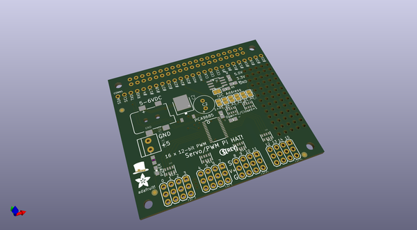
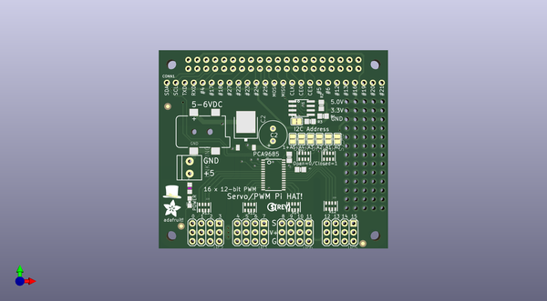
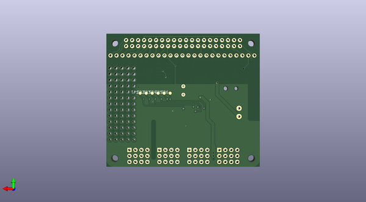

# adafruit_servo_hat_bonnet_pcb
 
## summary 
* id: adafruit_adafruit_servo_hat_bonnet_pcb_adafruit_servo_hat_rev_a
* user: adafruit
* name: adafruit_servo_hat_bonnet_pcb
* board: adafruit_servo_hat_rev_a
* repo: https://github.com/adafruit/Adafruit-Servo-HAT-Bonnet-PCB

* src_file_repo_sch: 
* src_file_repo_sch_link: https://github.com/adafruit/Adafruit-Servo-HAT-Bonnet-PCB/tree/master/
* full details link: https://github.com/oomlout/oomlout_oomp_project_bot_v_2/tree/main/projects/adafruit_adafruit_servo_hat_bonnet_pcb_adafruit_servo_hat_rev_a/current_version/working  

## schematic  
  
[schematic (pdf)](working_schematic.pdf)  

## pcb  
 
  
  
  
[board (pdf)](working.pdf)  

## working_bom
| Id | Designator | Footprint | Quantity | Designation | Supplier and ref |  | None | 
| --- | --- | --- | --- | --- | --- | --- | --- | 
| 1 | R4,R5 | RESPACK_4X0603 | 2 | 10K |  |  | [''] | 
| 2 | R10 | _0805MP | 1 | 470 |  |  | [''] | 
| 3 | U2 | TSSOP28 | 1 | PCA9685 |  |  | [''] | 
| 4 | SJ1 | SOLDERJUMPER_CLOSEDWIRE | 1 | WP |  |  | [''] | 
| 5 | R11,R12,R14,R13 | RESPACK_4X0603 | 4 | 220 |  |  | [''] | 
| 6 | R1,R3,R2 | 0805-NO | 3 | 3.9K |  |  | [''] | 
| 7 | FID3,FID1,FID2 | FIDUCIAL_1MM | 3 | FIDUCIAL" |  |  | [''] | 
| 8 | SJ_A5,SJ_A1,SJ_A4,SJ_A0,SJ_A3,SJ_A2 | SOLDERJUMPER_REFLOW_NOPASTE | 6 |  |  |  | [''] | 
| 9 | LED1 | CHIPLED_0805_NOOUTLINE | 1 | GREEN |  |  | [''] | 
| 10 | U$6 | PCBFEAT-REV-056 | 1 |  |  |  | [''] | 
| 11 | UNK5VIN0 | TERMBLOCK_1X2-3.5MM | 1 | 3.5mm term |  |  | [''] | 
| 12 | R7 | 0805-NO | 1 | 10K |  |  | [''] | 
| 13 | JP5,JP6,JP2,JP1 | 3X04 | 4 |  |  |  | [''] | 
| 14 | C2 | E3,5-8 | 1 |  |  |  | [''] | 
| 15 | U1 | SOIC8_150MIL | 1 | CAT24C32 |  |  | [''] | 
| 16 | CONN1 | 1X25_ROUND_70MIL | 1 | HEADER-1X25 |  |  | [''] | 
| 17 | RPI1 | PI_HAT_SLOTS | 1 | RASPBERRYPI_BPLUS_HATSLOTS |  |  | [''] | 
| 18 | U$5 | PIHATLOGO | 1 |  |  |  | [''] | 
| 19 | Q1 | TO252 | 1 | AOD417 |  |  | [''] | 
| 20 | C1 | 0805-NO | 1 | 10uF |  |  | [''] | 
| 21 | X1 | DCJACK_2MM_SMT | 1 | 2.1mm SMT |  |  | [''] | 
| 22 | U$51 | ADAFRUIT_5MM | 1 |  |  |  | [''] | 
| 23 | TP6,TP1,TP3,TP4,TP5,TP2 | B1,27 | 6 | TPB1,27 |  |  | [''] | 

## bom_schematic
no data

